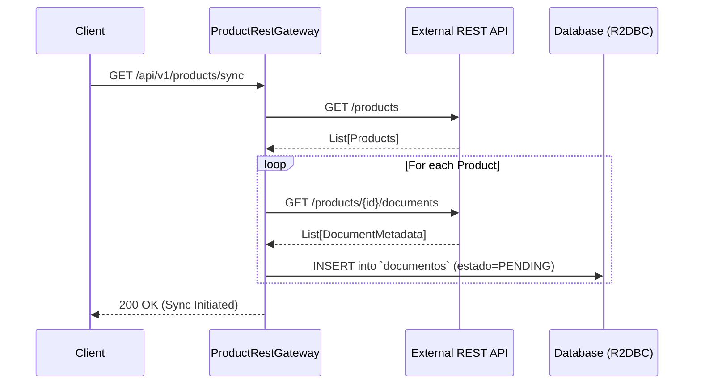
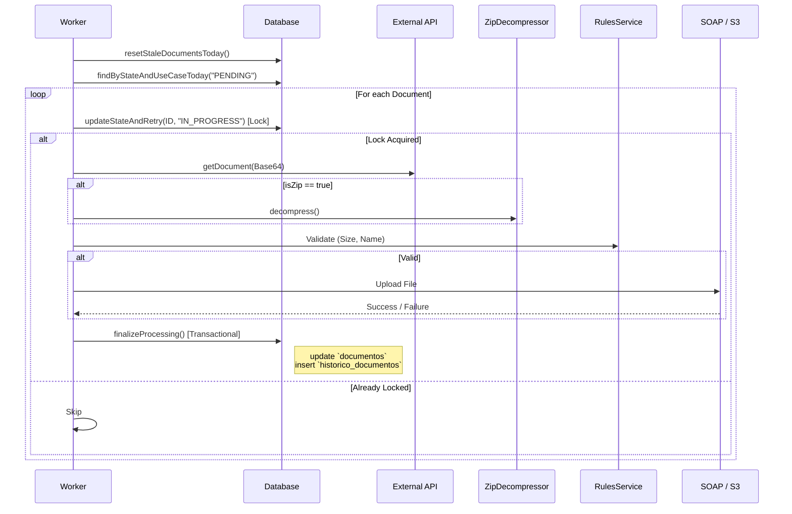
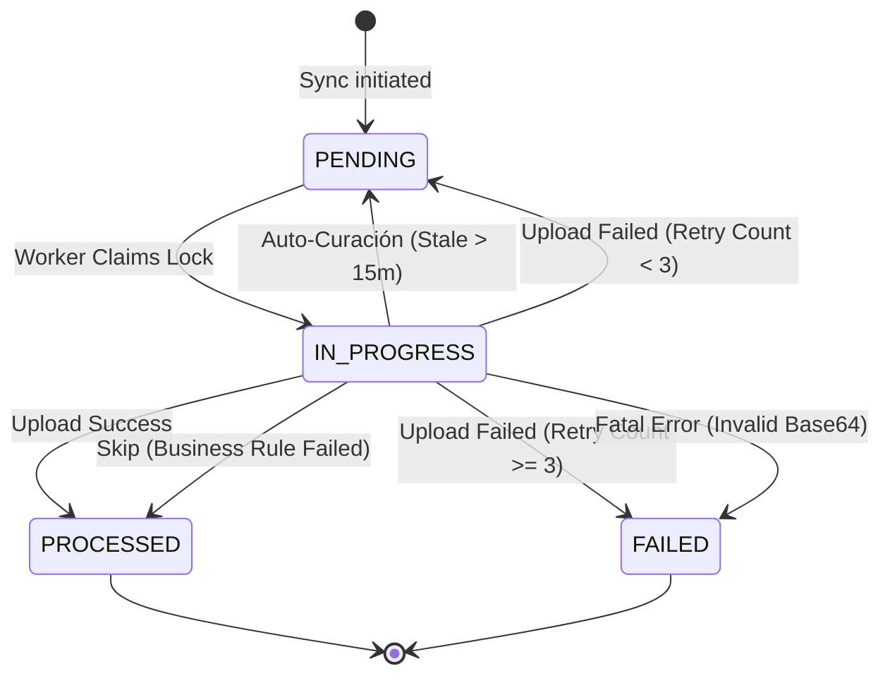

# File Processor Service

Microservicio reactivo basado en **Spring WebFlux + R2DBC** que gestiona el procesamiento resiliente de documentos. Obtiene archivos desde una API REST externa, los valida, descomprime (si son ZIP) y los envía a gateways externos (SOAP o AWS S3) con una política estricta de reintentos y trazabilidad atómica.

---

## Tabla de Contenidos

1. [Arquitectura (Clean Architecture)](#arquitectura-clean-architecture)
2. [API Endpoints](#api-endpoints)
3. [Flujo de Datos y Resiliencia](#flujo-de-datos-y-resiliencia)
4. [Base de Datos (Esquema R2DBC)](#base-de-datos-esquema-r2dbc)
5. [Descompresión de archivos ZIP](#descompresion-de-archivos-zip)
6. [Estados de Documentos (ProductState)](#estados-de-documentos-productstate)
7. [Validación de Documentos (RulesBussinesService)](#validacion-de-documentos-rulesbussinesservice)
8. [Escenarios de Procesamiento y Reintentos](#escenarios-de-procesamiento-y-reintentos)
9. [Códigos de Error y Matriz de Fallos](#codigos-de-error-y-matriz-de-fallos)
10. [Trazabilidad de Envíos (Auditoría)](#trazabilidad-de-envios-auditoria)
11. [Template Method Pattern (Resilience Pipeline)](#template-method-pattern-resilience-pipeline)
12. [Perfiles de Ejecución](#perfiles-de-ejecucion)
13. [Variables de Entorno](#variables-de-entorno)
14. [Compilación y Ejecución](#compilacion-y-ejecucion)
15. [Ejemplos de curl](#ejemplos-de-curl)
16. [Excepciones y Manejo de Errores](#excepciones-y-manejo-de-errores)
17. [Testing y QA](#testing-y-qa)
18. [Stack Tecnológico](#stack-tecnologico)

---

## Arquitectura (Clean Architecture Simplificada)

El proyecto sigue **Clean Architecture** con una simplificación orientada a reducir el "pasamanos" innecesario y la complejidad técnica. Se ha eliminado el subsistema de homologación dinámico por no aportar valor al negocio actual. La capa de dominio es **Java puro** y la comunicación entre capas se realiza exclusivamente a través de puertos (interfaces en `port/out`). Se mantiene la inversión de dependencia para la gestión de transacciones y resolución de tipos MIME.

### Estructura de Directorios Detallada

```text
com.example.fileprocessor/
├── Application.java                              # @SpringBootApplication (excluye WebMvc)
│
├── domain/                                       # Capa de dominio
│   ├── entity/
│   │   ├── Document.java                       # Record: metadatos del documento + estado actual
│   │   ├── ProductDocumentFile.java            # Record: documento obtenido de REST API
│   │   ├── ProductDocumentHistory.java         # Record: documento procesable (productId, isZip, pais)
│   │   ├── ProductState.java                   # Constantes de estado: PENDING, IN_PROGRESS, PROCESSED, FAILED
│   │   ├── FileUploadRequest.java              # Request para upload a gateway (SOAP/S3)
│   │   ├── FileUploadResponse.java             # Resultado de upload con status, errorCode
│   │   ├── FinalizeProcessingCommand.java      # Parameter Object: encapsula datos para finalización atómica
│   │   ├── ExternalServiceResponse.java        # Respuesta genérica de servicio externo
│   │   └── ProductHistory.java                 # Record: producto (metadata)
│   ├── usecase/
│   │   ├── AbstractDocumentProcessingUseCase.java  # Template Method: Pipeline de Resiliencia y transaccionalidad
│   │   ├── SoapDocumentProcessingUseCase.java       # Implementación SOAP Unificada
│   │   ├── S3DocumentProcessingUseCase.java         # Implementación S3
│   │   ├── SyncDocumentsUseCase.java                # Sincroniza productos y metadatos desde API REST
│   │   └── ProcessingResultCodes.java               # Enum: Single source of truth para estados y errores
│   ├── service/
│   │   └── RulesBussinesService.java              # Validación de documentos (tamaño, patrón de nombre)
│   ├── util/
│   │   ├── ZipDecompressor.java                   # Descompresión de ZIP con inferencia de contentType
│   │   ├── Base64Utils.java                       # Encoding/decoding seguro de Base64
│   │   └── MimeTypeUtil.java                      # Utilidad Java pura para resolver tipos MIME
│   ├── port/out/
│   │   ├── DocumentPersistencePort.java          # Puerto: Facade unificado para persistencia transaccional
│   │   ├── ProductRepository.java                # Puerto: productos (lectura/escritura)
│   │   ├── ProductRestGateway.java               # Puerto: consumo API REST externa de productos
│   │   ├── RulesBussinesGateway.java             # Puerto: validación de documentos
│   │   ├── S3Gateway.java                        # Puerto: envío a S3
│   │   └── SoapGateway.java                      # Puerto: envío a SOAP unificado
│   └── exception/
│       ├── DomainException.java                  # Base abstracta (RuntimeException + errorCode)
│       ├── InvalidBase64Exception.java           # Error de decodificación Base64
│       └── ProcessingException.java              # Error general de procesamiento en el pipeline
│
├── application/                                   # Capa de aplicación
│   └── service/config/
│       └── DomainConfig.java                      # @Configuration: definición de beans inyectando puertos
│
└── infrastructure/                                # Capa de infraestructura
    ├── config/
    │   ├── ProcessorsProperties.java              # Propiedades unificadas (límites, reintentos)
    │   └── JaxbConfig.java                        # Contexto compartido JAXB para SOAP
    ├── drivenadapters/
    │   ├── DocumentPersistenceAdapter.java        # Adaptador Facade que agrupa repositorios y TransactionalOperator
    │   ├── r2dbc/                                 # Adaptadores reactivos R2DBC
    │   │   ├── common/AbstractReactiveAdapterOperation.java # Clase base genérica para adaptadores R2DBC
    │   │   ├── DocumentR2dbcAdapter.java          # Hereda de AbstractReactiveAdapterOperation
    │   │   ├── DocumentHistoryR2dbcAdapter.java   # Implementa DocumentHistoryRepository
    │   │   ├── ProductR2dbcAdapter.java           # Hereda de AbstractReactiveAdapterOperation
    │   │   ├── entity/                            # Entidades mapeadas a tablas SQL
    │   │   ├── mapper/                            # Mapeadores Entidad-Dominio (DocumentMapper, ProductMapper)
    │   │   └── repository/                        # Repositorios Spring Data R2DBC
    │   ├── restclient/
    │   │   ├── ProductRestGatewayAdapter.java     # Implementa cliente WebClient para API REST
    │   │   └── dto/                               # DTOs JSON (ProductResponse, ProductDocumentResponse)
    │   ├── soap/
    │   │   └── SoapGatewayAdapter.java            # Cliente HTTP (WebClient) para peticiones SOAP
    │   └── aws/
    │       └── S3GatewayAdapter.java              # Cliente asíncrono para AWS S3
    ├── entrypoints/rest/
    │   ├── ProductRoutes.java                     # Router function (GET /products, GET /products/sync)
    │   ├── handler/ProductHandler.java            # Orquestador de solicitudes HTTP
    │   ├── config/DocumentRestProperties.java     # Propiedades de API REST externa
    │   └── constants/ApiConstants.java            # Headers de trace-id
    └── helpers/soap/                              # Herramientas consolidadas para construcción SOAP
        ├── constants/SoapConstants.java           # Namespaces comunes
        ├── mapper/SoapMapper.java                 # Construcción y parseo JAXB unificado
        └── xml/
            ├── SoapBody.java                      # Payload JAXB del Body
            ├── SoapEnvelope.java                  # Envolvente raíz JAXB (Header + Body)
            ├── SoapHeader.java                    # Payload JAXB del Header
            ├── SoapEnvelopeWrapper.java           # Parseo DOM seguro de la respuesta SOAP
            └── model/                             # Modelos JAXB con Lombok (Header, Body, Request, Response)
```

---

## API Endpoints

Ambos endpoints han sido configurados para responder al método **GET** a petición del negocio.

### GET `/api/v1/products/sync`

Sincroniza metadatos de documentos desde la API REST externa hacia la base de datos local (solo registra, no procesa binarios).

- **Headers:**
  - `message-id`: (opcional) Trace ID para correlación. Si no se envía, se genera un UUID.
  - `USE_CASE`: (opcional) Caso de uso inicial (`soap` o `s3`). Por defecto es `soap`.
- **Response:** HTTP 200 (fire-and-forget — la inserción en base de datos es asíncrona)
```json
{"status":"OK","message":"Document sync initiated"}
```

### GET `/api/v1/products`

Ejecuta el pipeline de procesamiento sobre los documentos en estado `PENDING` correspondientes al **día actual**. El sistema descarga, valida, descomprime y envía.

- **Headers:**
  - `message-id`: (opcional) Trace ID.
- **Query Params:**
  - `processor`: `soap` (default) | `s3` — Selecciona el pipeline a ejecutar.
- **Response:** HTTP 200 `Content-Type: application/x-ndjson` (Stream reactivo NDJSON)
```json
{"correlationId":"corr-123","status":"SUCCESS","success":true,"processedAt":"2026-04-30T20:15:00Z","errorCode":null,"attemptCount":1}
{"correlationId":"corr-124","status":"FAILURE","success":false,"processedAt":"2026-04-30T20:15:01Z","errorCode":"GATEWAY_TIMEOUT","attemptCount":2}
```

**Errores comunes:**
- `400 Bad Request` — `?processor=` con valor inválido.
- `503 Service Unavailable` — `?processor=s3` cuando el perfil S3 no está activo.

---

## Flujo de Datos y Resiliencia

El ciclo de vida se divide en dos fases asíncronas e independientes:

### 1. Flujo de Sincronización (GET `/api/v1/products/sync`)



### 2. Flujo de Procesamiento Resiliente (GET `/api/v1/products`)



---

## Base de Datos (Esquema R2DBC)

Se utiliza R2DBC para interactuar de forma no bloqueante con PostgreSQL (producción) o H2 (desarrollo).

### Tabla: `documentos` (Single Source of Truth)

Almacena el estado transaccional actual del documento. Se han simplificado los campos eliminando redundancias.

| Columna | Tipo | Descripción |
|---------|------|-------------|
| `id` | BIGSERIAL (PK) | Identificador único auto-generado |
| `id_documento` | VARCHAR(100) | ID del documento en el sistema externo |
| `id_producto` | VARCHAR(100) | ID del producto padre |
| `nombre` | VARCHAR(255) | Nombre del archivo |
| `estado` | VARCHAR(100) | Estado: PENDING, IN_PROGRESS, PROCESSED, FAILED |
| `mensaje_error` | TEXT | Resumen del último fallo técnico |
| `es_zip` | BOOLEAN | Indica si el origen fue un archivo ZIP comprimido |
| `caso_uso` | VARCHAR(100) | Caso de uso: SOAP o S3 |
| `retry_count` | INTEGER | Contador de intentos técnicos fallidos (Default: 0) |
| `fecha_creacion` | TIMESTAMP | Fecha de creación del registro en sync |
| `fecha_actualizacion` | TIMESTAMP | Crucial para la detección de "Stale Documents" |

> [!NOTE]
> Los campos `activo`, `clave_documento`, `propietario`, `ruta`, `version_contrato` y `nombre_zip_padre` han sido DEPRECATED y deben ser eliminados del esquema físico.

### Tabla: `historico_documentos` (Append-Only Audit Log)

Registra cada evento de manera inmutable. Su persistencia está vinculada transaccionalmente a la tabla `documentos`.

| Columna | Tipo | Descripción |
|---------|------|-------------|
| `id` | BIGSERIAL (PK) | Identificador único |
| `documento_id` | BIGINT (FK) | Referencia a `documentos(id)` |
| `nombre_archivo` | VARCHAR(255) | Útil para trazar entradas dentro de un ZIP (NULL si no es ZIP) |
| `operacion` | VARCHAR(50) | Tipo de operación: SYNC, SOAP, S3 |
| `resultado` | VARCHAR(50) | SUCCESS / FAILURE (Mapeado desde ProcessingResultCodes) |
| `codigo_error` | VARCHAR(50) | Categorización (GATEWAY_TIMEOUT, SIZE_EXCEEDED, etc.) |
| `mensaje_error` | TEXT | Mensaje descriptivo del fallo |
| `stack_trace` | TEXT | Stack trace detallado si ocurre una excepción |
| `reintentos` | INTEGER | Intento en el que se generó esta traza |
| `fecha_inicio` | TIMESTAMP | Inicio de la operación |
| `fecha_fin` | TIMESTAMP | Fin de la operación |

> [!NOTE]
> El campo `message_id` ha sido eliminado por falta de uso funcional en la arquitectura actual.

### Esquema de Base de Datos (Estado Final Refactorizado)

A continuación se detalla el DDL completo para recrear las tablas con secuencias explícitas:

```sql
-- Secuencias para auto-incremento
CREATE SEQUENCE IF NOT EXISTS documentos_id_seq;
CREATE SEQUENCE IF NOT EXISTS historico_documentos_id_seq;

-- Tabla: documentos
CREATE TABLE documentos (
    id BIGINT PRIMARY KEY DEFAULT NEXTVAL('documentos_id_seq'),
    id_documento VARCHAR(100) NOT NULL,
    id_producto VARCHAR(100) NOT NULL,
    nombre VARCHAR(255) NOT NULL,
    estado VARCHAR(100) NOT NULL,
    mensaje_error TEXT,
    es_zip BOOLEAN DEFAULT FALSE,
    caso_uso VARCHAR(100) NOT NULL,
    reintentos INTEGER DEFAULT 0,
    fecha_creacion TIMESTAMP DEFAULT CURRENT_TIMESTAMP,
    fecha_actualizacion TIMESTAMP DEFAULT CURRENT_TIMESTAMP
);

-- Tabla: historico_documentos
CREATE TABLE historico_documentos (
    id BIGINT PRIMARY KEY DEFAULT NEXTVAL('historico_documentos_id_seq'),
    documento_id BIGINT NOT NULL,
    nombre_archivo VARCHAR(255),
    operacion VARCHAR(50) NOT NULL,
    resultado VARCHAR(50) NOT NULL,
    codigo_error VARCHAR(50),
    mensaje_error TEXT,
    stack_trace TEXT,
    reintentos INTEGER,
    fecha_inicio TIMESTAMP,
    fecha_fin TIMESTAMP,
    CONSTRAINT fk_documento FOREIGN KEY (documento_id) REFERENCES documentos(id)
);

-- Vincular secuencias a las columnas (PostgreSQL)
ALTER SEQUENCE documentos_id_seq OWNED BY documentos.id;
ALTER SEQUENCE historico_documentos_id_seq OWNED BY historico_documentos.id;
```

### DDL de Migración (Limpieza de Esquema)

Si ya cuentas con una base de datos previa, ejecuta este script para eliminar los campos obsoletos y las tablas innecesarias:

```sql
-- Tabla documentos: Eliminar campos en desuso
ALTER TABLE documentos DROP COLUMN IF EXISTS activo;
ALTER TABLE documentos DROP COLUMN IF EXISTS clave_documento;
ALTER TABLE documentos DROP COLUMN IF EXISTS propietario;
ALTER TABLE documentos DROP COLUMN IF EXISTS ruta;
ALTER TABLE documentos DROP COLUMN IF EXISTS version_contrato;
ALTER TABLE documentos DROP COLUMN IF EXISTS mensaje_error;
ALTER TABLE documentos DROP COLUMN IF EXISTS nombre_zip_padre;

-- Tabla historico_documentos: Eliminar campos en desuso
ALTER TABLE historico_documentos DROP COLUMN IF EXISTS message_id;
ALTER TABLE historico_documentos DROP COLUMN IF EXISTS fecha_creacion;

-- Eliminar tablas obsoletas
DROP TABLE IF EXISTS productos;
DROP TABLE IF EXISTS categoria_manual;
DROP TABLE IF EXISTS pais_homologado;
```

### Índices Críticos
```sql
CREATE INDEX idx_documentos_estado ON documentos(estado);
CREATE INDEX idx_documentos_caso_uso ON documentos(caso_uso);
CREATE INDEX idx_historico_documento_id ON historico_documentos(documento_id);
```

---

## Descompresión de archivos ZIP

El componente `ZipDecompressor` se activa **exclusivamente durante el procesamiento** (no en sync).

- **Inferencia:** Si el `ProductDocumentHistory.filename` termina en `.zip`, se asigna automáticamente `isZip = true`.
- **Expansión:** El pipeline recibe el binario, lo descomprime en memoria y emite un flujo (Flux) de archivos individuales.
- **Trazabilidad:** Aunque todas las entradas de un ZIP comparten el mismo `documento_id` (PK del ZIP original), cada entrada se registra de manera independiente en `historico_documentos` usando el campo `nombre_archivo` para diferenciarlas.

**Ejemplo de Base de Datos:**

Documento Padre en tabla `documentos`:
```text
id=12 | id_documento="PROD-001/data.zip" | es_zip=true | estado="PROCESSED"
```

Registros resultantes en tabla `historico_documentos`:
```text
id=101 | documento_id=12 | nombre_archivo="informe.pdf" | resultado="SUCCESS"
id=102 | documento_id=12 | nombre_archivo="datos.csv"   | resultado="SUCCESS"
id=103 | documento_id=12 | nombre_archivo="logo.png"    | resultado="FAILURE" | codigo_error="SIZE_EXCEEDED"
```

---

## Estados de Documentos (ProductState)

El ciclo de vida en la tabla `documentos` es estricto:

1. **PENDING**: Creado por Sync o devuelto a este estado tras un fallo técnico (Reintento) o por el curador de estancamientos.
2. **IN_PROGRESS**: Bloqueo optimista concurrente (`update documentos set estado='IN_PROGRESS' where id=? and estado='PENDING'`).
3. **PROCESSED**: Envío exitoso o ignorado intencionalmente por reglas de negocio (Skip). Estado terminal.
4. **FAILED**: 3 intentos técnicos agotados o error irrecuperable (ej. Base64 inválido). Estado terminal.


---

## Validación de Documentos (RulesBussinesService)

El pipeline ejecuta reglas de negocio locales antes de comprometer red hacia el gateway externo. Si la regla no se cumple, el documento se marca como `PROCESSED` con un `codigo_error` especial, sin consumir reintentos (Skip Logic).

Configuración en `application.yml`:
```yaml
app:
  processors:
    soap:
      max-file-size-bytes: 10485760        # 10 MB
      filename-pattern: ".*\\.(pdf|docx|txt)$"
    s3:
      max-file-size-bytes: 52428800        # 50 MB
      filename-pattern: ".*\\.(pdf|csv)$"
```

---

## Escenarios de Procesamiento y Reintentos

La clase `AbstractDocumentProcessingUseCase` maneja los siguientes escenarios:

### 1. Caso Ideal
- Descarga OK -> Valida OK -> Gateway OK.
- Transacción atómica: `documentos.estado = PROCESSED`, `historico.resultado = SUCCESS`.

### 2. Error Técnico Transitorio (Gateway caído)
- Gateway responde HTTP 503 o Timeout. Reactor activa política interna de retry (Ej. 3 intentos espaciados en el mismo flujo reactivo).
- Si agota el flujo reactivo, devuelve la excepción al pipeline superior.
- Pipeline superior evalúa: ¿El documento tiene `retry_count` < 3?
  - **SÍ**: Transacción atómica: `documentos.estado = PENDING`, `documentos.retry_count = +1`, `historico.resultado = FAILURE`, código `GATEWAY_TIMEOUT`.
  - **NO**: Transacción atómica: `documentos.estado = FAILED`, `historico.resultado = FAILURE`.

### 3. Error de Negocio (Archivo demasiado grande)
- Validador lanza `ProcessingException(SIZE_EXCEEDED)`.
- El flujo intercepta (Skip Logic).
- Transacción atómica: `documentos.estado = PROCESSED` (para no reprocesar), `historico.resultado = FAILURE`, código `SIZE_EXCEEDED`.

---

## Códigos de Error y Matriz de Fallos (ProcessingResultCodes)

Se utiliza un Enum centralizado como única fuente de verdad para clasificar el resultado de las operaciones.

| Código | Clasificación | Acción en Pipeline |
| :--- | :--- | :--- |
| `SUCCESS` | Éxito | Finaliza como PROCESSED |
| `GATEWAY_TIMEOUT` | Técnico (Retryable) | Reintenta (Vuelve a PENDING si hay intentos) |
| `BAD_GATEWAY` | Técnico (Retryable) | Reintenta (Vuelve a PENDING) |
| `SERVICE_UNAVAILABLE`| Técnico (Retryable) | Reintenta (Vuelve a PENDING) |
| `EMPTY_CONTENT` | Negocio/Datos | Pasa a FAILED inmediatamente |
| `INVALID_BASE64` | Datos (Crítico) | Pasa a FAILED inmediatamente |
| `DECOMPRESSION_ERROR`| Datos (Crítico) | Pasa a FAILED inmediatamente |
| `SIZE_EXCEEDED` | Negocio | Skip (Finaliza como PROCESSED) |
| `PATTERN_MISMATCH` | Negocio | Skip (Finaliza como PROCESSED) |
| `SOURCE_NOT_FOUND` | Externo (404) | Pasa a FAILED inmediatamente |
| `DEST_UNAUTHORIZED` | Seguridad (403) | Pasa a FAILED inmediatamente |
| `UNKNOWN_ERROR` | Genérico | Pasa a FAILED o reintenta según contexto |

---

## Trazabilidad de Envíos (Auditoría)

La gestión transaccional se apoya en el **`TransactionalOperator`** de Spring Data R2DBC.
Dado que la API es reactiva y el Thread Local (necesario para `@Transactional` clásico) no funciona entre saltos de hilo, se orquesta el commit de esta forma:

```java
return historyRepository.saveHistory(...)
    .then(documentRepository.updateStateAndRetry(...))
    .as(transactionalOperator::transactional)
    .thenReturn(response);
```

Si el servidor colapsa (OOM, SigKill) durante el envío, la transacción no se cierra. El documento quedará en `IN_PROGRESS` y será rescatado en la siguiente ejecución del `GET /api/v1/products` por el método `resetStaleDocumentsToday`.

---

## Decisiones de Diseño y Optimizaciones

### 1. Procesamiento Secuencial (Backpressure)
Aunque el stack es reactivo, se ha optado por un procesamiento secuencial de documentos (`concatMap`) dentro de cada petición. Esto evita saturar los gateways externos (SOAP/S3) con ráfagas masivas de peticiones concurrentes y permite un control granular de los reintentos.

### 2. Auditoría Atómica
Toda operación que cambie el estado de un documento (`documentos`) debe registrar obligatoriamente una entrada en `historico_documentos`. Ambas operaciones ocurren dentro de una transacción R2DBC gestionada por `DocumentPersistenceAdapter`.

### 3. Eliminación de Homologación Dinámica
Se eliminó el subsistema de homologación por base de datos para simplificar el flujo. Ahora, los metadatos necesarios se inyectan directamente desde la fuente original o se resuelven mediante constantes en el dominio, reduciendo la latencia de red.

---

## Template Method Pattern (Resilience Pipeline)

La clase `AbstractDocumentProcessingUseCase` implementa el patrón Template Method definiendo el esqueleto de ejecución: limpieza, búsqueda, bloqueo, decodificación, descompresión, validación, orquestación transaccional y manejo de errores. 
Las clases concretas (`SoapDocumentProcessingUseCase`, `S3DocumentProcessingUseCase`) solo necesitan implementar dos métodos abstractos:
- `uploadDocument()`: La llamada final al gateway específico.
- `implementationName()`: Retorna "SOAP" o "S3".

---

## Perfiles de Ejecución

Spring Boot Profiles (`application-{profile}.yml`):
- `dev`: Configurado con base de datos embebida (H2), delay de reintentos corto, logs en nivel DEBUG.
- `prod`: Preparado para inyectar credenciales por variables de entorno, logs en nivel INFO/WARN. Requiere driver PostgreSQL.
- `s3`: Activa los beans y dependencias de AWS `S3AsyncClient`.

---

## Variables de Entorno

Mapeo típico para contenedores o Kubernetes:

- `DB_HOST`, `DB_PORT`, `DB_NAME`, `DB_USER`, `DB_PASSWORD`: Datos PostgreSQL.
- `PROCESSOR_SOAP_ENDPOINT`: URL del servicio SOAP destino.
- `PROCESSOR_REST_ENDPOINT`: URL base de la API REST externa proveedora.
- `AWS_REGION`, `AWS_S3_BUCKET`: Credenciales y destino AWS S3.

---

## Compilación y Ejecución

```bash
# Limpiar y compilar el proyecto (ejecuta los 140 tests)
./gradlew clean build

# Ejecutar localmente con perfil de desarrollo
./gradlew bootRun --args='--spring.profiles.active=dev'

# Ejecutar con soporte para AWS S3
./gradlew bootRun --args='--spring.profiles.active=dev,s3'
```

---

## Ejemplos de curl

### 1. Iniciar sincronización de base de datos
```bash
curl -X GET http://localhost:8080/api/v1/products/sync \
  -H 'USE_CASE: soap' \
  -H 'message-id: custom-trace-id-123'
```

### 2. Procesar documentos y enviar a SOAP
```bash
curl -X GET 'http://localhost:8080/api/v1/products?processor=soap' \
  -H 'message-id: exec-run-001'
```

---

## Excepciones y Manejo de Errores

El modelo de excepciones se centra en una única clase robusta: **`ProcessingException`** (hereda de `DomainException`).
- Acepta un `errorCode` de la matriz de fallos, un mensaje legible y una causa.
- Atraviesa el pipeline y es interceptada por el manejador global `handleGlobalError()`, el cual traduce la excepción en una respuesta `FileUploadResponse` unificada con el status `FAILURE`.

Se eliminaron clases superfluas (`FileValidationException`) para consolidar la lógica de captura en un único operador `onErrorResume` a lo largo del flujo reactivo.

---

## Testing y QA

El proyecto garantiza la calidad del código mediante una suite de más de **140 pruebas automatizadas** que cubren el 100% de la lógica crítica:
- **Test de Arquitectura (ArchUnit)**: Verificación automática de que la capa de dominio no importa clases de `org.springframework`.
- **Test de R2DBC**: Validación de consultas SQL nativas (`updateStateAndRetry`) y mapeos usando H2.
- **Test de UseCases**: Uso de `StepVerifier` y `Mockito` para validar el pipeline de resiliencia y el incremento de `retry_count`.
- **Test de Gateways**: `MockWebServer` simula retardos y errores HTTP para probar la resiliencia.
- **Test XML (JAXB)**: Verificación de sobres SOAP protegidos contra XXE.

---

---

## Stack Tecnológico

- **Lenguaje**: Java 21 (Records, Switch Expressions)
- **Framework Core**: Spring Boot 3.3.x
- **Programación Asíncrona**: Project Reactor (WebFlux)
- **Base de Datos**: Spring Data R2DBC (H2 & PostgreSQL)
- **Procesamiento XML**: JAXB (Jakarta XML Binding) + StAX (Streaming API for XML)
- **Integración AWS**: AWS SDK for Java v2 (`software.amazon.awssdk:s3`)
- **Testing**: JUnit 5, Reactor Test (StepVerifier), Mockito, MockWebServer
- **Build Tool**: Gradle (Kotlin DSL / Groovy)
- **Boilerplate**: Lombok (Entidades R2DBC + Modelos JAXB SOAP + Builders/Loggers)

---

## Plan de Pruebas y Escenarios de Validación

Para garantizar la estabilidad y resiliencia del `File Processor Service`, se recomienda ejecutar la siguiente matriz de pruebas funcionales y de caos (Chaos Engineering).

### 1. Escenarios Exitosos (Happy Paths)

| Escenario | Acción (Simulación) | Comportamiento Esperado | Verificación |
| :--- | :--- | :--- | :--- |
| **Sincronización Inicial** | Llamar `GET /api/v1/products/sync` con DB vacía. | El orquestador extrae los productos y sus metadatos del Gateway REST. | La tabla `documentos` tiene registros en estado `PENDING` con `retry_count = 0`. |
| **Envío a SOAP (Simple)** | Ejecutar `GET /api/v1/products` con documentos PDF pendientes. | El servicio descarga el archivo, pasa el validador, y envía a SOAP. | Tabla `documentos`: estado `PROCESSED`. Tabla `historico_documentos`: registra "SUCCESS" con `nombre_archivo = NULL`. |
| **Envío a S3 (Archivo ZIP)** | Ejecutar pipeline con un archivo comprimido pendiente. | El sistema extrae en memoria los archivos del ZIP y los envía iterativamente. | Tabla `historico_documentos`: registra un "SUCCESS" **por cada archivo extraído** con el campo `nombre_archivo` debidamente poblado. |

### 2. Escenarios de Negocio y Filtrado

| Escenario | Acción (Simulación) | Comportamiento Esperado | Verificación |
| :--- | :--- | :--- | :--- |
| **Regla de Exclusión por Regex** | Ingresar un documento en base de datos cuyo nombre no coincida con el patrón Regex configurado. | El validador (`RulesBussinesService`) lanza un skip. No se contacta al Gateway SOAP/S3. | Tabla `documentos`: estado `PROCESSED` (para no reintentar). Tabla `historico_documentos`: resultado `FAILURE` con el mensaje del filtro de exclusión. |
| **Descompresión Inválida** | Sincronizar un archivo marcado como `isZip=true` pero que es un PDF corrupto. | El motor reactivo falla limpiamente al intentar extraer entradas ZIP. | Tabla `historico_documentos`: registra un `FAILURE` técnico. `documentos` incrementa reintentos. |

### 3. Escenarios de Caos y Resiliencia Estructural

| Escenario | Acción (Simulación) | Comportamiento Esperado | Verificación |
| :--- | :--- | :--- | :--- |
| **Fallo Transitorio en API Externa (SOAP/S3 Caídos)** | Bloquear el puerto de salida del gateway SOAP o devolver HTTP 503 desde S3. | El adaptador reintenta 3 veces rápido (en memoria). Luego lanza `GATEWAY_TIMEOUT`. | Tabla `documentos`: el estado vuelve a `PENDING` y el `retry_count` se incrementa en 1. Tabla `historico_documentos`: guarda `FAILURE`. |
| **Límite de Reintentos Agotado** | Provocar 3 fallos transitorios consecutivos en el mismo documento en distintas ejecuciones del pipeline. | Al llegar al tercer intento (`retry_count >= 3`), el orquestador aborta definitivamente el ciclo de vida del documento. | Tabla `documentos`: estado final marcado como `FAILED`. Ya no será extraído por las siguientes tareas. |
| **Auto-Curación (Stale Lock Rescue)** | Manipular la base de datos cambiando el estado a `IN_PROGRESS` con fecha de hace 20 minutos (simulando que el pod de Kubernetes murió a medio procesar). | Al iniciar el pipeline, la primera instrucción barre la tabla buscando documentos atascados. | El log arroja `Recovered X stale documents`. Tabla `documentos`: los registros son retrocedidos a `PENDING` para procesarse nuevamente. |
| **Sincronización con Falla Parcial** | En `GET /api/v1/products/sync`, hacer que la API retorne HTTP 500 para el *Producto A*, pero HTTP 200 para el *Producto B*. | El sistema captura el error a nivel individual (`onErrorResume`), avisa en los logs y prosigue exitosamente con el Producto B. | El *Producto B* se sincroniza en DB, la llamada HTTP global al endpoint no se rompe y devuelve "Document sync completed". |

---
*Fin del documento técnico.*
