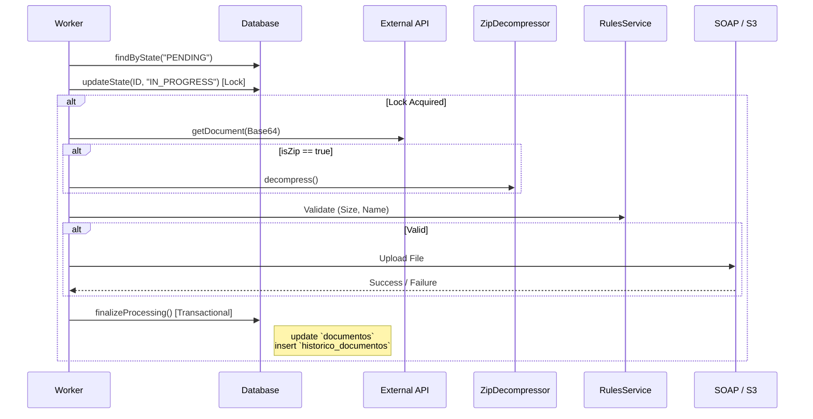

# File Processor Service

Microservicio reactivo basado en **Spring WebFlux + R2DBC** que gestiona el procesamiento resiliente de documentos. Obtiene productos con sus documentos asociados desde una API REST externa, los persiste en una base de datos PostgreSQL (producción) o H2 (desarrollo), valida reglas de negocio, descomprime archivos ZIP en caliente y los envía a gateways externos (**SOAP** o **AWS S3**) con una política estricta de reintentos y trazabilidad atómica.

---

## Tabla de Contenidos

1. [Arquitectura (Clean Architecture)](#arquitectura-clean-architecture)
2. [API Endpoints](#api-endpoints)
3. [Flujo de Datos](#flujo-de-datos)
4. [Base de Datos](#base-de-datos)
5. [Descompresión de archivos ZIP](#descompresion-de-archivos-zip)
6. [Estados de Documentos (ProductState)](#estados-de-documentos-productstate)
7. [Reglas de Negocio (RulesBussinesService)](#reglas-de-negocio-rulesbussinesservice)
8. [Escenarios de Procesamiento](#escenarios-de-procesamiento)
9. [Códigos de Error](#codigos-de-error)
10. [Trazabilidad de Envíos](#trazabilidad-de-envios)
11. [Template Method Pattern](#template-method-pattern)
12. [Perfiles de Ejecución](#perfiles-de-ejecucion)
13. [Variables de Entorno](#variables-de-envorno)
14. [Compilación y Ejecución](#compilacion-y-ejecucion)
15. [Ejemplos de curl](#ejemplos-de-curl)
16. [Excepciones](#excepciones)
17. [Testing](#testing)

---

## Arquitectura (Clean Architecture)

El proyecto sigue **Clean Architecture** con capas estrictamente separadas para garantizar mantenibilidad y testabilidad. La capa de dominio es Java puro (POJOs/Records) sin dependencias de frameworks. La infraestructura contiene los adaptadores concretos (R2DBC, REST, SOAP, S3). La comunicación entre capas se realiza a través de puertos (interfaces en `port/out`).

```text
com.example.fileprocessor/
├── Application.java                              # @SpringBootApplication (excluye WebMvc)
│
├── domain/                                       # Capa de dominio (Java Puro)
│   ├── entity/
│   │   ├── Document.java                       # Record: metadatos del documento + estado actual
│   │   ├── ProductDocumentFile.java            # Record: documento obtenido de REST API
│   │   ├── ProductDocumentHistory.java         # Record: documento procesable (con metadatos de producto)
│   │   ├── ProductState.java                   # Constantes de estado: PENDING, IN_PROGRESS, PROCESSED, FAILED
│   │   ├── FileUploadRequest.java              # Request para upload a gateway (SOAP/S3)
│   │   ├── FileUploadResponse.java             # Resultado de upload con status, errorCode, message
│   │   ├── FinalizeProcessingCommand.java      # Parameter Object: encapsula datos para finalización atómica
│   │   └── ExternalServiceResponse.java        # Respuesta genérica de servicio externo
│   ├── usecase/
│   │   ├── AbstractDocumentProcessingUseCase.java  # Template Method: Pipeline de Resiliencia y transaccionalidad
│   │   ├── SoapDocumentProcessingUseCase.java       # Implementación SOAP Unificada
│   │   ├── S3DocumentProcessingUseCase.java         # Implementación S3
│   │   ├── SyncDocumentsUseCase.java                # Sincroniza productos y metadatos desde API REST
│   │   └── ProcessingResultCodes.java               # Enum: Fuente única de verdad para errores
│   ├── service/
│   │   └── RulesBussinesService.java              # Lógica de validación (tamaño, patrón de nombre)
│   ├── util/
│   │   ├── ZipDecompressor.java                   # Descompresión de ZIP con inferencia de contentType
│   │   ├── Base64Utils.java                       # Encoding/decoding seguro de Base64
│   │   └── MimeTypeUtil.java                      # Resolución de tipos MIME
│   ├── port/out/
│   │   ├── DocumentPersistenceGateway.java       # Puerto: Fachada unificada para persistencia
│   │   ├── DocumentRepository.java               # Puerto: Gestión de metadatos de documentos
│   │   ├── DocumentHistoryRepository.java        # Puerto: Auditoría y trazabilidad
│   │   ├── ProductRestGateway.java               # Puerto: Consumo API REST externa
│   │   ├── RulesBussinesGateway.java             # Puerto: Contrato de validación
│   │   ├── S3Gateway.java                        # Puerto: Envío a S3
│   │   └── SoapGateway.java                      # Puerto: Envío a SOAP
│   └── exception/
│       ├── DomainException.java                  # Base abstracta (RuntimeException + errorCode)
│       └── ProcessingException.java              # Error general de procesamiento en el pipeline
│
├── application/                                   # Capa de aplicación
│   └── service/config/
│       └── DomainConfig.java                      # @Configuration: Definición de beans inyectando puertos
│
└── infrastructure/                                # Capa de infraestructura
    ├── config/
    │   └── ProcessorsProperties.java              # Propiedades unificadas (límites, reintentos)
    ├── drivenadapters/
    │   ├── DocumentPersistenceAdapter.java        # Adaptador Fachada que orquesta transacciones R2DBC
    │   ├── r2dbc/                                 # Adaptadores reactivos R2DBC
    │   │   ├── DocumentR2dbcAdapter.java          # Implementación DocumentRepository
    │   │   ├── DocumentHistoryR2dbcAdapter.java   # Implementación DocumentHistoryRepository
    │   │   ├── entity/                            # Entidades mapeadas a tablas SQL
    │   │   ├── mapper/                            # Mapeadores Entidad-Dominio
    │   │   └── repository/                        # Repositorios Spring Data R2DBC
    │   ├── restclient/
    │   │   └── ProductRestGatewayAdapter.java     # Implementa cliente WebClient para API REST
    │   ├── soap/
    │   │   └── SoapGatewayAdapter.java            # Cliente HTTP (WebClient) para peticiones SOAP
    │   └── aws/
    │       └── S3GatewayAdapter.java              # Cliente asíncrono para AWS S3
    └── entrypoints/rest/
        ├── ProductRoutes.java                     # Router function (GET /products, GET /products/sync)
        └── handler/ProductHandler.java            # Handler de orquestación HTTP
```

---

## API Endpoints

### GET `/api/v1/products/sync`

Sincroniza metadatos de documentos desde la API REST externa hacia la base de datos local. Solo registra la existencia y metadatos, no procesa los binarios.

- **Response:** HTTP 200 (fire-and-forget)
```json
{"status":"OK","message":"Document sync initiated"}
```

### GET `/api/v1/products`

Ejecuta el pipeline de procesamiento sobre los documentos en estado `PENDING` del **día actual**. El sistema descarga, valida, descomprime y envía según el procesador seleccionado.

- **Query Params:**
  - `processor`: `soap` (default) | `s3`
- **Response:** `application/x-ndjson` (Stream reactivo)
```json
{"correlationId":"corr-123","status":"SUCCESS","success":true,"processedAt":"2026-05-10T20:15:00Z","errorCode":null,"attemptCount":1}
```

---

## Flujo de Datos

### Flujo de Sincronización (POST/GET Sync)

1. Se obtienen todos los productos desde la API REST.
2. Por cada producto, se listan sus documentos.
3. Se persiste cada documento en la tabla `documentos` con estado `PENDING`.

### Flujo de Procesamiento



---

## Base de Datos

### Tabla: `documentos`

Almacena el estado transaccional actual del documento.

| Columna | Tipo | Descripción |
|---------|------|-------------|
| `id` | BIGSERIAL (PK) | Identificador único |
| `id_documento` | VARCHAR(100) | ID en sistema externo |
| `id_producto` | VARCHAR(100) | ID del producto padre |
| `nombre` | VARCHAR(255) | Nombre del archivo |
| `estado` | VARCHAR(100) | PENDING, IN_PROGRESS, PROCESSED, FAILED |
| `mensaje_error` | TEXT | Último mensaje de error detallado |
| `reintentos` | INTEGER | Intentos técnicos acumulados |
| `fecha_creacion` | TIMESTAMP | Fecha de registro |
| `fecha_actualizacion` | TIMESTAMP | Fecha de último cambio de estado |

### Tabla: `historico_documentos` (Auditoría)

Registra cada intento de procesamiento de manera inmutable.

| Columna | Tipo | Descripción |
|---------|------|-------------|
| `id` | BIGSERIAL (PK) | Identificador único |
| `documento_id` | BIGINT (FK) | Referencia a `documentos(id)` |
| `nombre_archivo` | VARCHAR(255) | Nombre del archivo (útil en ZIPs) |
| `operacion` | VARCHAR(50) | SOAP, S3, SYNC |
| `resultado` | VARCHAR(50) | SUCCESS / FAILURE |
| `codigo_error` | VARCHAR(50) | Categoría del error (TIMEOUT, SIZE, etc.) |
| `reintentos` | INTEGER | Número de intento de este registro |
| `fecha_inicio` | TIMESTAMP | Inicio de la operación |
| `fecha_fin` | TIMESTAMP | Fin de la operación |

---

## Descompresión de archivos ZIP

El componente `ZipDecompressor` expande archivos comprimidos en memoria durante el pipeline de procesamiento:

1. **Detección**: Si la extensión es `.zip`, se marca como `es_zip = true`.
2. **Expansión**: El flujo emite un registro por cada entrada dentro del ZIP.
3. **Trazabilidad**: Cada entrada genera su propio registro en `historico_documentos` vinculado al mismo `documento_id` padre, permitiendo ver el detalle de éxito/fallo de cada archivo individual contenido en el paquete.

---

## Estados de Documentos (ProductState)

- **PENDING**: Listo para ser tomado por el worker.
- **IN_PROGRESS**: Bloqueo optimista para evitar doble procesamiento concurrente.
- **PROCESSED**: Procesamiento finalizado (éxito o skip por reglas de negocio).
- **FAILED**: Agotó los 3 reintentos permitidos o error fatal irrecuperable.

---

## Reglas de Negocio (RulesBussinesService)

El servicio aplica validaciones críticas antes de realizar el envío al gateway externo. Si un documento no cumple las reglas, se marca como `PROCESSED` con un código de error de negocio para evitar reprocesamientos innecesarios (Skip Logic).

### Reglas Implementadas:

| Regla | Descripción | Acción si Falla |
|-------|-------------|-----------------|
| **Tamaño Máximo** | Verifica que el archivo no exceda el límite configurado (Ej: 10MB para SOAP). | Marca como PROCESSED, código `SIZE_EXCEEDED`. |
| **Patrón de Nombre** | Valida el nombre del archivo contra una expresión regular (Regex). | Marca como PROCESSED, código `PATTERN_MISMATCH`. |

> [!TIP]
> Estas reglas se configuran dinámicamente vía `application.yml` bajo la sección `app.processors`.

---

## Escenarios de Procesamiento

1. **Caso Ideal**: Sincronización -> Procesamiento -> Éxito -> Estado PROCESSED.
2. **Error Técnico (Reintentable)**: Fallo de conexión o timeout -> El estado vuelve a PENDING -> Se incrementa `reintentos` -> El worker lo retomará.
3. **Error de Negocio**: Archivo demasiado grande -> No se envía -> Estado PROCESSED con detalle `SIZE_EXCEEDED`.
4. **Fallo Crítico**: Base64 corrupto o ZIP inválido -> Estado FAILED directamente.

---

## Códigos de Error (ProcessingResultCodes)

- `SUCCESS`: Operación exitosa.
- `GATEWAY_TIMEOUT`: Tiempo de espera agotado (Reintentable).
- `SIZE_EXCEEDED`: Archivo excede el límite permitido.
- `PATTERN_MISMATCH`: Nombre de archivo no cumple con el formato.
- `INVALID_BASE64`: Error al decodificar el contenido.
- `EMPTY_CONTENT`: El documento no tiene contenido binario.

---

## Trazabilidad de Envíos

Toda operación que afecte el estado de un documento es **atómica y transaccional**. Gracias al uso de `TransactionalOperator`, garantizamos que:
1. Se actualice el estado y contador de reintentos en `documentos`.
2. Se inserte un registro detallado en `historico_documentos`.

Si ocurre un error en la persistencia, ambas acciones se revierten, manteniendo la integridad de la base de datos.

---

## Template Method Pattern

La lógica central reside en `AbstractDocumentProcessingUseCase`, la cual define el "esqueleto" del proceso:
- Limpieza de documentos estancados.
- Búsqueda de pendientes.
- Bloqueo y descarga.
- Validación y Envío.
- Finalización Transaccional.

Las implementaciones concretas (`SoapDocumentProcessingUseCase`, `S3DocumentProcessingUseCase`) solo proveen la lógica específica de envío al gateway correspondiente.

---

## Perfiles de Ejecución

- **dev**: H2 en memoria, logs DEBUG, timeouts cortos.
- **prod**: PostgreSQL, logs WARN, configuración productiva.
- **s3**: Habilita específicamente el soporte para AWS S3.

---

## Variables de Envornó

- `DB_HOST`, `DB_PORT`, `DB_NAME`, `DB_USER`, `DB_PASSWORD`: Conexión PostgreSQL.
- `PROCESSOR_SOAP_ENDPOINT`: URL del servicio SOAP destino.
- `PROCESSOR_REST_ENDPOINT`: URL de la API de productos externa.
- `AWS_REGION`, `AWS_S3_BUCKET`: Datos de configuración S3.

---

## Compilación y Ejecución

```bash
# Compilar y ejecutar tests
./gradlew clean build

# Iniciar aplicación (Perfil dev)
./gradlew bootRun --args='--spring.profiles.active=dev'
```

---

## Ejemplos de curl

```bash
# Sincronizar
curl http://localhost:8080/api/v1/products/sync

# Procesar SOAP
curl "http://localhost:8080/api/v1/products?processor=soap"
```

---

## Excepciones

Se utiliza una jerarquía basada en `DomainException` para capturar errores de negocio y técnicos. Todas las excepciones capturadas en el pipeline se traducen a un código de error estándar en la tabla de auditoría, evitando que el flujo reactivo se rompa inesperadamente.

---

## Testing

El proyecto cuenta con una cobertura robusta:
- **Unitarios**: Mockito + StepVerifier para el pipeline.
- **Integración**: Testcontainers/H2 para validar el esquema R2DBC y los repositorios.
- **Mocks**: MockWebServer para simular fallos en las APIs externas.

---

## Stack Tecnológico

- **Java 21**
- **Spring Boot 3.3.x (WebFlux)**
- **R2DBC** (PostgreSQL / H2)
- **AWS SDK v2** (S3 Async)
- **Lombok**
- **JAXB** (SOAP Marshalling)
