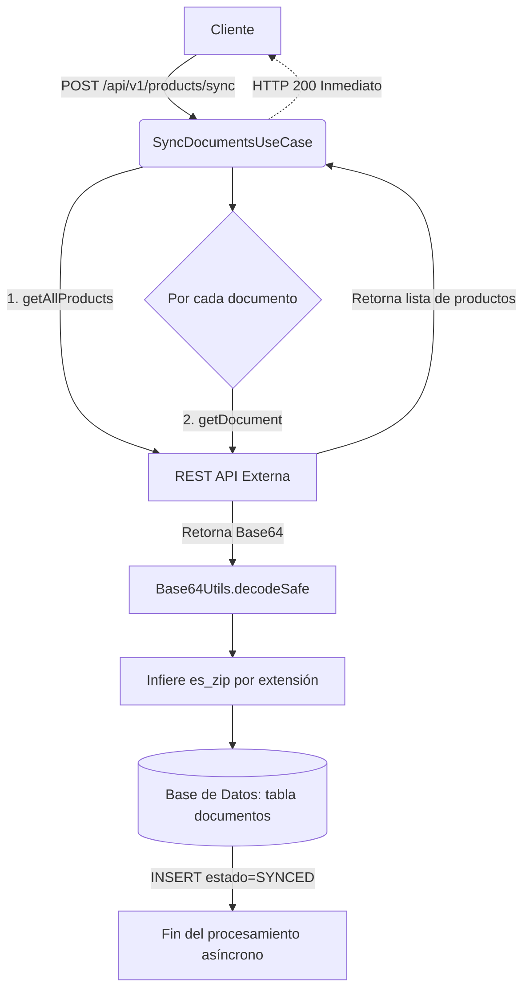
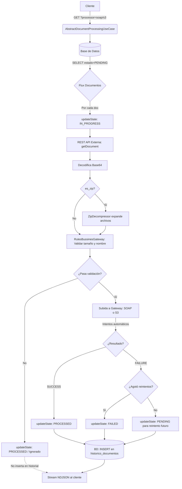
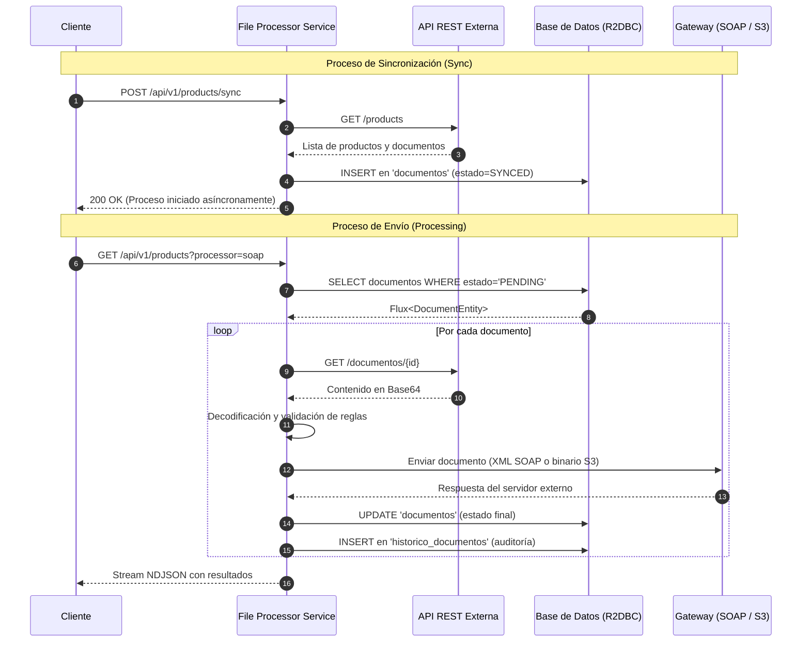
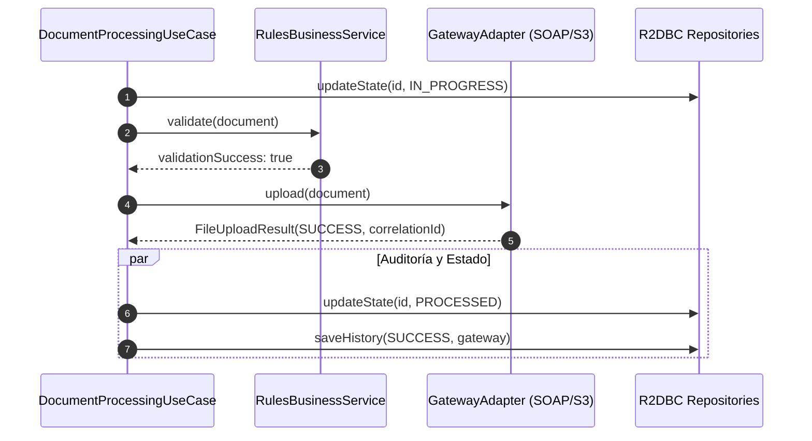
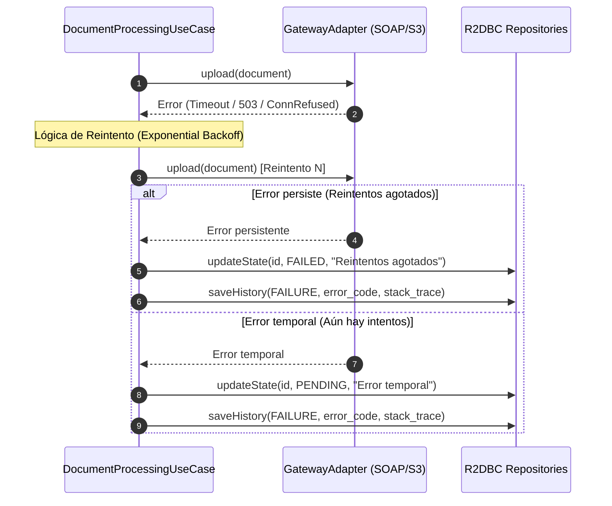

# File Processor Service

Microservicio reactivo basado en Spring WebFlux + R2DBC que obtiene productos con sus documentos asociados desde una API REST externa, los persiste en base de datos H2 (desarrollo) o PostgreSQL (produccion) y los envia a un servicio SOAP externo o AWS S3.

---

## Tabla de Contenidos

1. [Arquitectura (Clean Architecture)](#arquitectura-clean-architecture)
2. [API Endpoints](#api-endpoints)
3. [Flujo de Datos](#flujo-de-datos)
4. [Diagramas de Secuencia](#diagramas-de-secuencia)
5. [Base de Datos](#base-de-datos)
6. [Descompresion de archivos ZIP](#descompresion-de-archivos-zip)
7. [Estados de Documentos (ProductState)](#estados-de-documentos-productstate)
8. [Validacion de Documentos (RulesBussinesService)](#validacion-de-documentos-rulesbussinesservice)
9. [Escenarios de Procesamiento](#escenarios-de-procesamiento)
10. [Codigos de Error](#codigos-de-error)
11. [Trazabilidad de Envios](#trazabilidad-de-envios)
12. [Template Method Pattern](#template-method-pattern)
13. [Perfiles de Ejecucion](#perfiles-de-ejecucion)
14. [Variables de Entorno](#variables-de-entorno)
15. [Compilacion y Ejecucion](#compilacion-y-ejecucion)
16. [Ejemplos de curl](#ejemplos-de-curl)
17. [Visualizacion de Escenarios de Data en BD](#visualizacion-de-escenarios-de-data-en-bd)
18. [Excepciones](#excepciones)
19. [Testing](#testing)
20. [Reportes y Consultas SQL (Guía Administrativa)](#reportes-y-consultas-sql-guia-administrativa)

---

## Arquitectura (Clean Architecture)

El proyecto sigue **Clean Architecture** con capas estrictamente separadas. La capa de dominio es Java puro sin dependencias de frameworks. La capa de infraestructura contiene los adaptadores concretos (R2DBC, REST, SOAP, S3). La comunicacion entre capas se realiza a traves de puertos (interfaces en `port/out`).

```
com.example.fileprocessor/
├── Application.java                              # @SpringBootApplication (excluye WebMvc)
│
├── domain/                                       # Capa de dominio
│   ├── entity/
│   │   ├── DocumentHistory.java                  # Record unificado: metadatos del documento + trazabilidad de envio
│   │   ├── DocumentStatus.java                   # Enum: SUCCESS, FAILURE
│   │   ├── ProductDocumentFile.java              # Record: documento obtenido de REST API
│   │   ├── ProductDocumentHistory.java           # Record: documento (21 campos, incluye productId, isZip, pais)
│   │   ├── ProductState.java                     # Constantes de state: PENDING, IN_PROGRESS, PROCESSED, FAILED, SYNCED
│   │   ├── FileUploadRequest.java                # Request para upload a gateway (SOAP/S3)
│   │   ├── FileUploadResult.java                 # Resultado de upload con status, errorCode, correlationId
│   │   ├── HomologationResult.java               # Resultado de homologacion origin/pais
│   │   └── ExternalServiceResponse.java          # Respuesta generica de servicio externo
│   ├── usecase/
│   │   ├── AbstractDocumentProcessingUseCase.java  # Template Method base (procesa y descomprime ZIP en runtime)
│   │   ├── SoapDocumentProcessingUseCase.java       # Implementacion SOAP
│   │   ├── S3DocumentProcessingUseCase.java         # Implementacion S3
│   │   ├── SyncDocumentsUseCase.java                # Sincroniza productos y documentos (sin validacion)
│   │   └── ProcessingResultCodes.java               # Constantes de codigos de error
│   ├── service/
│   │   └── RulesBussinesService.java              # Validacion: tamano maximo, patron filename
│   ├── util/
│   │   ├── ZipDecompressor.java                   # Descompresion de ZIP con inferencia de contentType
│   │   ├── Base64Utils.java                       # Encoding/decoding seguro de Base64
│   │   └── ExceptionMapper.java                   # Centraliza mapeo de excepciones a códigos y mensajes
│   ├── port/out/
│   │   ├── DocumentHistoryRepository.java        # Puerto unificado: CRUD de documentos, consulta por state, trazabilidad
│   │   ├── ProductRestGateway.java                # Puerto: API REST externa de productos
│   │   ├── RulesBussinesGateway.java              # Puerto: validacion de documentos
│   │   ├── S3Gateway.java                         # Puerto: envio a S3
│   │   ├── SoapGateway.java                       # Puerto: envio a SOAP
│   │   └── HomologationRepository.java           # Puerto: homologacion de origin y pais (SOAP)
│   └── exception/
│       ├── DomainException.java                   # Base abstracta (RuntimeException + errorCode)
│       ├── FileValidationException.java           # Error de validacion de archivo
│       ├── InvalidBase64Exception.java            # Error de decodificacion Base64
│       └── ProcessingException.java              # Error de procesamiento (traceId + documentId)
│
├── application/                                   # Capa de aplicacion
│   └── service/config/
│       └── DomainConfig.java                      # @Configuration: beans de casos de uso
│
└── infrastructure/                                # Capa de infraestructura
    ├── config/
    │   └── ProcessorsProperties.java              # @ConfigurationProperties("app.processors")
    ├── drivenadapters/
    │   ├── r2dbc/                                 # Adaptadores reactivos R2DBC
    │   │   ├── DocumentHistoryR2dbcAdapter.java   # Implementa DocumentHistoryRepository (tabla unificada)
    │   │   ├── HomologationR2dbcAdapter.java      # Implementa HomologationRepository (cache en memoria)
    │   │   ├── entity/
    │   │   │   ├── DocumentHistoryEntity.java      # @Entity @Table("historico_documentos") — tabla unificada
    │   │   │   ├── CategoryManualEntity.java       # @Entity @Table("categoria_manual")
    │   │   │   └── CountryHomologatedEntity.java  # @Entity @Table("pais_homologado")
    │   │   ├── mapper/
    │   │   │   └── DocumentHistoryMapper.java     # DocumentHistory <-> DocumentHistoryEntity
    │   │   └── repository/
    │   │       ├── DocumentHistoryRepository.java # R2dbcRepository<DocumentHistoryEntity, Long>
    │   │       ├── CategoryManualRepository.java  # R2dbcRepository<CategoryManualEntity, Long>
    │   │       └── CountryHomologatedRepository.java # R2dbcRepository<CountryHomologatedEntity, Long>
    │   ├── restclient/
    │   │   ├── ProductRestGatewayAdapter.java     # WebClient a API REST externa (isZip inferido en dominio)
    │   │   └── dto/
    │   │       ├── ProductResponse.java            # DTO JSON de producto
    │   │       └── ProductDocumentResponse.java    # DTO JSON de documento (Base64)
    │   ├── soap/
    │   │   ├── SoapGatewayAdapter.java            # Envio SOAP con reintentos + backoff
    │   │   ├── SoapErrorCodes.java                # Constantes de error SOAP
    │   │   └── config/
    │   │       └── SoapProperties.java            # @ConfigurationProperties("app.soap")
    │   └── aws/
    │       ├── S3GatewayAdapter.java              # Envio S3 async con reintentos
    │       ├── S3ErrorCodes.java                  # Constantes de error S3
    │       └── config/
    │           ├── AwsConfig.java                 # Bean S3AsyncClient
    │           └── S3Properties.java              # @ConfigurationProperties("app.aws.s3")
    ├── entrypoints/rest/
    │   ├── ProductRoutes.java                    # Router function (WebFlux funcional)
    │   ├── handler/
    │   │   └── ProductHandler.java                # Handler de endpoints REST
    │   ├── config/
    │   │   └── DocumentRestProperties.java        # @ConfigurationProperties("app.document-rest")
    │   └── constants/
    │       ├── RestApiPaths.java                  # Rutas de la API
    │       └── ApiConstants.java                  # Constantes (headers, parametros)
    └── helpers/soap/
        ├── SoapConstants.java                   # Namespaces SOAP, templates XML
        ├── mapper/
        │   └── SoapMapper.java                   # JAXB marshalling/unmarshalling + Base64
        └── xml/
            ├── SoapEnvelopeWrapper.java         # Envoltorio SOAP con parseo DOM seguro
            └── model/
                ├── UploadFileRequest.java       # @XmlRootElement para request SOAP
                └── UploadFileResponse.java      # @XmlRootElement para response SOAP
```

### Recursos

```
src/main/resources/
├── application.yml              # Configuracion base
├── application-dev.yml         # Perfil desarrollo (DEBUG, timeouts cortos)
├── application-prod.yml         # Perfil produccion (WARN, graceful shutdown)
├── schema.sql                   # DDL para H2 (desarrollo)
└── schema-postgresql.sql         # DDL para PostgreSQL (produccion)

docs/migrations/
└── 001_create_documento_tables.sql  # DDL para la tabla unificada historico_documentos
```

---

## API Endpoints

### GET /api/v1/products

Procesa documentos pendientes desde la tabla `historico_documentos` en estado PENDING. Cada documento se obtiene de la API REST externa, se descomprime si es ZIP, se valida (nombre + tamano), y se envia al gateway (SOAP o S3).

**Headers:**
- `message-id`: (opcional) Trace ID para correlacion. Si no se envia, se genera un UUID automatico.

**Query Parameters:**
- `processor`: `soap` (default) | `s3` — Selecciona el gateway de salida.

**Response:** `Content-Type: application/x-ndjson` (NDJSON stream)
```json
{"correlationId":"corr-123","status":"SUCCESS","success":true,"processedAt":"2026-04-30T20:15:00Z","errorCode":null,"attemptCount":1}
{"correlationId":"corr-124","status":"FAILURE","success":false,"processedAt":"2026-04-30T20:15:01Z","errorCode":"GATEWAY_TIMEOUT","attemptCount":3}
```

**Errores:**
- `400 Bad Request` — Si `?processor=` tiene un valor no soportado.
- `503 Service Unavailable` — Si se solicita `?processor=s3` pero el perfil S3 no esta activo.

### POST /api/v1/products/sync

Sincroniza productos y documentos desde la API REST externa hacia la base de datos. Por cada producto se listan sus documentos, se obtiene el contenido de cada uno desde la API REST, y se persiste en la tabla `historico_documentos` con `estado=SYNCED`.

**Headers:**
- `message-id`: (opcional) Trace ID para correlacion.

**Response:** HTTP 200 (fire-and-forget — la operacion se ejecuta asincronamente)
```json
{"status":"OK","message":"Document sync initiated"}
```

### GET /actuator/health

Health check. Expone health, info, metrics, loggers y prometheus.

---

## Flujo de Datos

### Flujo de Sincronizacion (POST /api/v1/products/sync)



### Flujo de Procesamiento (GET /api/v1/products)



**Nota:** la descompresion ZIP se aplica tanto en procesamiento como en el dominio. La validacion de nombre y tamano solo se aplica en procesamiento.

---

## Diagramas de Secuencia

### Flujo General de Operaciones
Este diagrama muestra la interacción de alto nivel entre los componentes principales durante el ciclo de vida de un documento.



### Detalle de Procesamiento: Caso de Éxito
Flujo detallado de la lógica interna cuando un documento cumple todas las reglas y el servidor destino responde correctamente.



### Detalle de Procesamiento: Manejo de Errores y Reintentos
Muestra el comportamiento ante fallos temporales (reintentos) y fallos definitivos.



---

## Base de Datos

El servicio utiliza **R2DBC** (Reactive Relational Database Connectivity) para acceso no bloqueante a base de datos.

### Desarrollo: H2

En desarrollo se usa H2 en memoria con `r2dbc-h2`. El esquema se crea via `schema.sql`.

```yaml
spring:
  r2dbc:
    url: r2dbc:h2:mem:///fileprocessor;DB_CLOSE_DELAY=-1
    username: sa
    password:
  h2:
    console:
      enabled: true
      path: /h2-console
```

### Produccion: PostgreSQL

En produccion se usa PostgreSQL con `r2dbc-postgresql`. Para configurarlo, agregar la dependencia y ajustar la configuracion:

```kotlin
// build.gradle.kts
runtimeOnly("org.postgresql:r2dbc-postgresql")
runtimeOnly("org.postgresql:postgresql")
```

```yaml
spring:
  r2dbc:
    url: r2dbc:postgresql://${DB_HOST:localhost}:${DB_PORT:5432}/${DB_NAME:fileprocessor}
    username: ${DB_USER:postgres}
    password: ${DB_PASSWORD:postgres}
```

### Tabla: documentos

Almacena los metadatos y el estado actual de cada documento obtenido desde la API REST. Esta tabla representa la fuente de verdad del documento.

| Columna | Tipo | Descripcion |
|---------|------|-------------|
| `id` | BIGSERIAL (PK) | Identificador unico auto-generado |
| `id_documento` | VARCHAR(100) | ID del documento en el sistema externo |
| `id_producto` | VARCHAR(100) | ID del producto padre |
| `nombre` | VARCHAR(255) | Nombre del archivo |
| `estado` | VARCHAR(100) | Estado actual: PENDING / IN_PROGRESS / PROCESSED / FAILED / SYNCED |
| `mensaje_error` | TEXT | Mensaje de error si hubo fallo (ultimo error) |
| `es_zip` | BOOLEAN | Si es un archivo ZIP comprimido |
| `caso_uso` | VARCHAR(100) | Gateway objetivo: SOAP o S3 |
| `reintentos` | INT | Contador de intentos actuales del documento |
| `fecha_creacion` | TIMESTAMP | Fecha de creacion del registro |
| `fecha_actualizacion` | TIMESTAMP | Fecha de ultima actualizacion |

### Tabla: historico_documentos

Almacena la auditoria y trazabilidad detallada de cada intento de envio de un documento. Tiene una relacion de clave foranea hacia `documentos`.

| Columna | Tipo | Descripcion |
|---------|------|-------------|
| `id` | BIGSERIAL (PK) | Identificador unico auto-generado |
| `documento_id` | BIGINT (FK) | Referencia al documento en la tabla `documentos` |
| `nombre_archivo` | VARCHAR(255) | Nombre del archivo procesado (Se registra tanto para documentos individuales como para archivos internos de un `.zip`) |
| `operacion` | VARCHAR(50) | Operacion realizada (ej. UPLOAD_SOAP, UPLOAD_S3) |
| `resultado` | VARCHAR(50) | Resultado del intento: SUCCESS / FAILURE |
| `codigo_error` | VARCHAR(50) | Codigo de error (si fallo) |
| `mensaje_error` | TEXT | Detalle del error |
| `stack_trace` | TEXT | Pila de ejecucion del error |
| `reintentos` | INT | Numero de intento (0 = primer intento) |
| `fecha_inicio` | TIMESTAMP | Fecha de inicio de la operacion |
| `fecha_fin` | TIMESTAMP | Fecha de fin de la operacion |

### Tabla: categoria_manual

Almacena la homologacion de categorias de manuales. Se usa para resolver el `origin` de los documentos en el caso de uso SOAP usando busqueda contains.

| Columna | Tipo | Descripcion |
|---------|------|-------------|
| `id` | BIGSERIAL (PK) | Identificador unico auto-generado |
| `categoria` | VARCHAR(255) | Codigo de categoria (ej: "manual_tecnico") |
| `descripcion_manual` | VARCHAR(500) | Descripcion legible (ej: "Manual Tecnico del Producto") |
| `fecha_creacion` | TIMESTAMP | Fecha de creacion del registro |

### Tabla: pais_homologado

Almacena la homologacion de carpetas y paises mediante un Motor Reactivo Dinámico JSON.

| Columna | Tipo | Descripcion |
|---------|------|-------------|
| `id` | BIGSERIAL (PK) | Identificador unico auto-generado |
| `orden` | INT | Orden de prioridad de evaluación de la regla |
| `condicion_jsonb` | TEXT | Regla en formato JSON (soporta $eq, $contains, $in, $containsAny, etc.) |
| `carpeta_homologada` | VARCHAR(255) | Nombre de carpeta destino resultante |
| `pais_homologado` | VARCHAR(100) | Nombre de pais destino resultante |

### Tabla: productos

Almacena los productos sincronizados desde la API REST externa.

| Columna | Tipo | Descripcion |
|---------|------|-------------|
| `id` | BIGSERIAL (PK) | Identificador unico auto-generado |
| `id_producto` | VARCHAR(255) | ID del producto en el sistema externo |
| `nombre` | VARCHAR(500) | Nombre del producto |
| `fecha_carga` | TIMESTAMP | Fecha en que se cargo el producto al sistema |
| `estado` | VARCHAR(20) | Estado actual (ej. PENDING) |
| `mensaje_error` | VARCHAR(2000)| Mensaje de error si la carga o sincronizacion fallo |

### Indices

```sql
-- documentos
CREATE INDEX idx_documentos_estado ON documentos(estado);
CREATE INDEX idx_documentos_documento_id ON documentos(id_documento);
CREATE INDEX idx_documentos_producto_id ON documentos(id_producto);
CREATE INDEX idx_documentos_caso_uso ON documentos(caso_uso);

-- historico_documentos
CREATE INDEX idx_historico_documento_id ON historico_documentos(documento_id);
CREATE INDEX idx_historico_doc_operacion ON historico_documentos(documento_id, operacion, fecha_inicio DESC);

-- productos
CREATE INDEX idx_prod_estado       ON productos(estado);
CREATE INDEX idx_prod_fecha_carga  ON productos(fecha_carga);
CREATE INDEX idx_prod_producto_id  ON productos(id_producto);
CREATE INDEX idx_prod_carga_estado ON productos(fecha_carga, estado);

-- categoria_manual
CREATE INDEX idx_cat_categoria_vigencia ON categoria_manual (categoria, fecha_vigencia);

-- pais_homologado
CREATE INDEX idx_pais_orden ON pais_homologado(orden);
```
    
### DDL Completo

```sql
-- ============================================================================
-- Tabla: documentos
-- Almacena metadatos de documentos obtenidos.
-- ============================================================================
CREATE TABLE IF NOT EXISTS documentos (
    id BIGSERIAL PRIMARY KEY,
    id_documento VARCHAR(100) NOT NULL,
    id_producto VARCHAR(100) NOT NULL,
    nombre VARCHAR(255),
    estado VARCHAR(100) NOT NULL,
    mensaje_error TEXT,
    es_zip BOOLEAN DEFAULT FALSE,
    caso_uso VARCHAR(100),
    reintentos INT DEFAULT 0,
    fecha_creacion TIMESTAMP NOT NULL DEFAULT CURRENT_TIMESTAMP,
    fecha_actualizacion TIMESTAMP NOT NULL DEFAULT CURRENT_TIMESTAMP
);

CREATE INDEX IF NOT EXISTS idx_documentos_estado ON documentos(estado);
CREATE INDEX IF NOT EXISTS idx_documentos_documento_id ON documentos(id_documento);
CREATE INDEX IF NOT EXISTS idx_documentos_producto_id ON documentos(id_producto);
CREATE INDEX IF NOT EXISTS idx_documentos_caso_uso ON documentos(caso_uso);

-- ============================================================================
-- Tabla: historico_documentos
-- Almacena auditoria y trazabilidad de cada intento de envio.
-- ============================================================================
CREATE TABLE IF NOT EXISTS historico_documentos (
    id BIGSERIAL PRIMARY KEY,
    documento_id BIGINT NOT NULL,
    nombre_archivo VARCHAR(255),
    operacion VARCHAR(50),
    resultado VARCHAR(50),
    codigo_error VARCHAR(50),
    mensaje_error TEXT,
    stack_trace TEXT,
    reintentos INT NOT NULL DEFAULT 0,
    fecha_inicio TIMESTAMP,
    fecha_fin TIMESTAMP,
    FOREIGN KEY (documento_id) REFERENCES documentos(id)
);

CREATE INDEX IF NOT EXISTS idx_historico_documento_id ON historico_documentos(documento_id);
CREATE INDEX IF NOT EXISTS idx_historico_doc_operacion ON historico_documentos(documento_id, operacion, fecha_inicio DESC);

-- ============================================================================
-- Tabla: productos
-- Almacena productos sincronizados desde la API REST externa.
-- ============================================================================
CREATE TABLE IF NOT EXISTS productos (
    id              BIGSERIAL       PRIMARY KEY,
    id_producto     VARCHAR(255)    NOT NULL,
    nombre          VARCHAR(500)    NOT NULL,
    fecha_carga     TIMESTAMP       NOT NULL DEFAULT NOW(),
    estado          VARCHAR(20)     NOT NULL DEFAULT 'PENDING',
    mensaje_error   VARCHAR(2000)
);

CREATE INDEX IF NOT EXISTS idx_prod_estado       ON productos (estado);
CREATE INDEX IF NOT EXISTS idx_prod_fecha_carga  ON productos (fecha_carga);
CREATE INDEX IF NOT EXISTS idx_prod_producto_id  ON productos (id_producto);
CREATE INDEX IF NOT EXISTS idx_prod_carga_estado ON productos (fecha_carga, estado);

-- ============================================================================
-- Tabla: categoria_manual
-- Homologacion de categorias de manuales para resolucion de origin en SOAP.
-- ============================================================================
CREATE TABLE IF NOT EXISTS categoria_manual (
    id                  BIGSERIAL       PRIMARY KEY,
    categoria           VARCHAR(255)    NOT NULL UNIQUE,
    descripcion_manual  VARCHAR(500)    NOT NULL,
    fecha_vigencia      DATE,
    fecha_creacion      TIMESTAMP       NOT NULL DEFAULT NOW()
);

CREATE INDEX IF NOT EXISTS idx_cat_categoria_vigencia ON categoria_manual(categoria, fecha_vigencia);

-- ============================================================================
-- Tabla: pais_homologado
-- Motor reactivo dinámico para resolver carpeta y pais homologado usando JSON.
-- ============================================================================
CREATE TABLE IF NOT EXISTS pais_homologado (
    id                  BIGSERIAL       PRIMARY KEY,
    orden               INT             NOT NULL,
    condicion_jsonb     TEXT,
    carpeta_homologada  VARCHAR(255),
    pais_homologado     VARCHAR(100)
);

CREATE INDEX IF NOT EXISTS idx_pais_orden ON pais_homologado(orden);
```


---

## Homologacion de Categoria, Origin y Pais (SOAP)

El caso de uso SOAP realiza una homologacion de la `categoria` del documento, así como de la carpeta (`originFolder`) y el país (`originCountry`) antes de enviarlo.

### 1. Homologacion de Categoria (Por Prefijo)

La homologacion de la categoria del documento se hace buscando por prefijo sobre el ID del documento:
1. Se itera sobre las categorias (`categoria_manual`) cargadas en cache.
2. Si el ID del documento inicia con el prefijo (`prefijo`) de la categoria, se usa el valor de `categoria_homologado`.

```
Documento.businessDocumentId = "MAN-12345"
        │
        ▼
Busca en categoria_manual por prefijo
        │
        ▼
categoriaDocument = "Manual Tecnico del Producto"
```

### 2. Homologacion de Origin y Pais (Motor JSON)

La homologacion de la carpeta de origen y el país se realiza utilizando un **Motor Reactivo Dinámico JSON** configurado en la tabla `pais_homologado`.

```
Documento.originFolder = "garantia"
Documento.originCountry = "colombia"
        │
        ▼
Itera sobre pais_homologado en memoria ordenados por 'orden'
        │
        ▼
Evalua JSON: {"originFolder": {"$containsAny": ["garantia"]}, "originCountry": {"$containsAny": ["colomb", "co"]}}
        │
        ▼
Match!
        │
        ▼
HomologationResult.carpeta = "Manuales Garantía"
HomologationResult.pais = "Colombia"
```

El evaluador JSON interno (`JsonRuleEvaluator`) procesa el árbol de condiciones sobre los atributos del documento. Se soportan los siguientes operadores:

- `$eq`: Igualdad exacta (ignorando mayúsculas/minúsculas).
- `$contains`: Contiene el substring.
- `$regex`: Cumple con la expresión regular.
- `$in`: Coincide con cualquiera de los valores en la lista.
- `$containsAny`: Contiene al menos uno de los substrings en la lista.

Las reglas se evalúan de forma secuencial de acuerdo al campo `orden`. Cuando la primera regla hace *match*, se retornan los valores de `carpeta_homologada` y `pais_homologado` y se cortocircuita el proceso.

### Cache en Memoria

`HomologationR2dbcAdapter` carga todas las categorias y reglas JSON una sola vez en listas _thread-safe_ al primer acceso. Las consultas siguientes usan la caché en memoria sin volver a acceder a la base de datos. La caché se carga de forma _lazy_ (perezosa).

### Datos de Ejemplo

```sql
-- Categoria manual (Por Prefijo de Documento)
INSERT INTO categoria_manual (prefijo, categoria_homologado) VALUES
('MAN', 'Manual Tecnico del Producto'),
('USR', 'Manual de Usuario');

-- Pais y Carpeta homologado (Motor JSON)
INSERT INTO pais_homologado (orden, condicion_jsonb, carpeta_homologada, pais_homologado) VALUES 
(10, '{"originFolder": {"$containsAny": ["garantia", "oficina"]}, "originCountry": {"$containsAny": ["colomb", "co"]}}', 'Manuales Garantía', 'Colombia'),
(20, '{"originFolder": {"$containsAny": ["user", "usuario"]}, "originCountry": {"$containsAny": ["mex", "mx"]}}', 'Manuales de Usuario', 'México'),
(9999, '{}', 'Otros / No Catalogado', 'Internacional / Sin Asignar');
```

### Acceso a Consola H2 (solo desarrollo)

- **URL:** `http://localhost:8080/h2-console`
- **JDBC URL:** `jdbc:h2:mem:fileprocessor`
- **User:** `sa`
- **Password:** (vacio)

### Consultas SQL utiles

```sql
-- Ver todos los registros (metadatos y trazabilidad)
SELECT * FROM historico_documentos ORDER BY fecha_creacion DESC;

-- Ver solo metadatos de documentos (estado actual)
SELECT * FROM historico_documentos WHERE caso_uso IS NULL;

-- Ver trazabilidad de un documento especifico
SELECT * FROM historico_documentos WHERE id_documento = 'doc-123' AND caso_uso IS NOT NULL;

-- Ver solo envios por SOAP
SELECT * FROM historico_documentos WHERE caso_uso = 'SOAP';

-- Ver envios con reintentos > 0
SELECT * FROM historico_documentos WHERE reintentos > 0 ORDER BY fecha_creacion DESC;

-- Ver documentos pendientes de procesamiento
SELECT * FROM historico_documentos WHERE estado = 'PENDING' AND caso_uso IS NULL;

-- Ver documentos fallidos
SELECT * FROM historico_documentos WHERE estado = 'FAILED' AND caso_uso IS NULL;

-- Ver documentos descomprimidos de un ZIP
SELECT * FROM historico_documentos WHERE nombre_zip_padre = 'documents.zip';

-- Contar envios por caso de uso y resultado
SELECT caso_uso, resultado, COUNT(*) FROM historico_documentos WHERE caso_uso IS NOT NULL GROUP BY caso_uso, resultado;

-- Ver ultimo reintento de cada documento por caso de uso
SELECT h.*
FROM historico_documentos h
JOIN (
  SELECT id_documento, caso_uso, MAX(fecha_creacion) as max_fecha
  FROM historico_documentos
  WHERE caso_uso IS NOT NULL
  GROUP BY id_documento, caso_uso
) latest ON h.id_documento = latest.id_documento AND h.caso_uso = latest.caso_uso AND h.fecha_creacion = latest.max_fecha;
```

---

## Descompresion de archivos ZIP

`ZipDecompressor.decompress()` expande documentos ZIP. Se aplica durante la sincronizacion (sync) y el procesamiento.

### Inferencia de isZip

`isZip` se infiere de la extension del archivo en la capa de dominio (`ProductDocumentHistory.isZip()`).

### Comportamiento durante Sync

| Escenario | Resultado |
|-----------|-----------|
| Documento normal (`isZip=false`) | Se guarda tal cual en `historico_documentos` |
| Documento ZIP (`isZip=true`) | Primero se guarda el ZIP con `nombre_zip_padre=NULL`, luego cada archivo expandido se guarda con `nombre_zip_padre=filename_del_zip` |

### Inferencia de contentType

| Extension | ContentType |
|-----------|-------------|
| `.pdf` | `application/pdf` |
| `.csv` | `text/csv` |
| `.txt` | `text/plain` |
| `.docx` | `application/vnd.openxmlformats-officedocument.wordprocessingml.document` |
| `.xlsx` | `application/vnd.openxmlformats-officedocument.spreadsheetml.sheet` |
| otra | `application/octet-stream` |

### Ejemplo

Un documento ZIP con `id_documento=doc-1` y `nombre=documents.zip` que contiene `test.pdf` y `data.csv`:

```
ZIP: doc-1/documents.zip (isZip=true)
  ├── documents.zip  → id_documento="doc-1", nombre_zip_padre=null, isZip=true
  ├── test.pdf       → id_documento="doc-1/test.pdf", nombre_zip_padre="documents.zip", isZip=false
  └── data.csv       → id_documento="doc-1/data.csv", nombre_zip_padre="documents.zip", isZip=false
```

---

## Estados de Documentos (ProductState)

```java
public final class ProductState {
    public static final String PENDING     = "PENDING";     // Esperando procesamiento
    public static final String IN_PROGRESS = "IN_PROGRESS"; // En procesamiento actual
    public static final String PROCESSED   = "PROCESSED";   // Enviado exitosamente
    public static final String FAILED      = "FAILED";      // Agoto reintentos o fallo permanente
    public static final String SYNCED      = "SYNCED";      // Sincronizado desde REST API, listo para procesar
}
```

### Transiciones de State

```
               sync
                 │
                 ▼
              [SYNCED]          ← sincronizado, en tabla historico_documentos
                 │
                 │  (luego estado=PENDING)
                 ▼
             [PENDING]
                 │
                 │  executePendingDocuments()
                 ▼
          [IN_PROGRESS]
                 │
        ┌────────┴────────┐
        ▼                 ▼
    [PROCESSED]        [FAILED]
    (envio OK)     (reintentos agotados)
```

---

## Validacion de Documentos (RulesBussinesService)

`RulesBussinesService` implementa validacion **solo durante el procesamiento**:

### Procesamiento (Processing)

Se aplica durante `GET /api/v1/products`. Valida tanto el **tamano maximo** como el **patron de nombre de archivo**. Si un documento no pasa la validacion, se marca como `PROCESSED` (skip) sin enviarse al gateway.

| Regla | Processing |
|-------|------------|
| **Tamano maximo** | Omite si `doc.size() > max` |
| **Patron filename** | Omite si no coincide |

### Configuracion por defecto

```yaml
app:
  processors:
    s3:
      max-file-size-bytes: 52428800        # 50 MB
      filename-pattern: ".*\\.(pdf|csv)$"
    soap:
      max-file-size-bytes: 10485760        # 10 MB
      filename-pattern: ".*\\.(pdf|docx|txt)$"
```

### Reintentos en Gateway

Ambos gateways (SOAP y S3) implementan reintentos automaticos con backoff.

**SOAP Gateway:**
- Reintentos: `app.soap.retry-attempts` (default: 3)
- Backoff: 500ms fijo
- Condiciones reintentables: HTTP 503, 502, 504, 429, `TimeoutException`, `ConnectException`

**S3 Gateway:**
- Reintentos: `app.aws.s3.retry-attempts` (default: 3)
- Backoff: `app.aws.s3.retry-backoff-millis` (default: 500ms)
- Condiciones reintentables: `TimeoutException`, `SdkException`

---

## Escenarios de Procesamiento

### 1. Exitoso
```
Documento PENDING → IN_PROGRESS
uploadDocument() → SUCCESS
saveHistory() → INSERT en historico_documentos (resultado=SUCCESS, reintentos=0, caso_uso=SOAP/S3)
updateState()  → Actualiza fila de metadatos: estado=PROCESSED
Stream: {"success":true, "status":"SUCCESS"}
```

### 2. Error en Gateway (con reintentos)
```
uploadDocument() → exception
handleUploadError() → getRetryCount() desde historico_documentos
saveHistory() → INSERT en historico_documentos (resultado=FAILURE, reintentos=N, caso_uso=SOAP/S3)
updateState():
  - Si reintentos < 3: estado=PENDING (se reintentara)
  - Si reintentos >= 3: estado=FAILED
Stream: {"success":false, "status":"FAILURE", "errorCode":"GATEWAY_TIMEOUT", "retry":3}
```

### 3. Documento ZIP
```
Sync/Processing: isZip=true → ZipDecompressor.decompress()
           → Cada archivo expandido se procesa independientemente
           → Se guardan en tabla historico_documentos con estado=PENDING o se envian al gateway
```

### 4. Error en Descompresion ZIP
```
ZipDecompressor.decompress() → ProcessingException(INVALID_ZIP)
saveHistory() → INSERT en historico_documentos (errorCode=INVALID_ZIP)
documento no se guarda / no se procesa
```

### 5. Error de Base64
```
Base64Utils.decodeSafe() → InvalidBase64Exception(INVALID_BASE64)
saveHistory() → INSERT en historico_documentos (errorCode=INVALID_BASE64)
documento no se guarda / no se procesa
```

---

## Visualizacion de Escenarios de Data en BD

Para entender como se registran los eventos en la base de datos, a continuacion se muestran ejemplos visuales de los datos guardados bajo distintos escenarios. El diseño se compone de dos tablas separadas: `documentos` (estado actual) e `historico_documentos` (trazabilidad y auditoria).

### 1. Escenario Exitoso (Primer intento)
El documento `doc-1` se envia correctamente a SOAP en su primer intento.

**Tabla: `documentos`**

| id | id_documento | estado | caso_uso |
|----|--------------|--------|----------|
| 1  | doc-1        | PROCESSED | SOAP  |

**Tabla: `historico_documentos`**

| id | documento_id | operacion | resultado | codigo_error | reintentos |
|----|--------------|-----------|-----------|--------------|------------|
| 1  | 1            | UPLOAD_SOAP | SUCCESS   | *NULL*       | 0          |

### 2. Escenario de Fallo Temporal (Reintento en progreso)
El documento `doc-2` fallo por un timeout en el gateway S3. Su estado en `documentos` vuelve a `PENDING` para ser reintentado.

**Tabla: `documentos`**

| id | id_documento | estado | caso_uso |
|----|--------------|--------|----------|
| 2  | doc-2        | PENDING   | S3       |

**Tabla: `historico_documentos`**

| id | documento_id | operacion | resultado | codigo_error | reintentos |
|----|--------------|-----------|-----------|--------------|------------|
| 2  | 2            | UPLOAD_S3 | FAILURE   | GATEWAY_TIMEOUT | 0       |

### 3. Escenario de Fallo Permanente (Reintentos agotados)
El documento `doc-3` fallo repetidamente al enviarse por SOAP. Despues de llegar al limite de reintentos (ej. 3 intentos = reintento 0, 1 y 2), el estado final es `FAILED` permanente.

**Tabla: `documentos`**

| id | id_documento | estado | caso_uso |
|----|--------------|--------|----------|
| 3  | doc-3        | FAILED    | SOAP     |

**Tabla: `historico_documentos`**

| id | documento_id | operacion | resultado | codigo_error | reintentos |
|----|--------------|-----------|-----------|--------------|------------|
| 3  | 3            | UPLOAD_SOAP | FAILURE   | BAD_GATEWAY  | 0          |
| 4  | 3            | UPLOAD_SOAP | FAILURE   | BAD_GATEWAY  | 1          |
| 5  | 3            | UPLOAD_SOAP | FAILURE   | BAD_GATEWAY  | 2          |

### 4. Escenario ZIP (Descompresion parcial)
Un archivo ZIP `docs.zip` contiene `a.pdf` y `b.csv`. `a.pdf` se procesa correctamente, pero `b.csv` falla permanentemente.

**Tabla: `documentos`**

| id | id_documento | es_zip | estado | caso_uso |
|----|--------------|--------|--------|----------|
| 4  | docs.zip     | true   | SYNCED | *NULL*   |
| 5  | doc-4/a.pdf  | false  | PROCESSED | SOAP |
| 6  | doc-4/b.csv  | false  | FAILED | SOAP     |

**Tabla: `historico_documentos`**

| id | documento_id | operacion | resultado | codigo_error | reintentos |
|----|--------------|-----------|-----------|--------------|------------|
| 6  | 5            | UPLOAD_SOAP | SUCCESS   | *NULL*       | 0          |
| 7  | 6            | UPLOAD_SOAP | FAILURE   | INVALID_FILE | 0          |

### 5. Escenario de Sincronización Inicial (Recién Obtenido)
El documento `doc-5` acaba de ser obtenido mediante el endpoint de `sync`. Se registra con estado `SYNCED` y aún no ha sido procesado por ningún gateway.

**Tabla: `documentos`**

| id | id_documento | estado | caso_uso |
|----|--------------|--------|----------|
| 7  | doc-5        | SYNCED    | *NULL*   |

*(No hay registros en `historico_documentos` para este documento todavía)*

### 6. Escenario Ignorado (Validación Fallida)
El documento `doc-6` supera el límite de tamaño permitido. El sistema marca el metadato como `PROCESSED` (para no reprocesarlo iterativamente).

**Tabla: `documentos`**

| id | id_documento | estado | caso_uso |
|----|--------------|--------|----------|
| 8  | doc-6        | PROCESSED | *NULL*   |

*(No hay registros en `historico_documentos` ya que no se intentó enviar al Gateway)*

### 7. Escenario de Error Crítico Interno (Ej. Base64 inválido)
El documento `doc-7` se obtiene correctamente, pero su contenido Base64 es corrupto o no se puede decodificar. Se deja el registro de fallo en la BD.

**Tabla: `documentos`**

| id | id_documento | estado | caso_uso |
|----|--------------|--------|----------|
| 9  | doc-7        | FAILED    | SOAP     |

**Tabla: `historico_documentos`**

| id | documento_id | operacion | resultado | codigo_error | reintentos |
|----|--------------|-----------|-----------|--------------|------------|
| 8  | 9            | UPLOAD_SOAP | FAILURE   | INVALID_BASE64| 0         |

---

## Codigos de Error

### Errores de Dominio (ProcessingResultCodes)

Definidos en `domain/usecase/ProcessingResultCodes.java`:

| Codigo | Descripcion |
|--------|------------|
| `EMPTY_CONTENT` | Documento sin contenido |
| `INVALID_BASE64` | Fallo al decodificar Base64 |
| `INVALID_RESPONSE` | Respuesta SOAP invalida o malformada |
| `INVALID_ZIP` | Archivo ZIP corrupto o invalido |
| `UNKNOWN_ERROR` | Error no categorizado |
| `SSL_ERROR` | Error de certificado SSL/TLS |

### Errores de Gateway SOAP (SoapErrorCodes)

Definidos en `infrastructure/drivenadapters/soap/SoapErrorCodes.java`:

| Codigo | Disparador |
|--------|-----------|
| `GATEWAY_TIMEOUT` | `TimeoutException` en HTTP call |
| `BAD_GATEWAY` | `WebClientResponseException` (respuesta HTTP no exitosa) |
| `SERVICE_UNAVAILABLE` | `ConnectException` |
| `UNKNOWN_ERROR` | `IOException` u otras excepciones no previstas |

### Errores de Gateway S3 (S3ErrorCodes)

Definidos en `infrastructure/drivenadapters/aws/S3ErrorCodes.java`:

| Codigo | Disparador |
|--------|-----------|
| `GATEWAY_TIMEOUT` | `TimeoutException` en operacion S3 |
| `BAD_GATEWAY` | Error generico de gateway |
| `CLIENT_ERROR` | Error 4xx generico |
| `ACCESS_DENIED` | S3Exception con status 403 |
| `NOT_FOUND` | S3Exception con status 404 |
| `SERVICE_UNAVAILABLE` | S3Exception 503, SdkException, throttling |
| `UNKNOWN_ERROR` | Cualquier otra excepcion no mapeada |

## Seguimiento, Estados y Reintentos (Guía Funcional)

Para garantizar que no se pierda información y saber exactamente qué pasó con cada documento enviado, el sistema lleva un registro en dos niveles: un **"Expediente Principal"** (vista global) y una **"Bitácora Detallada"** (vista minuciosa). Esto es especialmente útil cuando se procesan paquetes (archivos `.zip`) que contienen múltiples documentos adentro.

### 1. Expediente Principal (Tabla `documentos`)
Esta es la vista general. Muestra cómo va el trámite completo del paquete que se subió, sin entrar a ver el historial de cada archivo pequeño. 

- **¿En qué estado está el paquete? (`estado`)**
  - **Pendiente (`PENDING`)**: El paquete está en fila esperando su turno para ser procesado, o tuvo un problema temporal (como una caída de internet) y el sistema lo volverá a intentar más tarde.
  - **En Progreso (`IN_PROGRESS`)**: El sistema está trabajando con los archivos en este momento.
  - **Procesado (`PROCESSED`)**: Todo fue un éxito. Todos los documentos dentro del paquete llegaron a su destino.
  - **Fallido (`FAILED`)**: El sistema intentó enviarlo varias veces (agotó todas sus oportunidades) y no pudo por un problema de conexión recurrente.
  - **Rechazado (`BUSINESS_REJECTION`)**: Fue rechazado porque no cumple con las reglas del negocio (por ejemplo, el documento pesa más de lo permitido o no es válido). El sistema no lo volverá a intentar porque requiere que una persona corrija el archivo.
- **Contador de intentos generales (`reintentos`)**: Indica cuántas "oportunidades" o ciclos generales le ha dado el sistema a este paquete. Solo suma +1 cuando el paquete entero falla y pasa a estado Pendiente para intentar en el futuro.
- **Mensaje de Error**: Un resumen fácil de leer sobre cuál fue el problema principal.

### 2. Bitácora Detallada (Tabla `historico_documentos`)
Esta es la vista con lupa. Es un diario que anota cada pequeño paso que da el sistema. **Nunca se borra nada**, y se agregan nuevas líneas para saber exactamente qué pasó, cuándo y cuántas veces para cada envío.

- **Nombre exacto del archivo (`nombre_archivo`)**: Se registra tanto para los documentos individuales (no-zip) como para cada uno de los archivos internos extraídos si el original es un `.zip` (por ejemplo: `cedula.pdf` o `contrato.pdf`). Esto asegura una visibilidad total de los nombres de los archivos procesados.
- **Resultado de cada envío**: Indica el resultado del intento en ese momento (Exitoso, Error o Rechazado).
- **Intentos rápidos o internos (`reintentos`)**: Si el sistema nota que la red falló al intentar realizar un envío, hará intentos rápidos e inmediatos (por ejemplo, hasta 3 reintentos). En esta bitácora verás registrado **cada uno de los intentos** por separado (intento 1, 2, 3, etc.), demostrando la trazabilidad completa del procesamiento de cada archivo.
- **Detalle del problema (`mensaje_error`)**: La respuesta o código de error exacto retornado por el destino externo para ese intento en específico.

### ¿Cómo funciona en la práctica cuando procesas documentos y paquetes (.zip)?

Imagina que procesas un paquete llamado `documentos_cliente.zip` que contiene dos archivos: `cedula.pdf` y `contrato.pdf`.

1. **Apertura del paquete:** El sistema abre el `.zip` automáticamente en memoria y toma los archivos para enviarlos individualmente.
2. **Intentos individuales (Registro en la Bitácora Detallada):**
   - El sistema intenta enviar `cedula.pdf`. Falla por un pequeño corte de red (intento 1). Automáticamente insiste. El segundo intento falla (intento 2). El tercer intento tiene éxito (intento 3). La **Bitácora Detallada** registrará 3 líneas:
     - *`cedula.pdf` | Error | Intento 1 | GATEWAY_TIMEOUT*
     - *`cedula.pdf` | Error | Intento 2 | GATEWAY_TIMEOUT*
     - *`cedula.pdf` | Éxito | Intento 3 | SUCCESS*
   - Luego, intenta enviar `contrato.pdf`. Sube exitosamente a la primera. La **Bitácora** registra:
     - *`contrato.pdf` | Éxito | Intento 1 | SUCCESS*
3. **Decisión Final (Expediente Principal):**
   Al terminar de intentar con todos los archivos, el sistema actualiza la vista global (tabla `documentos`). Si todos los archivos llegaron a su destino final, el paquete completo pasa a **Procesado (`PROCESSED`)**. Si algún archivo del paquete quedó en error reintentable después de todos sus reintentos automáticos, el paquete completo vuelve a **Pendiente (`PENDING`)** para una próxima vuelta del scheduler.
4. **La segunda vuelta (El reintento):**
   Más tarde, el sistema vuelve a tomar el expediente. Los contadores rápidos de la Bitácora Detallada inician de nuevo desde 1 para esta nueva ejecución, y cada intento fallido o exitoso se vuelve a anexar con su correspondiente fecha y hora.

### Escenarios Prácticos de Ejemplo

Para entender mejor cómo se actualizan el Expediente Principal y la Bitácora Detallada, veamos 4 escenarios comunes:

#### Escenario 1: El escenario ideal (Éxito a la primera)
Subes un paquete `.zip` con 2 archivos: `foto.png` y `contrato.pdf`.
*   **Qué pasa en el sistema**: Ambos archivos se envían correctamente al primer intento.
*   **Bitácora Detallada**: Muestra 2 líneas (una por archivo) indicando Éxito en el intento 1.
*   **Expediente Principal**: Pasa a estado **Procesado (`PROCESSED`)** con contador general en 1.

#### Escenario 2: Tropezón rápido (Falla temporal y recuperación)
Subes el paquete, pero justo en el momento de enviarlo, hay una pequeña pérdida de conexión en la red.
*   **Qué pasa en el sistema**: `foto.png` falla, el sistema lo reintenta rapidísimo por segunda vez, y ahí sí funciona.
*   **Bitácora Detallada**:
    *   Línea 1: `foto.png` / Error / Intento 1
    *   Línea 2: `foto.png` / Éxito / Intento 2
*   **Expediente Principal**: Como al final sí se logró enviar, el paquete pasa a estado **Procesado (`PROCESSED`)** y su contador general se queda en 1. A los ojos del negocio, todo fluyó sin requerir la intervención del ciclo largo del día siguiente.

#### Escenario 3: Problemas de reglas (Rechazo Permanente)
Subes un `.zip`, pero `contrato.pdf` está dañado o pesa demasiado (por ejemplo, 100MB).
*   **Qué pasa en el sistema**: El sistema ni siquiera intenta enviarlo, o el servidor destino lo rechaza inmediatamente por violar una política.
*   **Bitácora Detallada**: Muestra 1 línea para ese archivo indicando **Rechazado (`BUSINESS_REJECTION`)** en el intento 1.
*   **Expediente Principal**: Automáticamente el paquete entero se marca como **Rechazado (`BUSINESS_REJECTION`)**. El sistema se detiene y no volverá a intentar enviar este paquete automáticamente, porque requiere que un analista humano corrija el documento.

#### Escenario 4: Caída total (Requiere segunda vuelta de negocio)
Subes el `.zip` con los 2 archivos, pero el servidor destino está completamente caído por un mantenimiento no avisado.
*   **Qué pasa en el sistema (Hoy)**:
    *   `foto.png` intenta subir, falla 3 veces rápidas.
    *   `contrato.pdf` intenta subir, falla 3 veces rápidas.
*   **Bitácora Detallada (Hoy)**: Se crean 6 líneas en total (intentos 1, 2 y 3 para cada archivo) marcando Error.
*   **Expediente Principal (Hoy)**: El sistema se rinde por hoy. Pasa a estado **Pendiente (`PENDING`)** y su contador general sube a 2.
*   **Qué pasa en el sistema (Mañana)**: El sistema automático toma de nuevo el expediente 2. El servidor ya fue arreglado y todo fluye.
*   **Bitácora Detallada (Mañana)**: Se agregan 2 nuevas líneas de Éxito en el intento 1 (el contador rápido siempre inicia en 1 al empezar una nueva vuelta global).
*   **Expediente Principal (Mañana)**: Finalmente pasa a **Procesado (`PROCESSED`)**, dejando muy claro en su historia que tomó 2 ciclos largos de negocio lograrlo.

---

## Template Method Pattern

El patron se implementa en `AbstractDocumentProcessingUseCase`:

```
AbstractDocumentProcessingUseCase
│
├── executePendingDocuments()           ← FINAL (template method)
│   ├── historyRepository.findByState("PENDING")  → BD (tabla historico_documentos)
│   ├── historyRepository.updateState(docId, "IN_PROGRESS", null)
│   ├── Por cada documento:
│   │   ├── productRestGateway.getDocument(productId, docId) → REST externa
│   │   ├── toProductDocument(file) → ProductDocumentHistory
│   │   ├── Si isZip=true → ZipDecompressor.decompress() expande entradas
│   │   ├── documentValidator.validate(doc, true) → validacion nombre + tamano
│   │   ├── uploadDocument()       → ABSTRACT (SOAP o S3)
│   │   ├── handleUploadSuccess() o handleUploadError() → INSERT trazabilidad + UPDATE metadatos
│   │   └── historyRepository.updateState(docId, estado, mensaje_error)
│   │
│
├── uploadDocument()                     ← ABSTRACT
│   └── buildFileUploadRequest()         ← helper protegido
│
├── handleUploadError(Throwable)          ← helper protegido (reusable por subclases)
│
├── SoapDocumentProcessingUseCase
│   └── uploadDocument() → HomologationRepository.resolve() → SoapGateway.send()
│
└── S3DocumentProcessingUseCase
    └── uploadDocument() → S3Gateway.send()
```

### Subclases

**SoapDocumentProcessingUseCase** — Envia documentos via SOAP con homologacion de origin y pais. Bean definido en `DomainConfig`.

**S3DocumentProcessingUseCase** — Envia documentos via S3. Bean condicional (`@ConditionalOnBean(S3Gateway.class)`) definido en `DomainConfig`. Se usa `ObjectProvider` en el handler para manejar su disponibilidad opcional.

---

## Perfiles de Ejecucion

### Perfil default (SOAP)

Activo sin argumentos adicionales. Usa `SoapGatewayAdapter` para envio de documentos.

```bash
./gradlew bootRun
```

### Perfil S3

Activado con `-Ps3`. Habilita `S3GatewayAdapter` y `AwsConfig`. Usa LocalStack (`localhost:4566`) con path-style access por defecto.

```bash
./gradlew bootRun -Ps3
```

Configuracion del perfil S3 en `application.yml`:
```yaml
spring:
  config:
    activate:
      on-profile: s3
app:
  aws:
    s3:
      endpoint: http://localhost:4566
      path-style-access: true
```

### Perfil dev

Sobrescribe configuraciones para desarrollo local. Timeouts cortos y logging DEBUG.

```bash
./gradlew bootRun --args='--spring.profiles.active=dev'
```

```yaml
# application-dev.yml
logging:
  level:
    com.example.fileprocessor: DEBUG
    org.springframework.web.reactive: DEBUG
    reactor.netty: DEBUG
app:
  soap:
    endpoint: "http://localhost:9000/soap/fileservice"
    timeout-seconds: 5
    retry-attempts: 1
  document-rest:
    endpoint: "http://localhost:3001"
    timeout-seconds: 5
```

### Perfil prod

Optimizado para produccion. Logging WARN, graceful shutdown de 30s.

```bash
./gradlew bootRun --args='--spring.profiles.active=prod'
```

```yaml
# application-prod.yml
logging:
  level:
    com.example.fileprocessor: WARN
    org.springframework.web.reactive: WARN
server:
  shutdown: graceful
  lifecycle:
    timeout-per-shutdown-phase: 30s
app:
  soap:
    timeout-seconds: 15
    retry-attempts: 2
```

---

## Variables de Entorno

| Variable | Default | Descripcion |
|----------|---------|-------------|
| `DOCUMENT_REST_ENDPOINT` | `http://localhost:3001` | URL base de la API REST de productos |
| `SOAP_ENDPOINT` | `http://localhost:9000/soap/fileservice` | Endpoint del servicio SOAP |
| `AWS_BUCKET` | `documents-bucket` | Nombre del bucket S3 |
| `AWS_REGION` | `us-east-1` | Region AWS |
| `AWS_ACCESS_KEY` | (vacio) | AWS Access Key (opcional, usa DefaultCredentialsProvider si no se setea) |
| `AWS_SECRET_KEY` | (vacio) | AWS Secret Key (opcional) |
| `DB_HOST` | `localhost` | Host de PostgreSQL (solo prod) |
| `DB_PORT` | `5432` | Puerto de PostgreSQL |
| `DB_NAME` | `fileprocessor` | Nombre de base de datos PostgreSQL |
| `DB_USER` | `postgres` | Usuario de PostgreSQL |
| `DB_PASSWORD` | `postgres` | Password de PostgreSQL |

---

## Compilacion y Ejecucion

### Requisitos

- Java 21+
- Gradle 8.12+ (wrapper incluido)

### Comandos

```bash
# Compilar
./gradlew build

# Solo compilar sin tests
./gradlew assemble

# Ejecutar tests unitarios
./gradlew test

# Ejecutar tests de mutacion (PiTest, umbral 60%)
./gradlew pitest

# Reporte de cobertura (JaCoCo, umbral 75%)
./gradlew jacocoTestReport

# Ejecutar (perfil default: SOAP)
./gradlew bootRun

# Ejecutar con perfil S3
./gradlew bootRun -Ps3

# Ejecutar con perfil dev
./gradlew bootRun --args='--spring.profiles.active=dev'
```

---

## Ejemplos de curl

```bash
# Sincronizar productos y documentos desde API REST a BD
curl -X POST http://localhost:8080/api/v1/products/sync \
  -H "message-id: my-trace-123"

# Sincronizar productos y documentos desde API REST a BD filtrando por rango de fechas de cargue
curl -X POST "http://localhost:8080/api/v1/products/sync?date_init=2026-05-01&date_end=2026-05-27" \
  -H "message-id: my-trace-123"

# Procesar documentos pendientes via SOAP
curl "http://localhost:8080/api/v1/products?processor=soap" \
  -H "message-id: my-trace-456"

# Procesar documentos pendientes via S3
curl "http://localhost:8080/api/v1/products?processor=s3" \
  -H "message-id: my-trace-789"

# Health check
curl -s http://localhost:8080/actuator/health | jq .

# Metricas Prometheus
curl -s http://localhost:8080/actuator/prometheus
```

---

## Excepciones

### Jerarquia

```
RuntimeException
 └── DomainException (abstract)
      ├── errorCode: String
      ├── FileValidationException    → error de validacion de archivo
      ├── InvalidBase64Exception     → error de decodificacion Base64
      └── ProcessingException        → error de procesamiento
           ├── traceId: String
           ├── documentId: String
           └── metodos factory:
               - withTraceId(message, errorCode, traceId)
               - withTraceId(message, errorCode, traceId, cause)
               - fromContext(ctx, message, errorCode)
               - fromContext(ctx, message, errorCode, documentId)
```

### ProcessingException

Los metodos factory extraen automaticamente el `traceId` del contexto reactivo via `ContextView`. La excepcion formatea el mensaje como:

```
{mensaje} [traceId={traceId}]
```

`HEADER_TRACE_ID = "message-id"` es la clave usada para leer/escribir el traceId en el contexto reactivo.

---

## Testing

### Estructura de tests

Los tests siguen la misma estructura de paquetes que `src/main`, bajo `src/test/java/com/example/fileprocessor/`.

### Frameworks

- **JUnit 5** + **Mockito** + **Reactor Test** (`StepVerifier`)
- **MockWebServer** (OkHttp) para simular API REST externa en tests de integracion
- **PiTest** para mutation testing (umbral de mutantes matados: 60%)
- **JaCoCo** para cobertura de codigo (umbral: 75%)

### Ejecutar tests

```bash
# Unit tests
./gradlew test

# Mutation tests
./gradlew pitest

# Coverage report
./gradlew jacocoTestReport
```

### Validación E2E Local (Mocks)

El proyecto incluye un script de pruebas End-to-End (`testing/mocks/e2e_validation.sh`) que automatiza el levantamiento del microservicio, simula las APIs externas y valida el procesamiento completo bajo múltiples escenarios.

#### ¿Cómo funciona?
El proceso de validación sigue estos pasos de manera secuencial y desatendida:

1. **Inicia Servidores Simulados (Mocks):** Ejecuta en segundo plano `mocks.py` para levantar un servidor REST local (puerto 3001) que simula la API externa de productos, y un servidor SOAP local (puerto 9000) que simula el Gateway receptor.
2. **Levanta el Microservicio:** Inicia el File Processor Service bajo el perfil de desarrollo (`dev`), de forma que quede conectado a los servidores locales.
3. **Fase de Sincronización:** Se dispara una petición a `POST /api/v1/products/sync`. Esto fuerza al microservicio a consumir los más de 20 escenarios preparados en el mock (documentos exitosos, pesados, extensiones no permitidas, errores en base64, archivos ZIP, etc.).
4. **Fase de Procesamiento Masivo:** Llama a `GET /api/v1/products?processor=soap` para que el sistema empiece a procesar la cola. El script espera pacientemente **2.5 minutos (150 segundos)** para dar tiempo a que ocurran todos los reintentos asíncronos programados por *exponential backoff* en aquellos casos donde el mock SOAP forzó fallos temporales (HTTP 500, 503, 504, 429).
5. **Generación de Reportes Visuales:** Al culminar el tiempo de espera, se extrae el volcado completo de la base de datos H2 en memoria mediante un endpoint de debug. Luego, utiliza `format_tables.py` para formatear los resultados en tablas de consola fáciles de leer, las cuales son agregadas al final del archivo `testing/mocks/ms.log`.
6. **Limpieza (Cleanup):** Finalmente, destruye todos los procesos locales (el microservicio y los mocks) de forma segura.

#### Ejecución en Windows

Dado que es un script Bash (`.sh`), Windows no puede ejecutarlo directamente desde CMD o PowerShell clásico. Debes usar:

1. **Git Bash (Recomendado):** Haz clic derecho en la carpeta raíz del proyecto, selecciona "Open Git Bash here" y ejecuta: 
   ```bash
   ./testing/mocks/e2e_validation.sh
   ```
2. **WSL (Windows Subsystem for Linux):** Abre tu terminal WSL, navega a la carpeta del proyecto y ejecuta: 
   ```bash
   ./testing/mocks/e2e_validation.sh
   ```

*Nota:* Es requisito indispensable tener **Python 3** instalado en Windows (y agregado a las variables de entorno PATH) ya que el script utiliza `mocks.py` y `format_tables.py`. Al finalizar la prueba, puedes abrir el archivo `testing/mocks/ms.log` para ver el reporte detallado.

---

## Stack Tecnologico

| Componente | Tecnologia |
|-----------|------------|
| **Framework** | Spring Boot 3.3.5 + WebFlux |
| **Lenguaje** | Java 21 |
| **Build** | Gradle 8.12.1 (Kotlin DSL) |
| **Base de datos (dev)** | H2 (embebida) |
| **Base de datos (prod)** | PostgreSQL |
| **Acceso a datos** | R2DBC + Spring Data R2DBC |
| **API REST externa** | WebClient (no bloqueante) |
| **Gateway SOAP** | WebClient + JAXB + DOM |
| **Gateway S3** | AWS SDK S3 Async (Netty) |
| **Observabilidad** | Micrometer Tracing (Brave) + Prometheus |
| **Validacion SOAP** | JAXB (jakarta.xml.bind) + DOM Parser seguro |
| **Testing** | JUnit 5, Mockito, Reactor Test, MockWebServer |
| **Calidad** | JaCoCo, PiTest (mutation testing) |

---

## Reportes y Consultas SQL (Guía Administrativa)

Esta sección contiene consultas SQL optimizadas para la base de datos del microservicio (H2 en desarrollo, PostgreSQL en producción). Los reportes están diseñados para ser interpretados por personal administrativo, convirtiendo los códigos de error técnicos en descripciones claras en lenguaje de negocios.

### 1. Reporte de Documentos Rechazados por Reglas de Negocio
Este reporte muestra los documentos que fueron rechazados porque no cumplen con las políticas del negocio (como tamaño límite superado, extensión de archivo inválida o contenido vacío). Estos casos **requieren corrección del archivo** y no se solucionan con reintentos de red.

```sql
SELECT 
    d.id_documento AS "Código del Documento",
    h.nombre_archivo AS "Nombre del Archivo",
    d.sucursal AS "Sucursal",
    CASE h.codigo_error
        WHEN 'PATTERN_MISMATCH' THEN 'Formato de archivo no permitido (extensión o tipo MIME incorrecto)'
        WHEN 'SIZE_EXCEEDED' THEN 'El archivo supera el tamaño máximo permitido'
        WHEN 'INVALID_BASE64' THEN 'El contenido del archivo está corrupto (decodificación Base64 fallida)'
        WHEN 'EMPTY_CONTENT' THEN 'El archivo está vacío (0 bytes)'
        WHEN 'DECOMPRESSION_ERROR' THEN 'El archivo comprimido ZIP está corrupto o protegido con contraseña'
        ELSE 'Incumplimiento de regla de negocio general'
    END AS "Motivo del Rechazo",
    h.fecha_fin AS "Fecha de Rechazo"
FROM documentos d
JOIN historico_documentos h ON d.id = h.documento_id
WHERE d.estado = 'BUSINESS_REJECTION' 
   OR h.codigo_error IN ('PATTERN_MISMATCH', 'SIZE_EXCEEDED', 'INVALID_BASE64', 'EMPTY_CONTENT', 'DECOMPRESSION_ERROR')
ORDER BY h.fecha_fin DESC;
```

---

### 2. Reporte de Fallos de Envío o Conexión (Errores de API)
Este reporte lista las transacciones que fallaron debido a problemas en los servidores externos de origen o destino (como caídas de red, indisponibilidad del servicio SOAP/S3 o timeouts).

```sql
SELECT 
    d.id_documento AS "Código del Documento",
    h.nombre_archivo AS "Nombre del Archivo",
    d.caso_uso AS "Canal de Envío (SOAP/S3)",
    d.sucursal AS "Sucursal",
    h.reintentos AS "Intento de Envío",
    CASE h.codigo_error
        WHEN 'GATEWAY_TIMEOUT' THEN 'Tiempo de espera agotado (el servidor destino tardó demasiado en responder)'
        WHEN 'BAD_GATEWAY' THEN 'Error en el servidor de destino (respondió con error técnico 5xx)'
        WHEN 'SERVICE_UNAVAILABLE' THEN 'El servicio externo está fuera de línea temporalmente'
        WHEN 'SOURCE_NOT_FOUND' THEN 'El documento no existe en el sistema que origina el archivo (Error 404)'
        WHEN 'SOURCE_RATE_LIMIT' THEN 'Saturación en el origen (Límite de peticiones por minuto sumado)'
        WHEN 'DEST_BAD_REQUEST' THEN 'Los datos del documento fueron rechazados por el destino (Error 400)'
        WHEN 'DEST_UNAUTHORIZED' THEN 'Problema de acceso (Credenciales o permisos incorrectos en el destino)'
        WHEN 'UNKNOWN_ERROR' THEN 'Error de sistema no clasificado'
        ELSE 'Fallo de comunicación con la API'
    END AS "Descripción del Problema",
    h.mensaje_error AS "Detalle Técnico para Soporte",
    h.fecha_fin AS "Fecha del Fallo"
FROM documentos d
JOIN historico_documentos h ON d.id = h.documento_id
WHERE h.resultado = 'FAILURE'
  AND h.codigo_error NOT IN ('PATTERN_MISMATCH', 'SIZE_EXCEEDED', 'INVALID_BASE64', 'EMPTY_CONTENT', 'DECOMPRESSION_ERROR')
ORDER BY h.fecha_fin DESC;
```

---

### 3. Panel de Control General (Resumen para Administrativos)
Esta consulta genera un estado consolidado y limpio de todos los documentos y paquetes procesados, facilitando el seguimiento del estado del trámite de manera no técnica.

```sql
SELECT 
    d.id_documento AS "Documento Principal",
    COALESCE(h.nombre_archivo, d.nombre) AS "Nombre del Archivo",
    d.sucursal AS "Sucursal",
    CASE 
        WHEN d.estado = 'PROCESSED' THEN 'Completado con Éxito'
        WHEN d.estado = 'BUSINESS_REJECTION' THEN 'Rechazado (Requiere corregir archivo)'
        WHEN d.estado = 'FAILED' THEN 'Fallido Definitivo (Error de Conexión)'
        WHEN d.estado = 'PENDING' THEN 'En Espera (Pendiente de procesar o reintentar)'
        WHEN d.estado = 'IN_PROGRESS' THEN 'En Proceso de Envío'
        ELSE d.estado
    END AS "Estado del Trámite",
    CASE 
        WHEN h.resultado = 'SUCCESS' THEN 'Ninguna (Trámite finalizado con éxito)'
        WHEN h.codigo_error IN ('PATTERN_MISMATCH', 'SIZE_EXCEEDED', 'INVALID_BASE64', 'EMPTY_CONTENT', 'DECOMPRESSION_ERROR') 
            THEN 'Revisar y corregir archivo (tamaño, nombre o formato) y volver a subir'
        ELSE 'Esperar reintento automático de red o reportar a soporte técnico'
    END AS "Acción Requerida",
    d.fecha_actualizacion AS "Última Actualización"
FROM documentos d
LEFT JOIN (
    SELECT documento_id, nombre_archivo, resultado, codigo_error, fecha_fin,
           ROW_NUMBER() OVER (PARTITION BY documento_id, nombre_archivo ORDER BY fecha_fin DESC) as rn
    FROM historico_documentos
) h ON d.id = h.documento_id AND h.rn = 1
ORDER BY d.fecha_actualizacion DESC;
```
