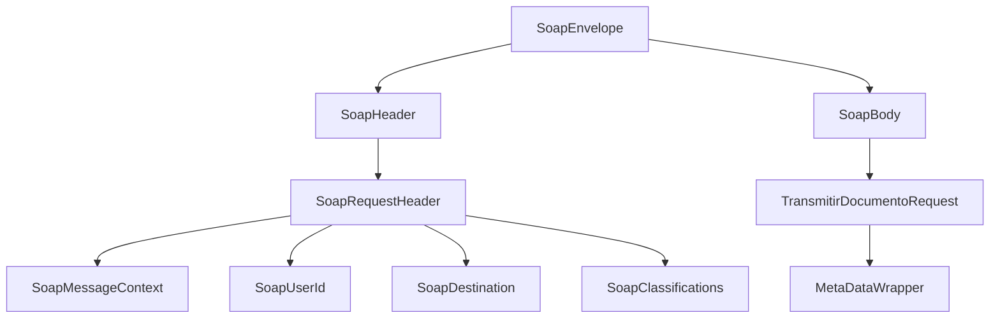

# Plan de Optimización: Generación de Mensajes SOAP

Este documento detalla el análisis y la propuesta de mejora para la generación del sobre XML (SOAP Envelope) en el servicio File Processor, con el objetivo de maximizar el rendimiento y reducir la presión sobre el Garbage Collector (GC).

## 1. Fase 0: Limpieza Selectiva

Para garantizar una arquitectura limpia, eliminaremos únicamente la lógica de procesamiento dinámico, conservando las clases de modelo como "Fuente de Verdad" para la estructura.

### Tabla de Ajustes:
| Componente | Acción | Motivo |
| :--- | :--- | :--- |
| `Modelos (@Xml)` | **CONSERVAR** | Definen la estructura y el tipado del contrato. |
| `JaxbConfig.java` | **CONSERVAR** | Provee el contexto para generar la plantilla al inicio. |
| `SoapEnvelopeWrapper.java`| **Eliminar** | Lógica de unwrap será simplificada. |
| `SoapMapper (Viejo)` | **Refactorizar** | Se cambiará Marshalling dinámico por Plantilla Híbrida. |

---

## 2. Estrategia Final: Plantilla Física (.xml) Reutilizable

Este enfoque es el más mantenible y rápido. Separamos la estructura (XML) de la lógica (Java).

### Flujo de Operación:
1.  **Carga y Pre-configuración (Boot):** Al arrancar, el `SoapMapper` lee el archivo `src/main/resources/templates/soap-envelope.xml` y reemplaza los valores fijos (namespaces, credenciales, etc.).
2.  **Inyección Dinámica (Runtime):** Por cada petición, solo se reemplazan los datos del archivo y el bloque de metadatos, garantizando una latencia mínima.
3.  **Mantenibilidad:** Cualquier cambio en la estructura SOAP se hace directamente en el archivo XML sin necesidad de recompilar lógica compleja.

---

## 3. Estructura de Clases Final (Target State)

Tras la limpieza y optimización, el paquete de infraestructura para SOAP quedará simplificado de la siguiente manera:

```text
infrastructure.helpers.soap
├── config
│   └── SoapProperties.java       (Configuración desde application.yml)
├── constants
│   └── SoapConstants.java        (Constantes de texto y logs)
├── mapper
│   └── SoapMapper.java           (Lógica de construcción de plantilla y mapeo)
└── templates
    └── SoapTemplateProvider.java (Opcional: Repositorio de la plantilla XML estática)
```

> [!IMPORTANT]
> Los paquetes `xml` y `xml.model` desaparecen por completo, eliminando más de 15 clases redundantes.

---

## 4. Estado Actual: Marshalling con JAXB (Referencia Histórica)

Actualmente, el servicio utiliza **JAXB (Jakarta XML Binding)** para generar el XML de salida.

### Proceso por cada petición:
1.  **Instanciación:** Creación de un árbol completo de objetos Java (`SoapEnvelope`, `SoapHeader`, `SoapBody`, `TransmitirDocumentoRequest`, etc.).
2.  **Traducción:** El `Marshaller` de JAXB recorre el árbol mediante reflexión y genera el texto XML.
3.  **Conversión Base64:** El contenido del archivo se convierte a un `String` Base64 intermedio antes de ser procesado por JAXB.

### Limitaciones Identificadas:
*   **Alto Consumo de Memoria:** Se crean cientos de objetos efímeros que deben ser limpiados por el GC inmediatamente después del envío.
*   **Overhead de Procesamiento:** JAXB realiza validaciones y procesamientos de anotaciones que son innecesarios cuando la estructura del XML es fija.
*   **Escalabilidad:** Con archivos de gran tamaño (>10MB), la duplicidad de Strings (Base64 + XML final) puede causar errores de `OutOfMemoryError`.

---

## 2. Propuesta: JAXB-Generated Template (Híbrido)

La propuesta consiste en mantener la seguridad de las clases anotadas con `@Xml` pero eliminar el costo de ejecución recurrente.

### Estrategia:
1.  **Generación de Plantilla (Startup):** Al iniciar la aplicación, se genera un XML "esqueleto" usando JAXB con valores de relleno (tokens).
2.  **Inyección Dinámica (Runtime):** Para cada petición real, se toma la plantilla y se reemplazan los tokens mediante `StringBuilder` y `String.replace`.

### Mapa de Jerarquía de Clases:


---

## 3. Estrategia Refinada: Estructura Permanente y Cuerpo Dinámico

Tras el análisis, se establece que la **estructura base y la cabecera son permanentes**. Esto simplifica drásticamente el proceso.

### Definición de Permanencia:
*   **Cabecera Estática:** Los valores como `systemId`, `userId`, `destination` y `classification` se inyectan **una sola vez** durante la fase de inicialización (boot) desde el `application.yml`.
*   **Cuerpo Dinámico:** Únicamente los campos dentro de `<v1:transmitirDocumentoRequest>` (`subTipoDocumental`, `nombreArchivo`, `archivo`) se inyectan en tiempo de ejecución por cada petición.
*   **Traceability:** El `messageId` (traceId) y el `timestamp` se tratarán como marcadores fijos en la cabecera que se reemplazan rápidamente, pero el resto del bloque `Header` es inmutable.

### Proceso de Construcción Optimizado:
1.  **Boot:** Se construye el String XML completo de la cabecera y el envoltorio del cuerpo.
2.  **Runtime:** Solo se realiza el "concatenado" o reemplazo de los 3-5 campos variables del cuerpo.

---

## 4. Beneficios Esperados

1.  **Reducción del Tiempo de Respuesta:** Mejora estimada del 40-60% en la fase de construcción del mensaje.
2.  **Menor Huella de Memoria:** Reducción drástica de la creación de objetos efímeros (Zero-Object Allocation en la estructura).
3.  **Estabilidad:** Prevención de latencias causadas por "Stop-the-world" del Garbage Collector durante picos de carga.
4.  **Mantenibilidad:** La estructura sigue definida en clases Java con `@Xml`, facilitando cambios futuros sin editar XMLs manuales.

---

## 5. Referencia del XML Resultante

Este es el formato completo del XML que la nueva implementación debe generar, incluyendo bloques opcionales:

```xml
<?xml version="1.0" encoding="UTF-8" standalone="yes"?>
<soapenv:Envelope 
    xmlns:soapenv="http://example.com/header" 
    xmlns:v2="http://example.com/body" 
    xmlns:v1="http://schemas.xmlsoap.org/soap/envelope/">
    <soapenv:Header>
        <v2:requestHeader>
            <systemId>{properties.systemId}</systemId>
            <messageId>{traceId}</messageId>
            <timestamp>{ISO_INSTANT_NOW}</timestamp>
            <!-- Solo si properties.messageContext no está vacío -->
            <messageContext>
                <property>
                    <key>{key}</key>
                    <value>{value}</value>
                </property>
            </messageContext>
            <!-- Solo si properties.userName no es nulo/vacío -->
            <userId>
                <userName>{properties.userName}</userName>
                <userToken>{properties.userToken}</userToken>
            </userId>
            <!-- Solo si properties.destinationName no es nulo/vacío -->
            <destination>
                <name>{properties.destinationName}</name>
                <namespace>{properties.destinationNamespace}</namespace>
                <operation>{properties.destinationOperation}</operation>
            </destination>
            <!-- Solo si properties.classifications no está vacío -->
            <classifications>
                <classification>{value}</classification>
            </classifications>
        </v2:requestHeader>
    </soapenv:Header>
    <soapenv:Body>
        <v1:transmitirDocumentoRequest>
            <subTipoDocumental>{request.subTipoDocumental}</subTipoDocumental>
            <nombreArchivo>{request.filename}</nombreArchivo>
            <archivo>{BASE64_DEL_CONTENIDO}</archivo>
            <!-- Solo si properties.metaData no está vacío -->
            <metaData>
                <tiposMetaData>
                    <nombre>{key}</nombre>
                    <valor>{value}</valor>
                </tiposMetaData>
            </metaData>
        </v1:transmitirDocumentoRequest>
    </soapenv:Body>
</soapenv:Envelope>
```

---

## 6. Configuración Dinámica (Externalización)

Para evitar el "hardcoding" de URLs de namespaces en el código o en la plantilla, estas se externalizarán a través del archivo `application.yml`.

### Estructura sugerida en YAML:
```yaml
adapter:
  soap:
    namespaces:
      envelope: "http://example.com/header"
      body: "http://example.com/body"
      standard: "http://schemas.xmlsoap.org/soap/envelope/"
      destination: "http://example.com/destination-url"
    classification: "VALOR_UNICO_CONFIGURABLE" # Cambio a variable única
```

### Implementación:
*   Los valores se cargarán en la clase `SoapProperties`.
*   Al generar la plantilla JAXB inicial, se utilizarán estos valores dinámicos, asegurando que el XML resultante siempre coincida con el entorno configurado.

---

## 7. Implementación de Referencia (Bajo Nivel)

Para mayor claridad técnica, se detallan los archivos core que conforman la nueva arquitectura.

### A. Plantilla XML (`src/main/resources/templates/soap-envelope.xml`)
```xml
<?xml version="1.0" encoding="UTF-8"?>
<soapenv:Envelope xmlns:soapenv="{{ns_envelope}}" xmlns:v2="{{ns_body}}" xmlns:v1="{{ns_standard}}">
    <soapenv:Header>
        <v2:requestHeader>
            <systemId>{{systemId}}</systemId>
            <messageId>{{traceId}}</messageId>
            <timestamp>{{timestamp}}</timestamp>
            <userId>
                <userName>{{userName}}</userName>
                <userToken>{{userToken}}</userToken>
            </userId>
            <destination>
                <name>{{destName}}</name>
                <namespace>{{destNs}}</namespace>
                <operation>{{destOp}}</operation>
            </destination>
            <classifications>
                <classification>{{classification}}</classification>
            </classifications>
        </v2:requestHeader>
    </soapenv:Header>
    <soapenv:Body>
        <v1:transmitirDocumentoRequest>
            <subTipoDocumental>{{subTipo}}</subTipoDocumental>
            <nombreArchivo>{{filename}}</nombreArchivo>
            <archivo>{{base64Content}}</archivo>
        </v1:transmitirDocumentoRequest>
    </soapenv:Body>
</soapenv:Envelope>
```

### B. Constantes (`SoapConstants.java`)
```java
public final class SoapConstants {
    public static final String T_NS_ENV      = "{{ns_envelope}}";
    public static final String T_NS_BODY     = "{{ns_body}}";
    public static final String T_NS_STD      = "{{ns_standard}}";
    public static final String T_TRACE_ID    = "{{traceId}}";
    public static final String T_TIMESTAMP   = "{{timestamp}}";
    public static final String T_SYSTEM_ID   = "{{systemId}}";
    public static final String T_USER_NAME   = "{{userName}}";
    public static final String T_USER_TOKEN  = "{{userToken}}";
    public static final String T_DEST_NAME   = "{{destName}}";
    public static final String T_DEST_NS     = "{{destNs}}";
    public static final String T_DEST_OP     = "{{destOp}}";
    public static final String T_CLASS       = "{{classification}}";
    public static final String T_SUBTYPE     = "{{subTipo}}";
    public static final String T_FILENAME    = "{{filename}}";
    public static final String T_CONTENT     = "{{base64Content}}";
}
```

### C. Motor de Mapeo (`SoapMapper.java`)
```java
@Component
public class SoapMapper {
    private final SoapProperties props;
    private String baseTemplate;

    @PostConstruct
    public void init() throws IOException {
        Resource resource = new ClassPathResource("templates/soap-envelope.xml");
        String raw = StreamUtils.copyToString(resource.getInputStream(), StandardCharsets.UTF_8);

        this.baseTemplate = raw
            .replace(SoapConstants.T_NS_ENV, props.namespaces().envelope())
            .replace(SoapConstants.T_NS_BODY, props.namespaces().body())
            .replace(SoapConstants.T_NS_STD, props.namespaces().standard())
            .replace(SoapConstants.T_SYSTEM_ID, props.systemId())
            .replace(SoapConstants.T_USER_NAME, props.userName())
            .replace(SoapConstants.T_USER_TOKEN, props.userToken())
            .replace(SoapConstants.T_DEST_NAME, props.destinationName())
            .replace(SoapConstants.T_DEST_NS, props.namespaces().destination())
            .replace(SoapConstants.T_DEST_OP, props.destinationOperation())
            .replace(SoapConstants.T_CLASS, props.classification());
    }

    public String buildEnvelope(FileUploadRequest request, String traceId) {
        return this.baseTemplate
            .replace(SoapConstants.T_TRACE_ID, traceId)
            .replace(SoapConstants.T_TIMESTAMP, Instant.now().toString())
            .replace(SoapConstants.T_SUBTYPE, request.getSubTipoDocumental())
            .replace(SoapConstants.T_FILENAME, request.getFilename())
            .replace(SoapConstants.T_CONTENT, Base64.getEncoder().encodeToString(request.getContent()));
    }
}
```

---

## 8. Seguridad y Sanitización de Datos

Al utilizar una plantilla de texto, se pierde el escapado automático de JAXB. Para prevenir inyecciones de XML o errores de sintaxis por caracteres especiales, se implementará la siguiente lógica de sanitización:

### Método de Escape:
Se aplicará un reemplazo de los 5 caracteres reservados de XML antes de cualquier inyección en la plantilla:
*   `&` -> `&amp;`
*   `<` -> `&lt;`
*   `>` -> `&gt;`
*   `"` -> `&quot;`
*   `'` -> `&apos;`

### Campos Afectados:
*   `traceId`
*   `filename`
*   `subTipoDocumental`
*   Valores dinámicos de metadatos.

> [!IMPORTANT]
> El contenido en **Base64** no requiere escapado, ya que su alfabeto es totalmente compatible con la sintaxis XML.

---
**Autor:** Antigravity AI
**Fecha:** 2026-05-11
