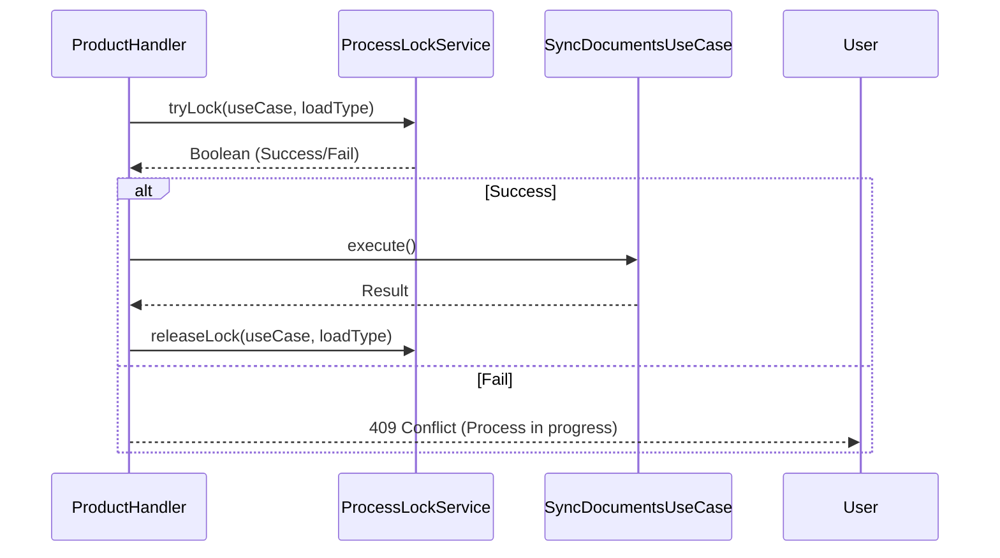

# Guía Técnica de Implementación: Tipos de Cargue y Monitoreo

## 1. Capa de Infraestructura: Base de Datos (Auditoría de Entidades)

Se requiere la siguiente sincronización para soportar la segmentación por `DIARIO`/`HISTORICO` y `caso_uso`:

### 1.1. `DocumentEntity.java` (Sincronización Pendiente)
*   **Acción:** Agregar campo `tipo_cargue` (Load Type).
*   **Mapeo:** `@Column("tipo_cargue") private String loadType;`

### 1.2. `ProductEntity.java` (Recreación Requerida)
*   **Acción:** Crear la entidad para segmentar productos maestros por tipo de cargue local.

### 1.3. `ProcessLockEntity.java` (Nueva)
*   **Propósito:** Semáforo reactivo para control de concurrencia.

---

## 2. Capa de Dominio: Contexto y Maestros

### 2.1. `ApiConstants.java`
*   **Keys:** `CONTEXT_LOAD_TYPE`, `CONTEXT_USE_CASE`.

### 2.2. `ProductMasterGateway.java` (Transición API -> DB)
*   **Motivo:** La fuente de productos ya no es una API REST, sino una **Base de Datos Maestra** externa.
*   **Acción:** Reemplazar el adaptador REST por un adaptador R2DBC que consulte la base de datos maestra.

### 2.3. Propagación de Contexto
El flujo debe ser: 
1. `ProductHandler` captura query params (`loadType`, `useCase`).
2. `contextWrite` inyecta los valores en el pipeline.
3. `DocumentR2dbcAdapter` recupera del contexto para filtrar el `findAll`.

---

## 3. Control de Concurrencia (ProcessLockService)

---

## 4. Próximos Pasos (Priorizados)

1.  **Sincronización de Entidades:** Actualizar `DocumentEntity` y crear `ProductEntity` / `ProcessLockEntity`.
2.  **Product Master Adapter:** Implementar el nuevo adaptador R2DBC para la base de datos maestra.
3.  **Locking Service:** Implementar `ProcessLockService`.
4.  **Refactor de Handlers:** Actualizar `ProductHandler` para usar el nuevo flujo `GET`.
