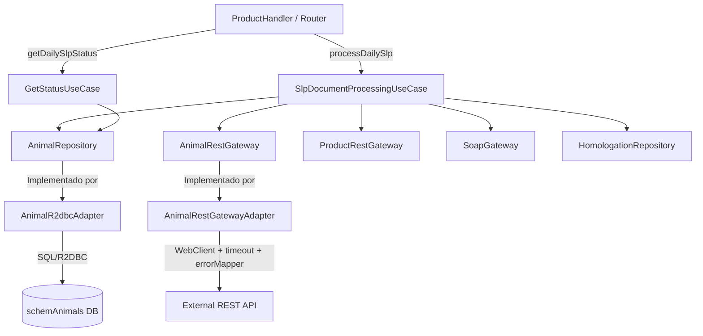

# Auditoría del Plan de Integración — `plan_integracion_animales.md`

> Fecha de auditoría: 2026-07-07  
> Revisado contra el código fuente base del proyecto.

---

## Resumen Ejecutivo

Se identificaron **12 hallazgos** distribuidos en categorías: números mágicos, variables sin uso, código muerto, inconsistencias estructurales y mejoras de diseño. Todos los hallazgos vienen acompañados de la propuesta de corrección aplicable directamente al plan.

---

## H-01 · Números Mágicos en `traverse()` ⚠️ ALTA

**Archivo**: `SlpDocumentProcessingUseCase.java` · Línea del plan ~186

```java
// ❌ Antes
if (node.getSource() != null && (node.getSource() == 1 || node.getSource() == 2 || node.getSource() == 4)) {
```

Los valores `1`, `2` y `4` son **números mágicos**: su significado de negocio no es evidente sin contexto. Si los valores cambian en el futuro, habría que buscarlos manualmente en el código.

**Corrección**: Definir una constante de dominio en la misma clase o en una clase de constantes del dominio.

```java
// ✅ Después
private static final Set<Integer> VALID_SOURCES = Set.of(1, 2, 4);

private void traverse(DirectoryNode node, List<DirectoryNode> result) {
    if (node == null) return;
    if (node.getSource() != null && VALID_SOURCES.contains(node.getSource())) {
        result.add(node);
    }
    if (node.getChildren() != null) {
        for (DirectoryNode child : node.getChildren()) {
            traverse(child, result);
        }
    }
}
```

---

## H-02 · Número Mágico `0L` en `FileUploadRequest.from()` ⚠️ ALTA

**Archivo**: `SlpDocumentProcessingUseCase.java` · Línea del plan ~216

```java
// ❌ Antes
FileUploadRequest uploadReq = FileUploadRequest.from(historyDTO, 0L, homologation);
```

El `0L` representa un `docId` interno de base de datos que no existe para el flujo SLP (porque no viene de la tabla `documentos` del esquema principal). Sin embargo, pasar `0L` silenciosamente puede causar inconsistencias si `FileUploadRequest` o futuras implementaciones de `SoapGateway` asumen que `docId > 0` es válido.

**Corrección**: Declarar una constante semántica o usar `null` explícito si el campo es opcional:

```java
// ✅ Después
private static final Long NO_DB_DOC_ID = null; // El flujo SLP no tiene doc_id en BD local

FileUploadRequest uploadReq = FileUploadRequest.from(historyDTO, NO_DB_DOC_ID, homologation);
```

> Verificar que `FileUploadRequest.from()` maneje `docId = null` correctamente (actualmente acepta `Long` que sí admite null).

---

## H-03 · String Mágico `"UNKNOWN"` como filename en el handler de errores ⚠️ ALTA

**Archivo**: `SlpDocumentProcessingUseCase.java` · Línea del plan ~233

```java
// ❌ Antes
.filename("UNKNOWN")
```

El literal `"UNKNOWN"` debería ser una constante del dominio para evitar discrepancias si se usa en más de un lugar (comparaciones, filtros en reportes, logs).

**Corrección**:
```java
// ✅ Después
// En una clase de constantes del dominio (o en SlpDocumentProcessingUseCase):
private static final String FILENAME_UNKNOWN = "UNKNOWN";

.filename(FILENAME_UNKNOWN)
```

---

## H-04 · Strings Mágicos de Estado `"SUCCESS"`, `"FAILED"`, `"ERROR"` ⚠️ ALTA

**Archivos**: `SlpDocumentProcessingUseCase.java` (~línea 223, 234) y `GetStatusUseCase.java` (~línea 578–584)

```java
// ❌ Antes — múltiples strings literales dispersos
.status(response.isSuccess() ? "SUCCESS" : "FAILED")
.status("ERROR")
if ("PENDING".equals(status) || "IN_PROGRESS".equals(status)) ...
else if ("SUCCESS".equals(status)) ...
```

El proyecto ya tiene `ProcessingResultCodes` como enum de estados. Los nuevos estados `SUCCESS`, `FAILED` y `ERROR` para animales deberían estar representados de igual forma, bien sea reutilizando `ProcessingResultCodes` o creando un `AnimalProcessingStatus` enum dedicado.

**Corrección**:
```java
// ✅ Opción A — reutilizar ProcessingResultCodes si son semánticamente equivalentes
.status(response.isSuccess() ? ProcessingResultCodes.SUCCESS.name() : ProcessingResultCodes.FAILURE.name())

// ✅ Opción B — nuevo enum dedicado
public enum AnimalProcessingStatus {
    PENDING, IN_PROGRESS, SUCCESS, FAILED, ERROR;
}
```

---

## H-05 · Variable `successCount` sin uso en `getDailySlpProcessStatus()` 🔴 MEDIA

**Archivo**: `GetStatusUseCase.java` (sección 3.4 del plan)

```java
// ❌ successCount se declara y acumula pero NUNCA se lee
long successCount = 0;
...
} else if ("SUCCESS".equals(status)) {
    successCount += count;  // ← acumulado pero nunca usado en la lógica final
}

long total = successCount + pendingCount + errorCount; // ← único uso: construir el total
```

`successCount` no se usa directamente en ninguna rama de retorno. La lógica sólo evalúa `total == 0`, `pendingCount > 0` y `errorCount > 0`. El valor es implícito via `total`.

**Corrección**: Reemplazar por una variable `total` calculada directamente:

```java
// ✅ Simplificado y sin variable muerta
long pendingCount = 0;
long errorCount = 0;
long totalCount = 0;

for (var row : list) {
    String status = row.getState();
    long count = row.getTotal();
    totalCount += count;
    if ("PENDING".equals(status) || "IN_PROGRESS".equals(status)) {
        pendingCount += count;
    } else if (AnimalProcessingStatus.SUCCESS.name().equals(status)) {
        // Success se contabiliza en totalCount
    } else {
        errorCount += count;
    }
}

if (totalCount == 0) return ApiConstants.STATUS_COMPLETED;
if (pendingCount > 0) return ApiConstants.STATUS_IN_PROGRESS;
return (errorCount > 0) ? ApiConstants.STATUS_ERROR : ApiConstants.STATUS_COMPLETED;
```

---

## H-06 · Import Wildcard `import com.example.fileprocessor.domain.port.out.*` 🟡 BAJA

**Archivo**: `SlpDocumentProcessingUseCase.java` · Línea del plan ~146

```java
// ❌ Antes
import com.example.fileprocessor.domain.port.out.*;
```

Los imports wildcard dificultan la lectura, ocultan dependencias reales y generan ruido en las revisiones de código. El proyecto base no usa wildcards en ninguna clase del dominio.

**Corrección**:
```java
// ✅ Después — imports explícitos
import com.example.fileprocessor.domain.port.out.AnimalRepository;
import com.example.fileprocessor.domain.port.out.AnimalRestGateway;
import com.example.fileprocessor.domain.port.out.HomologationRepository;
import com.example.fileprocessor.domain.port.out.ProductRestGateway;
import com.example.fileprocessor.domain.port.out.SoapGateway;
```

---

## H-07 · `AnimalMaestroEntity` tiene `@Setter` innecesario en entidad de solo lectura 🟡 BAJA

**Archivo**: `AnimalMaestroEntity.java` · Línea del plan ~261

```java
// ❌ Antes
@Getter
@Setter   // ← innecesario para una entidad de solo lectura (maestro)
@Builder
@AllArgsConstructor
@NoArgsConstructor
```

La tabla `animals_maestro` es de **solo lectura** para este servicio (fuente de datos). Agregar `@Setter` viola el principio de mínimo privilegio y abre la puerta a modificaciones accidentales del estado.

**Corrección**:
```java
// ✅ Después
@Getter
// Sin @Setter — entidad de solo lectura
@Builder
@AllArgsConstructor
@NoArgsConstructor
public class AnimalMaestroEntity { ... }
```

---

## H-08 · Import de `@Column` sin uso en `AnimalMaestroEntity` 🟡 BAJA

**Archivo**: `AnimalMaestroEntity.java` · Línea del plan ~256

```java
// ❌ Import declarado
import org.springframework.data.relational.core.mapping.Column;

// Sin ningún uso de @Column en los campos
public class AnimalMaestroEntity {
    @Id
    private Long id;
    private String name;     // ← sin @Column
    private String category; // ← sin @Column
}
```

El import `@Column` se importa pero no se usa en ningún campo. Eso genera un warning de compilación y confusión sobre si los campos tienen o no alias en la BD.

**Corrección**: Eliminar el import o agregar explícitamente `@Column("nombre_columna")` a cada campo para que el mapeo sea trazable y evidente.

---

## H-09 · Falta de `@Slf4j` o Logger en el Plan para `AnimalR2dbcAdapter` 🟡 BAJA

**Archivo**: `AnimalR2dbcAdapter.java` · Línea del plan ~360

El adaptador persiste historiales de procesamiento críticos pero no tiene ningún mecanismo de logging. Comparado con `DocumentHistoryR2dbcAdapter` del código base (que tiene manejo de estados visibles en logs), este adaptador es completamente silencioso ante errores de persistencia.

**Corrección**: Agregar `@Slf4j` de Lombok y logging en el método `saveHistory()`:

```java
// ✅ Después
@Slf4j
@Component
@RequiredArgsConstructor
public class AnimalR2dbcAdapter implements AnimalRepository {
    ...
    @Override
    public Mono<AnimalHistory> saveHistory(AnimalHistory history) {
        return historyRepository.save(entity)
                .doOnSuccess(saved -> log.debug("Historial persistido: animalId={}, status={}", saved.getAnimalId(), saved.getStatus()))
                .doOnError(e -> log.error("Error persistiendo historial para animalId={}: {}", history.getAnimalId(), e.getMessage()))
                ...
    }
}
```

---

## H-10 · `AnimalRestGatewayAdapter` no tiene manejo de errores ni timeout ⚠️ ALTA

**Archivo**: `AnimalRestGatewayAdapter.java` · Línea del plan ~421

```java
// ❌ Sin manejo de errores ni timeout
return webClient.get()
        .uri("/api/animals/{animalId}/directory", animalId)
        .retrieve()
        .bodyToMono(DirectoryResponse.class)
        .map(DirectoryResponse::getDirectoryId);
```

Comparado con `ProductRestGatewayAdapter` del código base (que tiene manejo de errores via `AdapterErrorMapper`, timeout configurable y reintentos), el adaptador propuesto es frágil: cualquier error HTTP o timeout causará un error no controlado que se propagará hasta el `onErrorResume` del UseCase con un mensaje poco descriptivo.

**Corrección**: Alinear con el patrón del `ProductRestGatewayAdapter`:

```java
// ✅ Después
return webClient.get()
        .uri("/api/animals/{animalId}/directory", animalId)
        .retrieve()
        .onStatus(status -> status.isError(), AdapterErrorMapper::mapResponseError)
        .bodyToMono(DirectoryResponse.class)
        .map(DirectoryResponse::getDirectoryId)
        .timeout(Duration.ofSeconds(timeoutSeconds))
        .onErrorMap(AdapterErrorMapper::mapError);
```

---

## H-11 · `countByProcessedAtAfterGroupedByStatus` no está declarado en el repositorio Spring Data 🔴 ALTA

**Archivo**: `AnimalHistoryRepository.java` y `AnimalR2dbcAdapter.java` · Sección 3.4 del plan

```java
// ❌ Se llama un método que no existe en el repositorio Spring Data declarado
return historyRepository.countByProcessedAtAfterGroupedByStatus(startOfDay)
```

El repositorio `AnimalHistoryRepository` solo extiende `R2dbcRepository<AnimalHistoryEntity, Long>` sin declarar este método. Spring Data **no puede derivar automáticamente** consultas de agrupación (`GROUP BY`) usando convenciones de nombre. Este código compilaría pero fallaría en runtime.

**Corrección**: Agregar la query al repositorio usando `@Query`:

```java
// ✅ En AnimalHistoryRepository.java
import org.springframework.data.r2dbc.repository.Query;

@Repository
public interface AnimalHistoryRepository extends R2dbcRepository<AnimalHistoryEntity, Long> {

    @Query("SELECT estado AS status, COUNT(*) AS total " +
           "FROM schemAnimals.historico_animales " +
           "WHERE fecha_procesamiento >= :startOfDay " +
           "GROUP BY estado")
    Flux<AnimalStatusCount> countGroupedByStatusSince(LocalDateTime startOfDay);
}
```

Y agregar un DTO de proyección:

```java
// ✅ DTO de proyección
public interface AnimalStatusCount {
    String getStatus();
    Long getTotal();
}
```

---

## H-12 · Diagrama de Arquitectura incompleto — faltan `HomologationRepository` y `GetStatusUseCase` 🟡 BAJA

**Sección**: 2. Arquitectura Propuesta · Mermaid graph

El diagrama no incluye:
- `HomologationRepository` como puerto de salida utilizado por el UseCase.
- `GetStatusUseCase` como componente que también accede a `AnimalRepository` para el endpoint de control.

**Corrección**:


---

## Tabla Resumen de Hallazgos

| ID | Descripción | Severidad | Categoría |
|----|-------------|-----------|-----------|
| H-01 | Números mágicos `1, 2, 4` en `traverse()` | ⚠️ ALTA | Magic Numbers |
| H-02 | `0L` como `docId` sin semántica | ⚠️ ALTA | Magic Numbers |
| H-03 | `"UNKNOWN"` como literal de filename | ⚠️ ALTA | Magic Strings |
| H-04 | Estados `"SUCCESS"`, `"FAILED"`, `"ERROR"` como strings | ⚠️ ALTA | Magic Strings |
| H-05 | `successCount` declarado y acumulado pero nunca leído | 🔴 MEDIA | Variable sin uso |
| H-06 | Import wildcard `domain.port.out.*` | 🟡 BAJA | Estilo |
| H-07 | `@Setter` innecesario en entidad de solo lectura | 🟡 BAJA | Diseño |
| H-08 | Import `@Column` sin uso en `AnimalMaestroEntity` | 🟡 BAJA | Código muerto |
| H-09 | `AnimalR2dbcAdapter` sin logging | 🟡 BAJA | Observabilidad |
| H-10 | `AnimalRestGatewayAdapter` sin manejo de errores ni timeout | ⚠️ ALTA | Resiliencia |
| H-11 | `countByProcessedAtAfterGroupedByStatus` no definido en el repositorio | 🔴 ALTA | Error de compilación/runtime |
| H-12 | Diagrama de arquitectura incompleto | 🟡 BAJA | Documentación |
