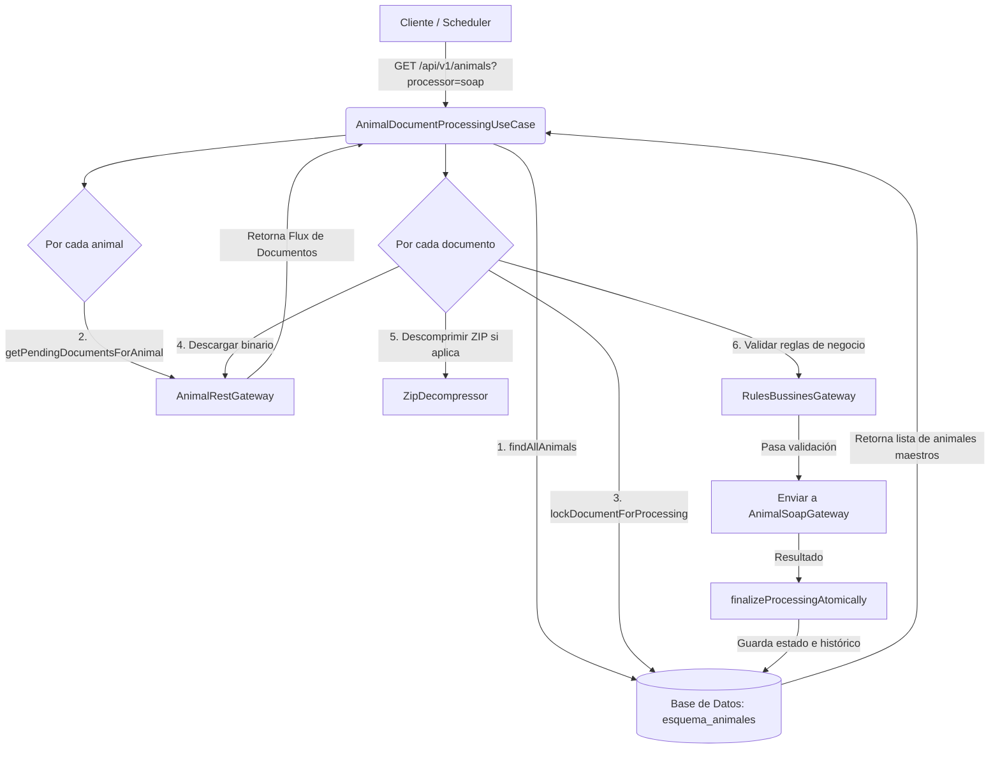
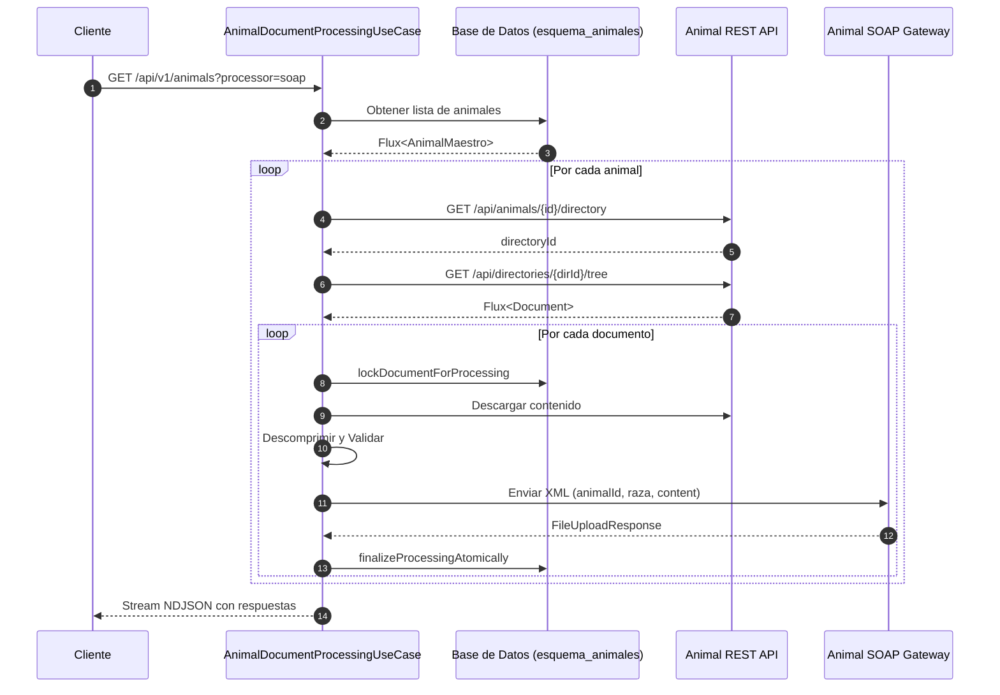

# Plan de Diseño: Procesamiento de Documentos de Animales (Versión Corregida)

Este documento establece el plan para extender el flujo actual de procesamiento (basado en `AbstractDocumentProcessingUseCase` y `DocumentHistoryDTO`) para soportar el nuevo caso de uso `AnimalDocumentProcessingUseCase` de manera mantenible y sin romper la compatibilidad con el esquema existente.

---

## 1. Análisis de Limitaciones Críticas Identificadas

Durante la revisión técnica se detectaron los siguientes puntos débiles en la propuesta de diseño inicial:
1. **Acoplamiento del canal de descarga (`downloadDocument`):** La descarga del archivo estaba atada al puerto `ProductRestGateway`, provocando fallas si se ejecutaba con entidades de animales.
2. **Incompatibilidad de Lombok en la herencia de DTOs:** La mezcla de `@Builder` clásico y `@SuperBuilder` genera errores de compilación de Lombok en cascada.
3. **Firma incompleta en `PersistenceGateway`:** Faltaban métodos críticos de bloqueo optimista y consultas transaccionales requeridas por la clase abstracta.
4. **Acoplamiento del request SOAP:** El puerto `SoapGateway` actual solo acepta `FileUploadRequest` (específico de productos).
5. **Sintaxis de esquema en Spring Data R2DBC:** El uso de atributos `schema` y `name` en `@Table` no es compatible con R2DBC.

---

## 2. Soluciones Técnicas Detalladas (Antes vs. Después)

### Fase 1: Generalización del DTO (Herencia con SuperBuilder)

#### El Problema (Lombok incompatible)
`DocumentHistoryDTO.java` utiliza la anotación `@Builder` simple, lo que impide que herede de una clase padre con `@SuperBuilder`:
```java
@Getter
@Builder(toBuilder = true)
public class DocumentHistoryDTO {
    private Long documentId;
    // ...
}
```

#### La Solución (Código Propuesto)
Migrar de forma homogénea todas las clases de la jerarquía de DTOs a `@SuperBuilder`:
```java
// 1. Clase Base (com/example/fileprocessor/domain/entity/BaseDocumentHistoryDTO.java)
@Getter
@SuperBuilder(toBuilder = true)
@NoArgsConstructor
@AllArgsConstructor
public abstract class BaseDocumentHistoryDTO {
    private Long documentId;
    private String filename;
    private byte[] content;
    private Long size;
    private String contentType;
    private String businessDocumentId;
    private String state;
    private Integer retryCount;
    // ... otros campos compartidos de trazabilidad
}

// 2. Modificación de DocumentHistoryDTO (Productos)
@Getter
@SuperBuilder(toBuilder = true)
@NoArgsConstructor
@AllArgsConstructor
public class DocumentHistoryDTO extends BaseDocumentHistoryDTO {
    private String productId;
}

// 3. Nuevo DTO para Animales (com/example/fileprocessor/domain/entity/animal/AnimalDocumentHistoryDTO.java)
@Getter
@SuperBuilder(toBuilder = true)
@NoArgsConstructor
@AllArgsConstructor
public class AnimalDocumentHistoryDTO extends BaseDocumentHistoryDTO {
    private String animalId;
    private String raza;
    private String tipo;
}
```

---

### Fase 2: Desacoplamiento de la Descarga de Archivos en la Clase Abstracta

#### El Problema (Código Acoplado)
En `AbstractDocumentProcessingUseCase.java`, la descarga del archivo está atada a `ProductRestGateway`:
```java
private Mono<DocumentHistoryDTO> downloadDocument(DocumentHistoryDTO baseHistory) {
    return productRestGateway.getDocument(baseHistory.getProductId(), baseHistory.getBusinessDocumentId())
            .map(file -> baseHistory.toBuilder()
                    .content(file.getContent())
                    .build());
}
```

#### La Solución (Polimorfismo en la descarga)
Declarar la descarga como un método abstracto que cada caso de uso implemente con su respectivo Rest Gateway:
```java
// En AbstractDocumentProcessingUseCase.java:
protected abstract Mono<H> downloadDocumentContent(H baseHistory);

// En ProductDocumentProcessingUseCase.java:
@Override
protected Mono<DocumentHistoryDTO> downloadDocumentContent(DocumentHistoryDTO baseHistory) {
    return productRestGateway.getDocument(baseHistory.getProductId(), baseHistory.getBusinessDocumentId())
            .map(file -> baseHistory.toBuilder()
                    .content(file.getContent())
                    .size(file.getSize())
                    .contentType(file.getContentType())
                    .filename(file.getFilename())
                    .build());
}

// En AnimalDocumentProcessingUseCase.java:
@Override
protected Mono<AnimalDocumentHistoryDTO> downloadDocumentContent(AnimalDocumentHistoryDTO baseHistory) {
    return animalRestGateway.getPendingDocumentsForAnimal(baseHistory.getAnimalId())
            .filter(doc -> doc.getDocumentId().equals(baseHistory.getBusinessDocumentId()))
            .next()
            .map(file -> baseHistory.toBuilder()
                    // Mapear el contenido y metadatos específicos del animal
                    .content(file.getContent())
                    .build());
}
```

---

### Fase 3: Convivencia de Esquemas (PersistenceGateway Completo)

#### El Problema (Contrato Incompleto)
El plan inicial proponía una interfaz de persistencia muy reducida que solo contenía `saveHistory`, provocando errores de compilación al faltar los métodos de bloqueo y consultas de la clase abstracta.

#### La Solución (Contrato de Ciclo de Vida Completo)
Declarar todo el ciclo transaccional en una interfaz genérica:
```java
// domain/port/out/PersistenceGateway.java
public interface PersistenceGateway<T, H extends BaseDocumentHistoryDTO> {
    Flux<T> findPendingDocumentsToday(String useCase, LocalDateTime startOfDay);
    Mono<Integer> lockDocumentForProcessing(Long id, Integer currentRetryCount);
    Mono<Void> saveHistory(H historyDto);
    Mono<Void> finalizeProcessingAtomically(H historyDto);
    Mono<Integer> updateState(Long id, String state, String errorMessage);
}
```

#### Implementación 1: Esquema Anterior (Productos - public)
El adaptador actual se adaptará para implementar la nueva interfaz, manteniendo intacto el guardado en `public.historico_documentos`:
```java
// infrastructure/drivenadapters/r2dbc/product/ProductPersistenceR2dbcAdapter.java
@Component
public class ProductPersistenceR2dbcAdapter implements PersistenceGateway<ProductDocument, DocumentHistoryDTO> {
    private final DocumentHistoryRepository productRepository; 

    @Override
    public Mono<Void> saveHistory(DocumentHistoryDTO historyDto) {
        DocumentHistoryEntity entity = productMapper.toEntity(historyDto);
        return productRepository.save(entity).then();
    }
    // ... implementar el resto de métodos apuntando a las tablas de productos
}
```

#### Implementación 2: Nuevo Esquema (Animales - esquema_animales)
Para animales, especificaremos la tabla usando la notación de punto compatible con Spring Data R2DBC:
```java
// Entidad de persistencia (esquema_animales.historico_documentos)
@Table("esquema_animales.historico_documentos") // Notación de punto para R2DBC
@Getter
@Setter
@Builder
@NoArgsConstructor
@AllArgsConstructor
public class AnimalDocumentHistoryEntity {
    @Id
    private Long id;
    
    @Column("animal_id")
    private String animalId;
    
    @Column("raza")
    private String raza;
    
    // ... campos comunes
}

// Adaptador de persistencia de Animales
@Component
public class AnimalPersistenceR2dbcAdapter implements PersistenceGateway<AnimalDocument, AnimalDocumentHistoryDTO> {
    private final AnimalDocumentHistoryRepository animalRepository; 

    @Override
    public Mono<Void> saveHistory(AnimalDocumentHistoryDTO historyDto) {
        AnimalDocumentHistoryEntity entity = animalMapper.toEntity(historyDto);
        return animalRepository.save(entity).then();
    }
    // ... implementar métodos apuntando al repositorio de animales
}
```

---

### Fase 4: Adaptación del Gateway SOAP

#### El Problema (SoapGateway acoplado)
`SoapGateway` actual solo procesa la clase `FileUploadRequest` de productos:
```java
public interface SoapGateway {
    Flux<FileUploadResponse> send(FileUploadRequest request);
}
```

#### La Solución (Gateways SOAP Independientes o Adaptador Específico)
Para mantener la limpieza de Clean Architecture, definimos un puerto SOAP especializado para animales:
```java
// domain/port/out/AnimalSoapGateway.java
public interface AnimalSoapGateway {
    Flux<FileUploadResponse> send(AnimalFileUploadRequest request);
}

// AnimalDocumentProcessingUseCase.java
@Override
protected Flux<FileUploadResponse> uploadDocument(AnimalDocumentHistoryDTO history, Long docId) {
    AnimalFileUploadRequest request = AnimalFileUploadRequest.builder()
            .animalId(history.getAnimalId())
            .raza(history.getRaza())
            .fileContent(history.getContent())
            .build();
    
    return animalSoapGateway.send(request);
}
```

---

## 3. Resumen de Tareas (Plan de Acción)
- [ ] Refactorizar DTO actual y base a `@SuperBuilder` para admitir herencia.
- [ ] Crear `AnimalDocumentHistoryDTO` con propiedades de negocio de animales.
- [ ] Generizar `AbstractDocumentProcessingUseCase<T, H>` y declarar `downloadDocumentContent` como abstract.
- [ ] Crear la interfaz completa `PersistenceGateway<T, H>`.
- [ ] Implementar `ProductPersistenceR2dbcAdapter` mapeando al esquema default (`public`).
- [ ] Crear la entidad `AnimalDocumentHistoryEntity` con anotación `@Table("esquema_animales.historico_documentos")`.
- [ ] Crear el adaptador `AnimalPersistenceR2dbcAdapter` para guardar en el nuevo esquema de animales.
- [ ] Definir el puerto `AnimalSoapGateway` y su adaptador SOAP para soportar los nuevos campos en el XML.
- [ ] Inyectar los puertos correctos en `AnimalDocumentProcessingUseCase` y `ProductDocumentProcessingUseCase` mediante Spring.
- [ ] Implementar y actualizar las Pruebas Unitarias para validar la inyección genérica y los nuevos canales.
- [ ] Ejecutar pruebas de mutación y testing local para verificar regresión cero.

---

## 4. Pruebas Unitarias (Fase 5)

La refactorización con genéricos e interfaces requiere actualizar las pruebas unitarias existentes para reflejar los nuevos tipos.

### 4.1. Cambios en `AnimalDocumentProcessingUseCaseTest.java`

#### El Problema (Mocks Acoplados)
Actualmente, las pruebas mockean `DocumentPersistenceGateway` y `SoapGateway` concretos:
```java
@Mock
private DocumentPersistenceGateway persistencePort;
@Mock
private SoapGateway soapGateway;
```

#### La Solución (Prueba Adaptada a los Nuevos Puertos)
Actualizar los mocks de la prueba para usar los nuevos puertos genéricos y especializados:
```java
// src/test/java/com/example/fileprocessor/domain/usecase/AnimalDocumentProcessingUseCaseTest.java
@ExtendWith(MockitoExtension.class)
class AnimalDocumentProcessingUseCaseTest {

    @Mock
    private PersistenceGateway<AnimalDocument, AnimalDocumentHistoryDTO> persistencePort; // Cambiado a PersistenceGateway genérico
    @Mock
    private AnimalRestGateway animalRestGateway;
    @Mock
    private AnimalSoapGateway animalSoapGateway; // Cambiado al SoapGateway de animales
    @Mock
    private RulesBussinesGateway documentValidator;

    private AnimalDocumentProcessingUseCase useCase;

    @BeforeEach
    void setUp() {
        useCase = new AnimalDocumentProcessingUseCase(
                persistencePort, 
                documentValidator, 
                "/tmp/test-zip-dir",
                animalRepository,
                animalRestGateway,
                animalSoapGateway // Inyecta el adaptador SOAP específico
        );
    }

    @Test
    void executeAnimalProcessingSuccess() {
        AnimalMaestro animal = AnimalMaestro.builder().id(100L).name("Cow").build();
        
        // AnimalDocument hereda de BaseDocument
        AnimalDocument doc = AnimalDocument.builder()
                .id(1L)
                .documentId("doc-1")
                .animalId("animal-100")
                .name("test.pdf")
                .build();

        when(animalRepository.findAllAnimals()).thenReturn(Flux.just(animal));
        when(animalRestGateway.getPendingDocumentsForAnimal(100L)).thenReturn(Flux.just(doc));
        
        // Mocks usando el nuevo PersistenceGateway genérico
        when(persistencePort.lockDocumentForProcessing(anyLong(), anyInt())).thenReturn(Mono.just(1));
        
        // Mocks del validador que ahora acepta BaseDocumentHistoryDTO
        when(documentValidator.validate(any(BaseDocumentHistoryDTO.class), anyBoolean()))
            .thenAnswer(inv -> Mono.just(inv.getArgument(0)));

        // Mock del SOAP gateway de animales
        when(animalSoapGateway.send(any(AnimalFileUploadRequest.class)))
            .thenReturn(Flux.just(FileUploadResponse.builder()
                .success(true)
                .correlationId("soap-corr-123")
                .build()));

        when(persistencePort.finalizeProcessingAtomically(any())).thenReturn(Mono.empty());

        StepVerifier.create(useCase.executeAnimalProcessing())
            .expectNextMatches(FileUploadResponse::isSuccess)
            .expectComplete()
            .verify(Duration.ofSeconds(10));
    }
}
```

### 4.2. Estrategia de Verificación de Cobertura
1. **Regresión Cero en Productos:** Al terminar de implementar los genéricos, ejecutar `AbstractDocumentProcessingUseCaseTest.java` y `ProductDocumentProcessingUseCaseTest.java` (originalmente `SoapDocumentProcessingUseCaseTest.java` y `S3DocumentProcessingUseCaseTest.java`) para asegurar que el cambio a `@SuperBuilder` y `PersistenceGateway` de productos no rompió la lógica del esquema `public`.
2. **Mutant Test (PiTest):** Ejecutar `./gradlew pitest` y verificar que el umbral de mutación siga estando arriba del 60%.
3. **JaCoCo Test:** Correr `./gradlew jacocoTestReport` para asegurar que el nuevo `AnimalPersistenceR2dbcAdapter` y `AnimalDocumentProcessingUseCase` mantengan una cobertura de código superior al 75%.

---

## 5. Pruebas End-to-End (E2E) y Validación Local (Fase 6)

Para validar la estabilidad del sistema completo sin dependencias reales, el proyecto cuenta con simuladores locales en Python (`mocks.py`) y un script orquestador (`e2e_validation.sh`). El plan para soportar la validación E2E del nuevo flujo de animales conservando el de productos es el siguiente:

### 5.1. Actualización de `testing/mocks/mocks.py`

Agregaremos soporte para simular la API REST de animales y el nuevo endpoint de SOAP de animales.

#### Cambios en la Simulación REST (API de Animales):
```python
# testing/mocks/mocks.py (Nuevo servidor mock en Puerto 3002 o bajo la misma clase)

# --- ANIMAL REST API MOCK (Puerto 3002) ---
class AnimalRestHandler(http.server.BaseHTTPRequestHandler):
    def do_GET(self):
        # 1. Simular Endpoint de árbol de directorios (/api/animals/{animalId}/directory)
        if "/api/animals/" in self.path and "/directory" in self.path:
            animal_id = self.path.split('/')[-2]
            response = {
                "directoryId": f"dir-animal-{animal_id}",
                "status": "active"
            }
            self.send_response(200)
            self.send_header('Content-Type', 'application/json')
            self.end_headers()
            self.wfile.write(json.dumps(response).encode())
            return
            
        # 2. Simular obtención de archivos aplanados (/api/directories/{directoryId}/tree)
        if "/api/directories/" in self.path and "/tree" in self.path:
            dir_id = self.path.split('/')[-2]
            scenarios = {
                "dir-animal-100": [
                    {
                        "documentId": "ANM-DOC-101",
                        "name": "cartilla_vacunacion.pdf",
                        "size": 512,
                        "isZip": False,
                        "content": base64.b64encode(b"pdf-content").decode('utf-8')
                    },
                    {
                        "documentId": "ANM-DOC-102",
                        "name": "historial_clinico.zip",
                        "size": 1024,
                        "isZip": True,
                        "content": create_mock_zip({"documento.txt": b"texto-dentro-del-zip"})
                    }
                ]
            }
            response = scenarios.get(dir_id, [])
            self.send_response(200)
            self.send_header('Content-Type', 'application/json')
            self.end_headers()
            self.wfile.write(json.dumps(response).encode())
            return
```

### 5.2. Actualización de `testing/mocks/e2e_validation.sh`

El orquestador Bash se modificará para levantar los mocks adicionales, disparar las ejecuciones de Productos y de Animales secuencialmente, y verificar los estados finales en base de datos.

#### Orquestación del Flujo de Ejecución E2E:
```bash
# e2e_validation.sh

# 1. Levantamiento del Microservicio con puertos mockeados de animales:
./gradlew bootRun --args='--spring.profiles.active=dev --server.port=8085 --app.document-rest.endpoint=http://localhost:3003 --app.soap.v2.endpoint=http://localhost:9003/soap/adminDocs --app.animal-rest.endpoint=http://localhost:3002' > "$SCRIPT_DIR/ms.log" 2>&1 &

# 2. Validación de Productos (Legado):
echo "Ejecutando Sync y Procesamiento de Productos..."
curl -s -H "use-case: SOAP" "$MS_URL${BASE_PATH}/products/sync/soap"
curl -s "$MS_URL${BASE_PATH}/products/soap"

# 3. Validación de Animales (Nuevo):
echo "Ejecutando Procesamiento de Animales (GET /api/v1/animals?processor=soap)..."
curl -s "$MS_URL${BASE_PATH}/animals?processor=soap" > /dev/null

# 4. Esperar finalización del flujo en los logs
until grep -q "Daily Animal processing completed" "$SCRIPT_DIR/ms.log"; do
    sleep 2
done
echo "Procesamiento de animales finalizado!"

# 5. Extracción de Dump de BD para Animales (esquema_animales)
echo "Extrayendo trazabilidad del esquema_animales..."
check_control_endpoint "animals/sync/status" \
    "$MS_URL${BASE_PATH}/animals/sync/status" \
    "exitoso|0"
```

### 5.3. Validación de Reportes Combinados en Consola
El script formateará la base de datos volcando las tablas de ambos esquemas al finalizar:
*   `public.documentos` y `public.historico_documentos` (para Productos).
*   `esquema_animales.documentos` y `esquema_animales.historico_documentos` (para Animales).
El validador de Python `format_tables.py` se actualizará para detectar dinámicamente si el JSONDump contiene múltiples esquemas y generar dos reportes visuales separados en `testing/mocks/ms.log`.

---

## 6. Actualización del README.md (Fase 7)

Para documentar adecuadamente el nuevo comportamiento del microservicio sin alterar la documentación histórica de productos, se procederá a adicionar (o modificar donde sea estrictamente necesario para reflejar los genéricos) las siguientes secciones en `README.md`:

### 6.1. Actualización de la Arquitectura (Sección 1)
Se incorporará el caso de uso de animales en la estructura de paquetes del árbol del proyecto:
```
com.example.fileprocessor/
├── domain/
│   ├── entity/
│   │   ├── BaseDocumentHistoryDTO.java        # Nuevo: DTO base de trazabilidad
│   │   └── animal/
│   │       ├── AnimalDocument.java            # Nuevo: Dominio de animales
│   │       └── AnimalDocumentHistoryDTO.java   # Nuevo: Campos SOAP de animales
│   ├── usecase/
│   │   ├── AbstractDocumentProcessingUseCase.java # Modificado: Ahora genérico <T, H>
│   │   └── AnimalDocumentProcessingUseCase.java   # Nuevo: Caso de uso especializado
```

### 6.2. Documentación de Nuevos Endpoints (Sección 2)
Se añadirá la descripción de los nuevos endpoints del flujo de animales sin eliminar los de productos:
```markdown
### GET /api/v1/animals
Orquesta el procesamiento diario de animales. Obtiene la lista desde la API REST externa de animales, valida reglas de negocio (tamaño y extensión) y envía a la API SOAP específica.

**Query Parameters:**
- `processor`: `soap` (único soportado por ahora).

**Response:** `Content-Type: application/x-ndjson` (NDJSON stream)
```

### 6.3. Ampliación de Flujos y Diagramas Mermaid (Sección 3 y 4)
Para reflejar la coexistencia de ambos procesos, se agregarán nuevos diagramas específicos para Animales debajo de los de Productos.

#### Nuevo Flujo de Datos para Animales (Sección 3):


#### Diagrama de Secuencia de Animales (Sección 4):
Se agregará el flujo temporal reactivo que orquesta animales secuencialmente desde el REST externo:


### 6.4. Estructura de Base de Datos Multi-Esquema (Sección 5)
Se añadirá una subsección indicando la coexistencia de bases de datos y esquemas:
```markdown
### Base de Datos para Animales (esquema_animales)
Para aislar los datos del caso de uso de animales, la persistencia se realiza en el esquema `esquema_animales` utilizando la misma estructura de tablas de trazabilidad:
- `esquema_animales.documentos`
- `esquema_animales.historico_documentos`
```

### 6.5. Nuevas Variables de Entorno (Sección 14)
Se adicionarán al listado las variables que controlan la conexión al Rest y Soap de animales:
```markdown
| Variable | Default | Descripción |
|----------|---------|-------------|
| `ANIMAL_REST_ENDPOINT` | `http://localhost:3002` | URL base de la API REST de animales |
| `SOAP_V2_ENDPOINT` | `http://localhost:9000/soap/adminDocs` | Endpoint SOAP de animales |
```

### 6.6. Ejemplos de Curl Adicionales (Sección 16)
Se anexará la petición curl para gatillar el nuevo proceso:
```bash
# Procesar documentos de animales diariamente vía SOAP
curl "http://localhost:8080/api/v1/animals?processor=soap" \
  -H "message-id: animal-trace-123"
```

### 6.7. Ampliación del Script E2E (Sección 19 - Testing)
Se actualizará el apartado de validación E2E para documentar que `./testing/mocks/e2e_validation.sh` ahora valida automáticamente el comportamiento integrado de ambos dominios de negocio.


