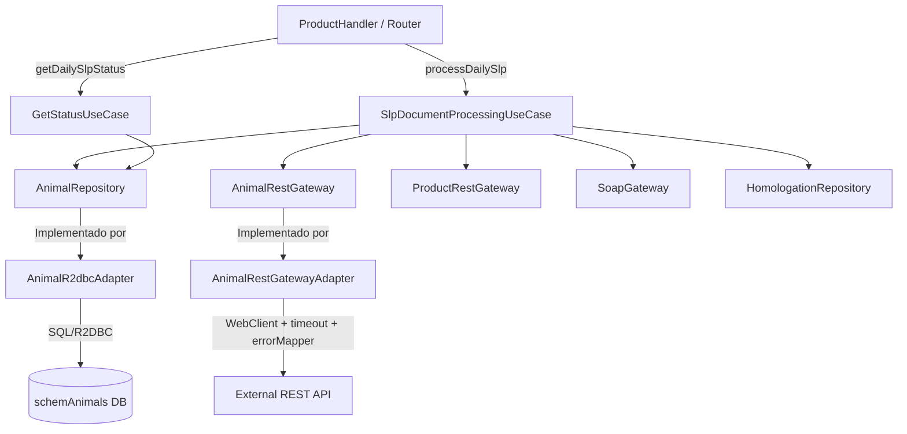

# Plan de Integración de Procesamiento de Documentos de Animales (SLP)

Este documento define el diseño arquitectónico y plan de implementación para el nuevo flujo de negocio de procesamiento diario (`type_job = daily`) y caso de uso SLP (`use-case = slp`). El flujo consiste en leer información de animales desde una base de datos secundaria, consultar servicios REST externos para obtener la estructura de directorios, filtrar documentos basados en el origen (`Source` in `[1, 2, 4]`), descargarlos de la API REST de productos existente y enviarlos mediante el canal SOAP actual, registrando la trazabilidad en un esquema dedicado.

---

## 1. Diseño de Base de Datos y Trazabilidad

### Base de Datos Existente y Mapeo R2DBC
El servicio actualmente utiliza un motor H2 (en memoria para desarrollo/test) configurado con R2DBC. Los Repositorios usan Spring Data R2DBC.

### Nuevas Tablas en Esquema `schemAnimals`
Dado que la base de datos física puede contener múltiples esquemas, mapearemos las entidades R2DBC agregando explícitamente el prefijo de esquema en la anotación `@Table`.

1. **Tabla de Origen**: `schemAnimals.animals_maestro`
   Representa la tabla maestra de donde se extraerán los animales para procesamiento diario.
2. **Tabla de Trazabilidad**: `schemAnimals.historico_animales` (equivalente a `historico_documentos`)
   Almacenará el resultado del procesamiento diario de los documentos de cada animal.

---

## 2. Arquitectura Propuesta (Clean Architecture)

Seguiremos la estructura actual del proyecto basada en Puertos y Adaptadores (Arquitectura Hexagonal):



---

## 3. Código Fuente Detallado (Propuesta de Implementación)

### 3.1. Capa de Dominio (Domain)

#### Entidades

##### `com/example/fileprocessor/domain/entity/animal/AnimalMaestro.java`
```java
package com.example.fileprocessor.domain.entity.animal;

import lombok.Builder;
import lombok.Value;

@Value
@Builder
public class AnimalMaestro {
    Long id;
    String name;
    String category;
}
```

##### `com/example/fileprocessor/domain/entity/animal/DirectoryNode.java`
```java
package com.example.fileprocessor.domain.entity.animal;

import lombok.Builder;
import lombok.Value;
import java.util.List;

@Value
@Builder
public class DirectoryNode {
    String id;
    String name;
    Integer source; // Campo a filtrar: 1, 2 o 4
    String productId; // Mapeado para descarga
    String businessDocumentId; // Mapeado para descarga
    List<DirectoryNode> children;
}
```

##### `com/example/fileprocessor/domain/entity/animal/AnimalHistory.java`
```java
package com.example.fileprocessor.domain.entity.animal;

import lombok.Builder;
import lombok.Value;
import java.time.Instant;

@Value
@Builder
public class AnimalHistory {
    Long id;
    Long animalId;
    String documentId;
    String filename;
    String status;
    String syncMessage;
    Instant processedAt;
}
```

##### `com/example/fileprocessor/domain/entity/animal/AnimalProcessingStatus.java`
```java
package com.example.fileprocessor.domain.entity.animal;

/**
 * Estados posibles del procesamiento diario de documentos de animales (SLP).
 * Equivalente al ProcessingResultCodes del flujo principal.
 */
public enum AnimalProcessingStatus {
    PENDING,
    IN_PROGRESS,
    SUCCESS,
    FAILED,
    ERROR;
}
```

#### Puertos de Salida (Ports Out)

##### `com/example/fileprocessor/domain/port/out/AnimalRepository.java`
```java
package com.example.fileprocessor.domain.port.out;

import com.example.fileprocessor.domain.entity.animal.AnimalMaestro;
import com.example.fileprocessor.domain.entity.animal.AnimalHistory;
import reactor.core.publisher.Flux;
import reactor.core.publisher.Mono;

public interface AnimalRepository {
    Flux<AnimalMaestro> findAllAnimals();
    Mono<AnimalHistory> saveHistory(AnimalHistory history);
}
```

##### `com/example/fileprocessor/domain/port/out/AnimalRestGateway.java`
```java
package com.example.fileprocessor.domain.port.out;

import com.example.fileprocessor.domain.entity.animal.DirectoryNode;
import reactor.core.publisher.Mono;

public interface AnimalRestGateway {
    Mono<String> getDirectoryIdByAnimalId(Long animalId);
    Mono<DirectoryNode> getDirectoryTree(String directoryId);
}
```

#### Caso de Uso (UseCase)

##### `com/example/fileprocessor/domain/usecase/SlpDocumentProcessingUseCase.java`
```java
package com.example.fileprocessor.domain.usecase;

import com.example.fileprocessor.domain.entity.animal.AnimalHistory;
import com.example.fileprocessor.domain.entity.animal.AnimalProcessingStatus;
import com.example.fileprocessor.domain.entity.animal.DirectoryNode;
import com.example.fileprocessor.domain.entity.FileUploadRequest;
import com.example.fileprocessor.domain.entity.product.DocumentHistoryDTO;
import com.example.fileprocessor.domain.port.out.AnimalRepository;
import com.example.fileprocessor.domain.port.out.AnimalRestGateway;
import com.example.fileprocessor.domain.port.out.HomologationRepository;
import com.example.fileprocessor.domain.port.out.ProductRestGateway;
import com.example.fileprocessor.domain.port.out.SoapGateway;
import lombok.RequiredArgsConstructor;
import lombok.extern.slf4j.Slf4j;
import reactor.core.publisher.Flux;
import reactor.core.publisher.Mono;

import java.time.Instant;
import java.util.ArrayList;
import java.util.List;
import java.util.Set;

@Slf4j
@RequiredArgsConstructor
public class SlpDocumentProcessingUseCase {

    /** Valores de Source permitidos para procesamiento — definidos como constante de dominio */
    private static final Set<Integer> VALID_SOURCES = Set.of(1, 2, 4);
    /** El flujo SLP no tiene doc_id en BD local — se diferencia explícitamente de un 0 accidental */
    private static final Long NO_DB_DOC_ID = null;
    /** Nombre de archivo por defecto cuando la descarga falla antes de obtener metadatos */
    private static final String FILENAME_UNKNOWN = "UNKNOWN";

    private final AnimalRepository animalRepository;
    private final AnimalRestGateway animalRestGateway;
    private final ProductRestGateway productRestGateway;
    private final SoapGateway soapGateway;
    private final HomologationRepository homologationRepository;

    public Flux<AnimalHistory> executeSlpProcessing() {
        log.info("Iniciando procesamiento diario SLP...");
        return animalRepository.findAllAnimals()
                .flatMap(animal -> animalRestGateway.getDirectoryIdByAnimalId(animal.getId())
                        .flatMap(animalRestGateway::getDirectoryTree)
                        .flatMapMany(tree -> Flux.fromIterable(flattenAndFilterTree(tree)))
                        .flatMap(node -> processNodeDocument(animal.getId(), node))
                );
    }

    private List<DirectoryNode> flattenAndFilterTree(DirectoryNode root) {
        List<DirectoryNode> result = new ArrayList<>();
        traverse(root, result);
        return result;
    }

    private void traverse(DirectoryNode node, List<DirectoryNode> result) {
        if (node == null) return;

        // Filtro de Source: valores permitidos definidos en VALID_SOURCES (evitar magic numbers)
        if (node.getSource() != null && VALID_SOURCES.contains(node.getSource())) {
            result.add(node);
        }

        if (node.getChildren() != null) {
            for (DirectoryNode child : node.getChildren()) {
                traverse(child, result);
            }
        }
    }

    private Mono<AnimalHistory> processNodeDocument(Long animalId, DirectoryNode node) {
        log.info("Procesando documento del nodo: {}, Source: {}", node.getName(), node.getSource());

        // 1. Descargar documento utilizando la infraestructura existente
        return productRestGateway.getDocument(node.getProductId(), node.getBusinessDocumentId())
                .flatMap(file -> {
                    // Mapear a DocumentHistoryDTO compatible con el flujo de Homologacion y SOAP existente
                    DocumentHistoryDTO historyDTO = DocumentHistoryDTO.builder()
                            .productId(node.getProductId())
                            .businessDocumentId(node.getBusinessDocumentId())
                            .filename(file.getFilename())
                            .content(file.getContent())
                            .size(file.getSize())
                            .contentType(file.getContentType())
                            .build();

                    // 2. Resolver homologación y enviar a SOAP
                    return homologationRepository.resolve(historyDTO)
                            .flatMap(homologation -> {
                                // NO_DB_DOC_ID indica que este docId no existe en la BD local del servicio
                                FileUploadRequest uploadReq = FileUploadRequest.from(historyDTO, NO_DB_DOC_ID, homologation);
                                return soapGateway.send(uploadReq);
                            })
                            .map(response -> AnimalHistory.builder()
                                    .animalId(animalId)
                                    .documentId(node.getBusinessDocumentId())
                                    .filename(file.getFilename())
                                    .status(response.isSuccess()
                                            ? AnimalProcessingStatus.SUCCESS.name()
                                            : AnimalProcessingStatus.FAILED.name())
                                    .syncMessage(response.getMessage())
                                    .processedAt(Instant.now())
                                    .build());
                })
                .onErrorResume(error -> {
                    log.error("Error procesando nodo {} para animalId {}: {}", node.getId(), animalId, error.getMessage());
                    return Mono.just(AnimalHistory.builder()
                            .animalId(animalId)
                            .documentId(node.getBusinessDocumentId())
                            .filename(FILENAME_UNKNOWN)
                            .status(AnimalProcessingStatus.ERROR.name())
                            .syncMessage(error.getMessage())
                            .processedAt(Instant.now())
                            .build());
                })
                // 3. Persistir trazabilidad en schemAnimals
                .flatMap(animalRepository::saveHistory);
    }
}
```

---

### 3.2. Capa de Infraestructura (Infrastructure)

#### Entidades R2DBC (Mapeo de base de datos)

##### `com/example/fileprocessor/infrastructure/drivenadapters/r2dbc/entity/AnimalMaestroEntity.java`
```java
package com.example.fileprocessor.infrastructure.drivenadapters.r2dbc.entity;

import org.springframework.data.annotation.Id;
import org.springframework.data.relational.core.mapping.Column;
import org.springframework.data.relational.core.mapping.Table;
import lombok.*;

@Table("schemAnimals.animals_maestro")
@Getter
// Sin @Setter — entidad de solo lectura (fuente de datos maestra)
@Builder
@AllArgsConstructor
@NoArgsConstructor
public class AnimalMaestroEntity {
    @Id
    private Long id;

    @Column("name")
    private String name;

    @Column("category")
    private String category;
}
```

##### `com/example/fileprocessor/infrastructure/drivenadapters/r2dbc/entity/AnimalHistoryEntity.java`
```java
package com.example.fileprocessor.infrastructure.drivenadapters.r2dbc.entity;

import org.springframework.data.annotation.Id;
import org.springframework.data.relational.core.mapping.Column;
import org.springframework.data.relational.core.mapping.Table;
import lombok.*;
import java.time.Instant;

@Table("schemAnimals.historico_animales")
@Getter
@Setter
@Builder
@AllArgsConstructor
@NoArgsConstructor
public class AnimalHistoryEntity {
    @Id
    private Long id;
    
    @Column("id_animal")
    private Long animalId;
    
    @Column("id_documento")
    private String documentId;
    
    @Column("nombre_archivo")
    private String filename;
    
    @Column("estado")
    private String status;
    
    @Column("mensaje_error")
    private String syncMessage;
    
    @Column("fecha_procesamiento")
    private Instant processedAt;
}
```

#### Spring Data Repositories

##### `com/example/fileprocessor/infrastructure/drivenadapters/r2dbc/repository/AnimalMaestroRepository.java`
```java
package com.example.fileprocessor.infrastructure.drivenadapters.r2dbc.repository;

import com.example.fileprocessor.infrastructure.drivenadapters.r2dbc.entity.AnimalMaestroEntity;
import org.springframework.data.r2dbc.repository.R2dbcRepository;
import org.springframework.stereotype.Repository;

@Repository
public interface AnimalMaestroRepository extends R2dbcRepository<AnimalMaestroEntity, Long> {
}
```

##### `com/example/fileprocessor/infrastructure/drivenadapters/r2dbc/repository/AnimalHistoryRepository.java`
```java
package com.example.fileprocessor.infrastructure.drivenadapters.r2dbc.repository;

import com.example.fileprocessor.infrastructure.drivenadapters.r2dbc.entity.AnimalHistoryEntity;
import com.example.fileprocessor.infrastructure.drivenadapters.r2dbc.projection.AnimalStatusCount;
import org.springframework.data.r2dbc.repository.Query;
import org.springframework.data.r2dbc.repository.R2dbcRepository;
import org.springframework.stereotype.Repository;
import reactor.core.publisher.Flux;
import java.time.LocalDateTime;

@Repository
public interface AnimalHistoryRepository extends R2dbcRepository<AnimalHistoryEntity, Long> {

    /**
     * Agrupa los registros de hoy por estado para el endpoint de monitoreo.
     * Nota: Spring Data R2DBC NO deriva GROUP BY por convencion de nombre;
     *       se requiere @Query explicita.
     */
    @Query("SELECT estado AS status, COUNT(*) AS total " +
           "FROM schemAnimals.historico_animales " +
           "WHERE fecha_procesamiento >= :startOfDay " +
           "GROUP BY estado")
    Flux<AnimalStatusCount> countGroupedByStatusSince(LocalDateTime startOfDay);
}
```

##### `com/example/fileprocessor/infrastructure/drivenadapters/r2dbc/projection/AnimalStatusCount.java`
```java
package com.example.fileprocessor.infrastructure.drivenadapters.r2dbc.projection;

/**
 * Proyeccion R2DBC para mapear el resultado del GROUP BY de historico_animales.
 */
public interface AnimalStatusCount {
    String getStatus();
    Long getTotal();
}
```

#### Adaptador R2DBC

##### `com/example/fileprocessor/infrastructure/drivenadapters/r2dbc/AnimalR2dbcAdapter.java`
```java
package com.example.fileprocessor.infrastructure.drivenadapters.r2dbc;

import com.example.fileprocessor.domain.entity.animal.AnimalMaestro;
import com.example.fileprocessor.domain.entity.animal.AnimalHistory;
import com.example.fileprocessor.domain.entity.product.StateCount;
import com.example.fileprocessor.domain.port.out.AnimalRepository;
import com.example.fileprocessor.infrastructure.drivenadapters.r2dbc.entity.AnimalHistoryEntity;
import com.example.fileprocessor.infrastructure.drivenadapters.r2dbc.entity.AnimalMaestroEntity;
import com.example.fileprocessor.infrastructure.drivenadapters.r2dbc.repository.AnimalHistoryRepository;
import com.example.fileprocessor.infrastructure.drivenadapters.r2dbc.repository.AnimalMaestroRepository;
import lombok.RequiredArgsConstructor;
import lombok.extern.slf4j.Slf4j;
import org.springframework.stereotype.Component;
import reactor.core.publisher.Flux;
import reactor.core.publisher.Mono;

import java.time.LocalDateTime;

@Slf4j
@Component
@RequiredArgsConstructor
public class AnimalR2dbcAdapter implements AnimalRepository {

    private final AnimalMaestroRepository maestroRepository;
    private final AnimalHistoryRepository historyRepository;

    @Override
    public Flux<AnimalMaestro> findAllAnimals() {
        return maestroRepository.findAll()
                .map(entity -> AnimalMaestro.builder()
                        .id(entity.getId())
                        .name(entity.getName())
                        .category(entity.getCategory())
                        .build());
    }

    @Override
    public Mono<AnimalHistory> saveHistory(AnimalHistory history) {
        AnimalHistoryEntity entity = AnimalHistoryEntity.builder()
                .animalId(history.getAnimalId())
                .documentId(history.getDocumentId())
                .filename(history.getFilename())
                .status(history.getStatus())
                .syncMessage(history.getSyncMessage())
                .processedAt(history.getProcessedAt())
                .build();

        return historyRepository.save(entity)
                .doOnSuccess(saved -> log.debug(
                        "Historial persistido: animalId={}, documentId={}, status={}",
                        saved.getAnimalId(), saved.getDocumentId(), saved.getStatus()))
                .doOnError(e -> log.error(
                        "Error persistiendo historial para animalId={}: {}",
                        history.getAnimalId(), e.getMessage()))
                .map(saved -> AnimalHistory.builder()
                        .id(saved.getId())
                        .animalId(saved.getAnimalId())
                        .documentId(saved.getDocumentId())
                        .filename(saved.getFilename())
                        .status(saved.getStatus())
                        .syncMessage(saved.getSyncMessage())
                        .processedAt(saved.getProcessedAt())
                        .build());
    }

    @Override
    public Flux<StateCount> countAnimalsGroupedByStateToday(LocalDateTime startOfDay) {
        return historyRepository.countGroupedByStatusSince(startOfDay)
                .map(row -> new StateCount(row.getStatus(), row.getTotal()));
    }
}
```

#### Adaptador REST de API de Animales y Directorios

##### `com/example/fileprocessor/infrastructure/drivenadapters/restclient/AnimalRestGatewayAdapter.java`
```java
package com.example.fileprocessor.infrastructure.drivenadapters.restclient;

import com.example.fileprocessor.domain.entity.animal.DirectoryNode;
import com.example.fileprocessor.domain.port.out.AnimalRestGateway;
import lombok.RequiredArgsConstructor;
import lombok.extern.slf4j.Slf4j;
import org.springframework.stereotype.Component;
import org.springframework.web.reactive.function.client.WebClient;
import reactor.core.publisher.Mono;

import java.time.Duration;

@Slf4j
@Component
@RequiredArgsConstructor
public class AnimalRestGatewayAdapter implements AnimalRestGateway {

    private final WebClient animalWebClient; // bean dedicado con baseUrl para APIs de animal/directorio
    private final long animalApiTimeoutSeconds; // inyectado desde app.animal-rest.timeout-seconds

    @Override
    public Mono<String> getDirectoryIdByAnimalId(Long animalId) {
        return animalWebClient.get()
                .uri("/api/animals/{animalId}/directory", animalId)
                .retrieve()
                .onStatus(status -> status.isError(), AdapterErrorMapper::mapResponseError)
                .bodyToMono(DirectoryResponse.class)
                .map(DirectoryResponse::getDirectoryId)
                .timeout(Duration.ofSeconds(animalApiTimeoutSeconds))
                .onErrorMap(AdapterErrorMapper::mapError)
                .doOnError(e -> log.error("Error obteniendo directoryId para animalId={}: {}", animalId, e.getMessage()));
    }

    @Override
    public Mono<DirectoryNode> getDirectoryTree(String directoryId) {
        return animalWebClient.get()
                .uri("/api/directories/{directoryId}/tree", directoryId)
                .retrieve()
                .onStatus(status -> status.isError(), AdapterErrorMapper::mapResponseError)
                .bodyToMono(DirectoryNode.class)
                .timeout(Duration.ofSeconds(animalApiTimeoutSeconds))
                .onErrorMap(AdapterErrorMapper::mapError)
                .doOnError(e -> log.error("Error obteniendo arbol de directorios para directoryId={}: {}", directoryId, e.getMessage()));
    }

    // DTO Helper interno — no expuesto fuera del adaptador
    @lombok.Data
    private static class DirectoryResponse {
        private String directoryId;
    }
}
```

---

### 3.3. Rutas y Controladores (WebFlux endpoints)

Para habilitar este endpoint, mantendremos la estructura existente agregando la nueva lógica al `ProductHandler` y a las rutas.

#### Cambio en `ProductRoutes.java`
Agregar el nuevo endpoint que detecte los parámetros `type_job = daily` y lance el flujo de procesamiento.
Se agregará una ruta bajo `app.paths.API_V1_PRODUCTS` (o una variante similar):

```java
    @Bean
    public RouterFunction<ServerResponse> processDailySlpProducts(ProductHandler handler) {
        return nest(
            path(pathProperties.basePath()),
            route(GET("/products/daily/slp"), handler::processDailySlpProducts)
        );
    }

    @Bean
    public RouterFunction<ServerResponse> processDailySlpStatusRoute(ProductHandler handler) {
        return nest(
            path(pathProperties.basePath()),
            route(GET("/products/process/status/daily"), handler::getDailySlpProcessStatus)
        );
    }
```

#### Nuevos Métodos en `ProductHandler.java`
```java
    // Agregar la inyección del nuevo UseCase
    private final SlpDocumentProcessingUseCase slpDocumentProcessingUseCase;

    public Mono<ServerResponse> processDailySlpProducts(ServerRequest request) {
        var headers = request.headers().asHttpHeaders().toSingleValueMap();
        
        Context context = Context.of(
            TYPE_JOB, "daily",
            HEADER_TRACE_ID, headers.getOrDefault(HEADER_TRACE_ID, UUID.randomUUID().toString()),
            HEADER_USE_CASE, "slp"
        );

        return Mono.deferContextual(ctx -> {
            String traceId = ctx.get(HEADER_TRACE_ID);
            LOGGER.log(Level.INFO, "Starting Daily SLP Animal Processing, traceId: {0}", traceId);

            slpDocumentProcessingUseCase.executeSlpProcessing()
                .doOnNext(history -> LOGGER.log(Level.INFO, "Animal Document Processed: animal={0}, file={1}, status={2}",
                    new Object[]{history.getAnimalId(), history.getFilename(), history.getStatus()}))
                .doOnError(error -> LOGGER.log(Level.SEVERE, "SLP Daily processing failed for traceId {0}: {1}", new Object[]{traceId, error.getMessage()}))
                .doOnComplete(() -> LOGGER.log(Level.INFO, "SLP Daily processing completed for traceId: {0}", traceId))
                .contextWrite(ctx)
                .subscribe();

            return ServerResponse.accepted()
                .contentType(MediaType.APPLICATION_JSON)
                .bodyValue(java.util.Map.of("status", "OK", "message", "Daily SLP processing initiated"));
        }).contextWrite(context);
    }

    public Mono<ServerResponse> getDailySlpProcessStatus(ServerRequest request) {
        return getStatusUseCase.getDailySlpProcessStatus()
                .flatMap(status -> ServerResponse.ok()
                        .contentType(MediaType.TEXT_PLAIN)
                        .bodyValue(status));
    }
```

#### Modificación en `DomainConfig.java`
Instanciar el bean de `SlpDocumentProcessingUseCase` y actualizar `GetStatusUseCase` para recibir `AnimalRepository`:
```java
    @Bean
    public SlpDocumentProcessingUseCase slpDocumentProcessingUseCase(
            AnimalRepository animalRepository,
            AnimalRestGateway animalRestGateway,
            ProductRestGateway productRestGateway,
            SoapGateway soapGateway,
            HomologationRepository homologationRepository) {
        return new SlpDocumentProcessingUseCase(
            animalRepository,
            animalRestGateway,
            productRestGateway,
            soapGateway,
            homologationRepository
        );
    }

    @Bean
    public GetStatusUseCase getStatusUseCase(
            ProductMasterRepository productMasterRepository,
            DocumentRepository documentRepository,
            AnimalRepository animalRepository) { // Nuevo puerto inyectado
        return new GetStatusUseCase(productMasterRepository, documentRepository, animalRepository);
    }
```

---

### 3.4. Endpoint de Control para SLP (Caso de Uso de Monitoreo)

Se extenderá `GetStatusUseCase` para que pueda consultar la trazabilidad de la ejecución diaria de SLP en `schemAnimals.historico_animales`.

#### Firma de consulta en `AnimalRepository.java`
```java
    Flux<StateCount> countAnimalsGroupedByStateToday(LocalDateTime startOfDay);
```

#### Implementación en `AnimalR2dbcAdapter.java`
```java
    @Override
    public Flux<StateCount> countAnimalsGroupedByStateToday(LocalDateTime startOfDay) {
        return historyRepository.countByProcessedAtAfterGroupedByStatus(startOfDay)
                .map(row -> new StateCount(row.getStatus(), row.getTotal()));
    }
```

#### Lógica en `GetStatusUseCase.java`
```java
    public Mono<String> getDailySlpProcessStatus() {
        LocalDateTime startOfDay = LocalDateTime.now().with(LocalTime.MIN);

        return animalRepository.countAnimalsGroupedByStateToday(startOfDay)
                .collectList()
                .map(list -> {
                    long pendingCount = 0;
                    long errorCount = 0;
                    long totalCount = 0;

                    for (var row : list) {
                        String status = row.getState();
                        long count = row.getTotal();
                        totalCount += count;

                        if (AnimalProcessingStatus.PENDING.name().equals(status)
                                || AnimalProcessingStatus.IN_PROGRESS.name().equals(status)) {
                            pendingCount += count;
                        } else if (!AnimalProcessingStatus.SUCCESS.name().equals(status)) {
                            // Cualquier estado que no sea SUCCESS ni PENDING/IN_PROGRESS es un error
                            errorCount += count;
                        }
                    }

                    if (totalCount == 0) {
                        return ApiConstants.STATUS_COMPLETED;
                    }
                    if (pendingCount > 0) {
                        return ApiConstants.STATUS_IN_PROGRESS;
                    }
                    return (errorCount > 0)
                            ? ApiConstants.STATUS_ERROR
                            : ApiConstants.STATUS_COMPLETED;
                });
    }
```

---

## 4. Estrategia de Pruebas y Cobertura

Para garantizar la estabilidad y confiabilidad de esta nueva implementación, se ejecutará una estrategia de pruebas basada en pruebas unitarias y de mutación (Mutation Testing) siguiendo las configuraciones existentes del proyecto.

### 4.1. Pruebas Unitarias

#### Escenarios de Prueba para `SlpDocumentProcessingUseCaseTest`
Se deben crear pruebas unitarias exhaustivas utilizando JUnit 5 y Mockito para cubrir los siguientes escenarios:
- **Flujo Exitoso Completo**: Validar la obtención de la lista de animales, el ID de directorio y el árbol de carpetas. Probar el aplanamiento correcto del árbol y verificar que se procesan y envían a SOAP solo los documentos con `Source` igual a `1`, `2` o `4`.
- **Filtro de Nodos Inactivos**: Validar que los nodos del directorio con `Source` diferente de `1, 2, 4` (por ejemplo, `3`, `5` o `null`) sean explícitamente ignorados y no generen llamadas de descarga ni envíos SOAP.
- **Manejo de Errores en API Externa (REST)**: Validar el comportamiento de resiliencia del flujo reactivo si la llamada para obtener el árbol de directorios retorna un error (HTTP 500, Timeout, etc.), asegurando que el caso de uso registre la trazabilidad en estado `ERROR` en la base de datos sin romper el flujo de otros animales.
- **Fallo en Envío SOAP**: Validar que si el servicio SOAP falla para un documento específico, se persista la trazabilidad con estado `FAILED` y su correspondiente mensaje de error, mientras que el resto de los documentos del mismo animal o de otros animales continúe procesándose.

#### Escenarios de Prueba para `GetStatusUseCaseTest` (Endpoint de Control)
- **Monitoreo - Sin Registros**: Validar que si no se han procesado animales en el día actual, retorne `STATUS_COMPLETED` (estado por defecto).
- **Monitoreo - En Progreso**: Validar que si existe al menos un registro hoy con estado `PENDING` o `IN_PROGRESS`, el estado general retornado sea `STATUS_IN_PROGRESS`.
- **Monitoreo - Errores**: Validar que si existen registros con estado de error hoy y ninguno está pendiente, el estado general retornado sea `STATUS_ERROR`.

---

### 4.2. Pruebas de Mutación (Mutation Testing)

El proyecto cuenta con el plugin **Pitest** (`info.solidsoft.pitest`) integrado y configurado en el archivo `build.gradle.kts` para evaluar la efectividad y calidad de los tests unitarios mediante la inyección de mutantes en el bytecode.

#### Configuración del Mutation Testing
Las nuevas clases deberán alinearse a los límites y umbrales definidos en la configuración de Pitest del proyecto:
- **Clases Objetivo (targetClasses)**: Pitest analizará el dominio (`com.example.fileprocessor.domain.*`) y los adaptadores (`com.example.fileprocessor.infrastructure.drivenadapters.*`). Las clases del caso de uso SLP y el adaptador R2DBC de animales serán evaluadas automáticamente.
- **Umbral de Mutación (mutationThreshold)**: Configurado en **60%**. Se requiere que al menos el 60% de los mutantes generados en las nuevas clases sean "eliminados" (killed) por las pruebas unitarias.
- **Umbral de Cobertura de Líneas (coverageThreshold)**: Configurado en **80%**.
- **Mutadores Activos**: Se evaluarán mutaciones críticas como:
  - `NEGATE_CONDITIONALS` e `invert_negs` (invertir condiciones lógicas).
  - `REMOVE_CONDITIONALS_EQUAL_IF` y `REMOVE_CONDITIONALS_ORDER_IF` (eliminar condiciones en bloques IF).
  - `MATH` y `REMOVE_INCREMENTS` (mutaciones matemáticas y de incrementos).
  - `VOID_METHOD_CALLS` y `NON_VOID_METHOD_CALLS` (eliminar llamadas a métodos).

#### Comando para Ejecutar las Pruebas de Mutación
Para ejecutar el análisis de mutación localmente y verificar que las nuevas clases cumplen con los umbrales de cobertura y supervivencia de mutantes, se debe ejecutar:

```bash
./gradlew pitest
```

El reporte detallado en formato HTML con los mutantes sobrevivientes estará disponible en:
`build/reports/pitest/index.html`

Se deberá iterar sobre el reporte agregando casos de prueba límite (boundary testing) y validaciones condicionales en las pruebas unitarias hasta eliminar todos los mutantes sobrevivientes relevantes y superar los umbrales exigidos.


